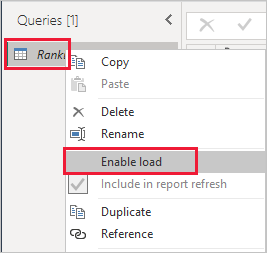
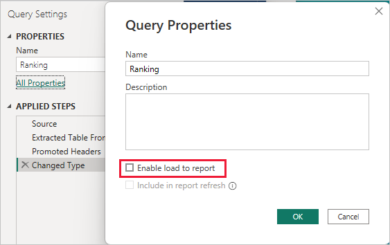
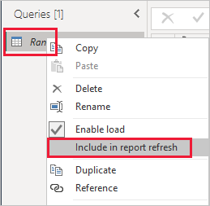
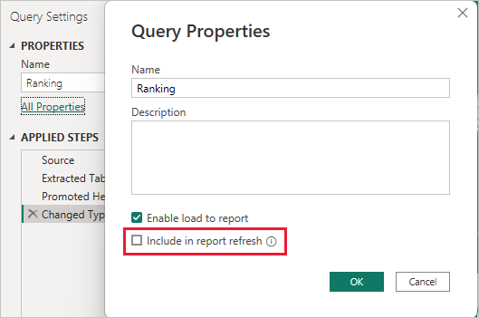

# Managing query refresh in Power BI

With Power BI, you can connect to [many different types of data sources and shape the data to meet your needs](desktop-shape-and-combine-data.md).
The connections and transformations are stored in queries, which are by default refreshed either by manual or automatic refresh of the report in the Service.

## Managing loading of queries

In many situations, it makes sense to break down your data transformations in multiple queries. One popular example is merging where you merge two queries into one to essentially do a join. In this situation, some queries aren't relevant to load into Power BI Desktop because they're intermediate steps, while they're still required for your data transformations to work correctly. For these queries, you can make sure they aren't loaded in Power BI Desktop. Unselect **Enable load** in the context menu of the query in Power Query Editor:

You can also make this change in the **Properties** screen:

## Excluding queries from refresh

For queries for which the source data isn't updated often or at all, it makes sense to not have the queries included in the refresh of the report. In this scenario, you can exclude queries from being refreshed when the report is refreshed. Unselect **Include in report refresh** in the context menu of the query in Power Query Editor:

You can also make this change in the **Properties** screen:

> [!NOTE]
> Any queries excluded from refresh are also excluded in automatic refresh in the Power BI service.

## Related content

- [Shape and combine data](desktop-shape-and-combine-data.md)
- [Configuring scheduled refresh](refresh-scheduled-refresh.md)  
- [Tools for troubleshooting refresh issues](service-gateway-onprem-tshoot.md)  
- [Troubleshooting refresh scenarios](refresh-troubleshooting-refresh-scenarios.md)  

More questions? [Try asking the Power BI Community](https://community.powerbi.com/)
