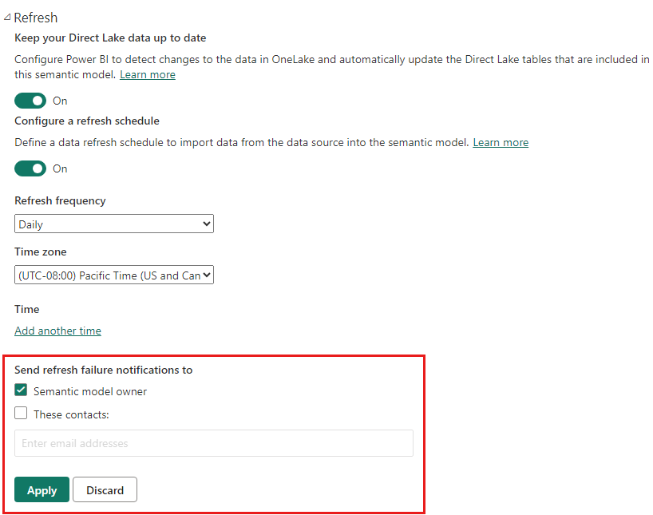

# Troubleshooting refresh scenarios

Here you can find information regarding different scenarios you may face when refreshing data within the Power BI service.

> [!NOTE]
> If you encounter a scenario that is not listed below, and it's causing you issues, you can ask for further assistance on the [community site](https://community.powerbi.com/), or you can create a [support ticket](https://powerbi.microsoft.com/support/).
>

You should always ensure that basic requirements for refresh are met and verified. These basic requirements include:

* Verify the gateway version is up to date
* Verify the report has a gateway selected - if not, the datasource may have changed or might be missing

Once you've confirmed those requirements are met, take a look through the following sections for more troubleshooting. 

## Email notifications

If you're coming to this article from an email notification, and you no longer want to receive emails about refresh issues, contact your Power BI admin. Ask them to remove your email or an email list you're subscribed to from the appropriate datasets in Power BI. They can do this from the following area in the Power BI admin portal.

## Refresh using Web connector doesn't work properly

If you have a Web connector script that's using the [**Web.Page**](/powerquery-m/web-page) function, and you have updated your dataset or report after November 18th, 2016, you must use a gateway for refresh to work properly.

## Unsupported data source for refresh

When configuring a dataset, you may get an error indicating the dataset uses an unsupported data source for refresh. For details, see
[Troubleshooting unsupported data source for refresh](service-admin-troubleshoot-unsupported-data-source-for-refresh.md).

## Dashboard doesn't reflect changes after refresh

Please wait about 10-15 minutes for a refresh to be reflected in the dashboard tiles. If it is still not showing up, re-pin the visualization to the dashboard.

## GatewayNotReachable when setting credentials

You may encounter `GatewayNotReachable` when trying to set credentials for a data source. This can be the result of an outdated gateway. Install the latest gateway and try again.

## Processing Error: The following system error occurred: Type Mismatch

This could be an issue with your M script within your Power BI Desktop file or Excel workbook. It can also be due to an out-of-date Power BI Desktop version.

## Tile refresh errors

For a list of errors you may encounter with dashboard tiles, and explanations, see [Troubleshooting tile errors](refresh-troubleshooting-tile-errors.md).

## Refresh fails when updating data from sources that use AAD OAuth

The Azure Active Directory (**AAD**) OAuth token, used by many different data sources, expires in approximately one hour. You can run into situations where loading data takes longer than the token expiration (more than one hour), since the Power BI service waits for up to two hours when loading data. In that situation, the data loading process can fail with a credentials error.

Data sources that use AAD OAuth include **Microsoft Dynamics CRM Online**, **SharePoint Online** (SPO), and others. If you’re connecting to such data sources, and get a credentials failure when loading data takes more than an hour, this may be the reason.

Microsoft is investigating a solution that allows the data loading process to refresh the token and continue. However, if your Dynamics CRM Online or SharePoint Online instance (or other AAD OAuth data source) is so large that it can run into the two-hour data-load threshold, you may experience a data load timeout from the Power BI service as well.

Also note that, for refresh to work properly, when connecting to a **SharePoint Online** data source using AAD OAuth, you must use the same account that you use to sign in to the **Power BI service**.

## Uncompressed data limits for refresh

The maximum size for datasets imported into the **Power BI service** is 1 GB. These datasets are heavily compressed to ensure high performance. In addition, in shared capacity, the service places a limit on the amount of uncompressed data that is processed during refresh to 10 GB. This limit accounts for the compression, and therefore is much higher than 1 GB. Datasets in Power BI Premium are not subject to this limit. If refresh in the Power BI service fails for this reason, please reduce the amount of data being imported to Power BI and try again.

## Scheduled refresh timeout

Scheduled refresh for imported datasets timeout after two hours. This timeout is increased to five hours for datasets in **Premium** workspaces. If you  encounter this limit, consider reducing the size or complexity of your dataset, or consider breaking the dataset into smaller pieces.

## Scheduled refresh failures

If a scheduled refresh fails four times in a row, Power BI disables the refresh. Address the underlying problem, and then re-enable the scheduled refresh.

## Access to the resource is forbidden  

This error can occur because of expired cached credentials. Clear your internet browser cache by going signing into Power BI and going to `https://app.powerbi.com?alwaysPromptForContentProviderCreds=true`. This forces an update of your credentials.

## Data refresh failure because of password change or expired credentials

Data refresh can also fail due to expired cached credentials. Clear your internet browser cache by going signing into Power BI and going to `https://app.powerbi.com?alwaysPromptForContentProviderCreds=true`. This forces an update of your credentials.

## Refresh a column of the ANY type containing TRUE/FALSE results in unexpected values

When you create a report in Power BI Desktop that contains an ANY data type column, and that column contains TRUE/FALSE values, the values of that column can differ between the Power BI Desktop and the Power BI service after a refresh. In Power BI Desktop, the underlying engine converts the boolean values to strings, retaining TRUE or FALSE values. In the Power BI service, the underlying engine converts the values to objects, and subsequently converts the values to -1 or 0.

Visuals created in Power BI Desktop using such columns may behave or appear as designed prior to a refresh event, but may change (due to TRUE/FALSE being converted to -1/0) after the refresh event.

## Resolve the error: Container exited unexpectedly with code 0x0000DEAD

If you get the **Container exited unexpectedly with code 0x0000DEAD** error, try to disable the scheduled refresh and republish the dataset.

## Refresh operation throttled by Power BI Premium

A Premium capacity may throttle data refresh operations when too many datasets are being processed concurrently. Throttling can occur in Power BI Premium capacities, or more rarely, in Premium Gen2 capacities. When a refresh operation is canceled the follow error message is logged into the refresh history:

- *The operation was throttled by Power BI Premium because there were too many datasets being processed concurrently.*
 
If the error occurs frequently, modify your refresh schedule to perform the refresh operation when fewer datasets are being processed, increase the time between refresh operations for all datasets in your refresh schedule on the affected Premium capacity, or do both. You can retry the operation if you're using custom XMLA operations. 

## Next steps

- [Data refresh in Power BI](refresh-data.md)  
- [Troubleshooting the On-premises data gateway](service-gateway-onprem-tshoot.md)  
- [Troubleshooting the Power BI Gateway - Personal](service-admin-troubleshooting-power-bi-personal-gateway.md)  

More questions? [Try asking the Microsoft Power BI Community](https://community.powerbi.com/)
