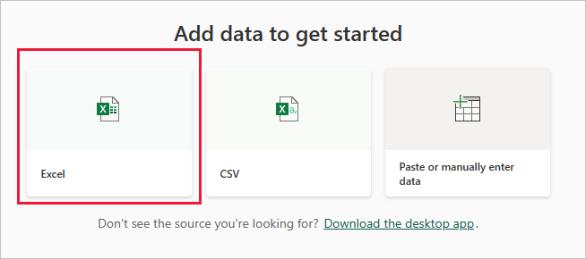

# Error: We couldn't find any data in your Excel workbook

> [!NOTE]  
> This article applies to Excel 2007 and later.

Use the information in this article to understand and resolve an error where data isn't found in the Excel workbook when you try importing it into the Power BI service.

When you import an Excel workbook into the Power BI service, you might see the following error:

```output
Error: We couldn't find any data formatted as a table. To import from Excel into the Power BI service, you need to format the data as a table. Select all the data you want in the table and press Ctrl+T.
```


## Quick solution

1. Edit your workbook in Excel.
1. Select the range of cells that contain your data. The first row should contain your column headers, the column names.
1. Press **Ctrl** + **T** to create a table.
1. Save your workbook.
1. Return to the Power BI service and import your workbook again, or if you're working in Excel 2016 and you've saved your workbook to OneDrive for work or school, in Excel, select **File** > **Publish**.

## Details

### Cause

In Excel, you can create a *table* out of a range of cells, which makes it easier to sort, filter, and format data.

When you import an Excel workbook, Power BI looks for these tables and imports them into a semantic model. If it doesn't find any tables, you see this error message.

### Solution

1. Open your workbook in Excel.

   > [!NOTE]
   > The pictures here are of Excel 2013. If you're using a different version, things might look a little different, but the steps are the same.

    

1. Select the range of cells that contain your data. The first row should contain your column headers, the column names.

   

1. In the ribbon on the **Insert** tab, select **Table**. Or, as a shortcut, press **Ctrl** + **T**.

   

1. You see the following dialog. Make sure **My table has headers** is selected, then choose **OK**.

    

   Now your data is formatted as a table.

   

1. Save your workbook.

1. Return to the Power BI service. Select **Create** from the navigation pane, then select the **Excel** tile under **Add data to start building a report**.

   

1. Import your Excel workbook again. This time, the import should find the table and succeed.

If the import still fails, let us know by selecting **Community** in the help menu:


