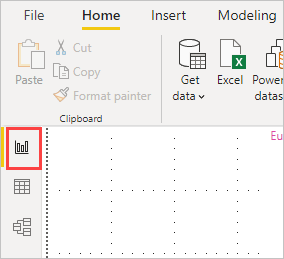
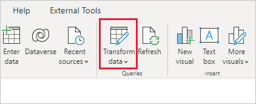
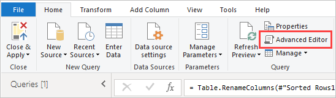
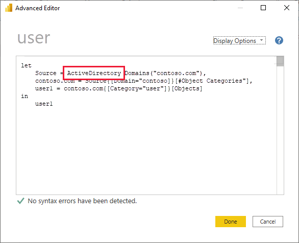

# Troubleshooting unsupported data source for refresh

You might see an error when trying to configure a semantic model for scheduled refresh.

```output
You cannot schedule refresh for this semantic model because it gets data from sources that currently don't support refresh.
```

This issue happens when the data source you used, within Power BI Desktop, isn't supported for refresh. You need to find the data source that you're using and compare that against the list of supported data sources at [Refresh data in Power BI](refresh-data.md).

## Find the data source

If you aren't sure what data source was used, you can find that using the following steps within Power BI Desktop.

1. In Power BI Desktop, make sure you are on the **Report** pane.

   

2. Select **Transform data** from the ribbon bar.

   

3. Select **Advanced Editor**.

   

4. Make note of the provider listed for the source. In this example, the provider is **ActiveDirectory**.

   

5. Compare the provider with the list of supported data sources found in [Power BI data sources](power-bi-data-sources.md).

> [!NOTE]
> For refresh issues related to dynamic data sources, including data sources that include hand-authored queries, see [Refresh and dynamic data sources](refresh-data.md#refresh-and-dynamic-data-sources).

## Related content

- [Data Refresh](refresh-data.md)
- [Power BI Gateway - Personal](service-gateway-personal-mode.md)
- [On-premises data gateway](service-gateway-onprem.md)
- [Troubleshooting the On-premises data gateway](service-gateway-onprem-tshoot.md)
- [Troubleshooting the Power BI Gateway - Personal](service-admin-troubleshooting-power-bi-personal-gateway.md)

More questions? [Try asking the Power BI Community](https://community.powerbi.com/)
