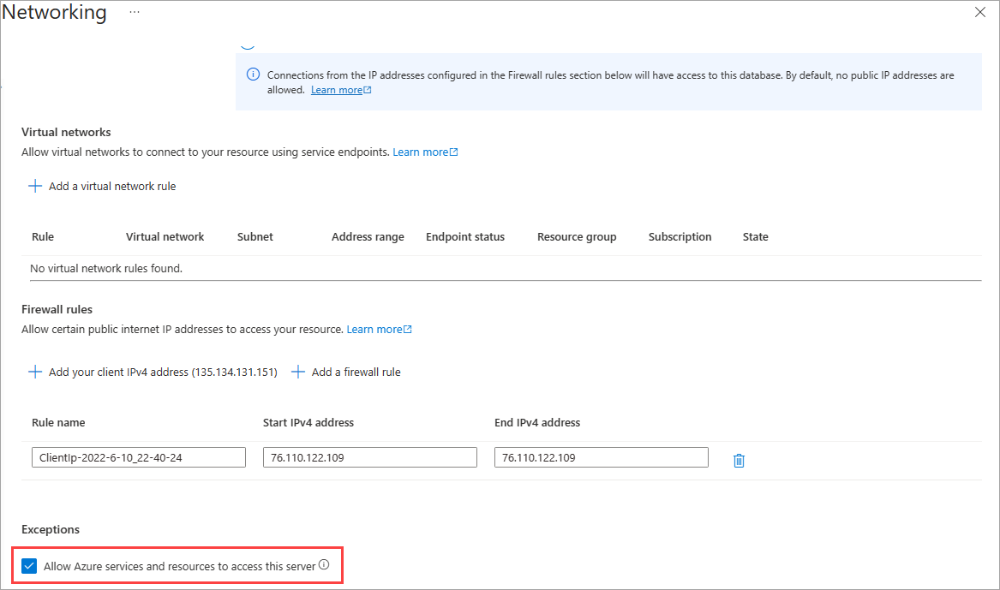

# Troubleshoot scheduled refresh for Azure SQL databases in Power BI

For detailed information about refresh, see [Refresh data in Power BI](refresh-data.md) and [Configure scheduled refresh](refresh-scheduled-refresh.md).

While you set up scheduled refresh for an Azure SQL database, if you get an error with error code 400 when editing the credentials, try these steps to configure the correct firewall rule:

1. Sign in to the [Azure portal](https://portal.azure.com).

1. Go to the Azure SQL database for which you're configuring refresh.

1. In the **Overview** page, select **Set server firewall**.

1. On the **Networking** page, select **Allow Azure services and resources to access this server** and choose **Save**.

      

More questions? [Try the Power BI Community](https://community.powerbi.com/).
