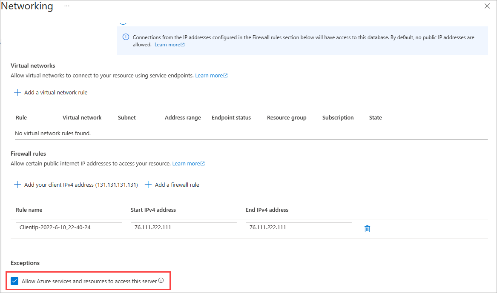

# Troubleshooting scheduled refresh for Azure SQL Databases in Power BI

For detailed information about refresh, see [Refresh data in Power BI](refresh-data.md) and [Configure scheduled refresh](refresh-scheduled-refresh.md).

While setting up scheduled refresh for Azure SQL database, if you get an error with error code 400 when editing the credentials, try the following to set up the appropriate firewall rule:

1. Sign in to the [Azure portal](https://portal.azure.com).

1. Go to the Azure SQL database for which you're configuring refresh.

1. At the top of the **Overview** blade, select **Set server firewall**.

1. On the **Firewall settings** blade, make sure that **Allow Azure services and resources to access this server** is set to **Yes**.

      

More questions? [Try the Power BI Community](https://community.powerbi.com/)
