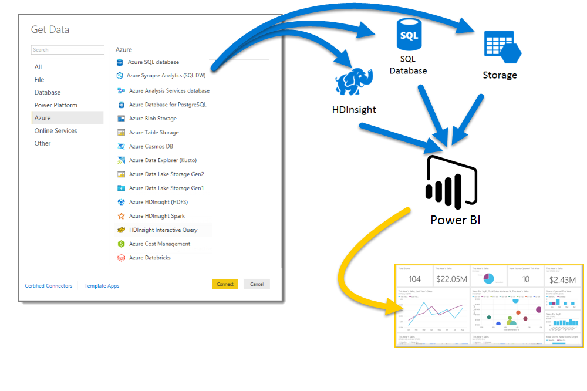

# Azure and Power BI

With **Azure** services and **Power BI**, you can turn your data processing efforts into analytics and reports that provide real-time insights into your business. Whether your data processing is cloud-based or on-premises, straightforward, or complex, single-sourced or massively scaled, warehoused, or real-time, Azure and Power BI have the built-in connectivity and integration to bring your business intelligence efforts to life.

Power BI has a multitude of Azure connections available, and the business intelligence solutions you can create with those services are as unique as your business. You can connect as few as one Azure data source, or a handful, then shape and refine your data to build customized reports.

## Azure SQL Database and Power BI

You can start with a straightforward connection to an Azure SQL Database, and create reports to monitor the progress of your business. Using the [Power BI Desktop](../fundamentals/desktop-getting-started.md), you can create reports that  identify trends and key performance indicators that move your business forward.

There's plenty more information for you to learn about [Azure SQL Database](https://azure.microsoft.com/services/sql-database/).

## Transform, shape, and merge your cloud data

Do you have more complex data, and all sorts of sources? No problem. With **Power BI Desktop** and Azure services, connections are just a tap of the **Get Data** dialog away. Within the same Query you can connect to your **Azure SQL Database**, your **Azure HDInsight** data source, and your **Azure Blob Storage** (or **Azure Table Storage**), then select only the subsets within each that you need, and refine it from there.

You can create different reports for different audiences too, using the same data connections and even the same Query. Just build a new report page, refine your visualizations for each audience, and watch it keep the business in the know.

For more information, take a look at the following resources:

* [Azure SQL Database](https://azure.microsoft.com/services/sql-database/)
* [Azure HDInsight](https://azure.microsoft.com/services/hdinsight/)
* [Azure Storage](https://azure.microsoft.com/services/storage/) (Blob storage and Table storage)

## Get complex (and ahead) using Azure Services and Power BI

You can expand as much as you need with Azure and Power BI. Harness multi-source data processing, make use of massive real-time systems, use [Stream Analytics](https://azure.microsoft.com/services/stream-analytics/)and [Event Hubs](https://azure.microsoft.com/services/event-hubs/), and coalesce your varied SaaS services into business intelligence reports that give your business an edge.

## Context insights with Power BI Embedded analytics

Embed stunning, interactive data visualizations in applications, websites, portals, and more, to take advantage of your business data. With [Power BI Embedded as a resource in Azure](https://azure.microsoft.com/services/power-bi-embedded/), you can easily embed interactive reports and dashboards, so your users can enjoy consistent, high-fidelity experiences across devices.  Power BI used with embedding analytics is to help you through your journey from Data -> Knowledge -> Insights -> Actions.  Furthermore, you can extend the value of Power BI and Azure also by embedding analytics in your [organization's internal applications and portals](https://powerbi.microsoft.com/developers/embedded-analytics/organization/).

There's lots of information about Power BI APIs in the [Power BI Developer Portal](https://dev.powerbi.com).

For more information, see [What is Power BI Embedded in Azure?](../developer/embedded/azure-pbie-what-is-power-bi-embedded.md).

## Embed your Power BI data within your app

Embed stunning, interactive data visualizations in applications, websites, portals, and more, to showcase your business data in context. Using [Power BI Embedded in Azure](https://azure.microsoft.com/services/power-bi-embedded/), you can easily embed interactive reports and dashboards, so your users can enjoy consistent, high-fidelity experiences across devices.

## What could you do with Azure and Power BI?

There are all sorts of scenarios where **Azure** and **Power BI** can be combined - the possibilities and opportunities are as unique as your business. For more information about **Azure services**, check out this [overview page](/azure/machine-learning/team-data-science-process/plan-your-environment), which describes **Data Analytics Scenarios using Azure**, and learn how to transform your data sources into intelligence that drives your business ahead.