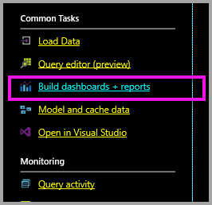
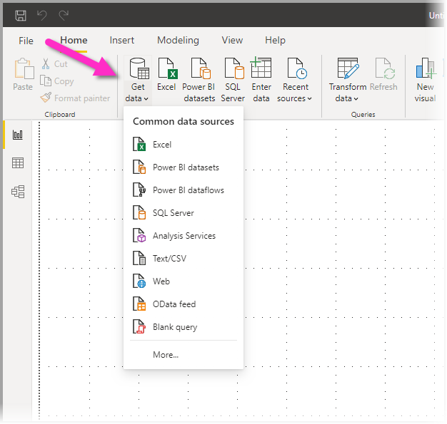
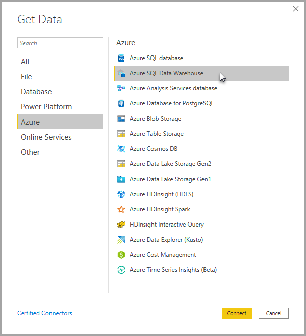
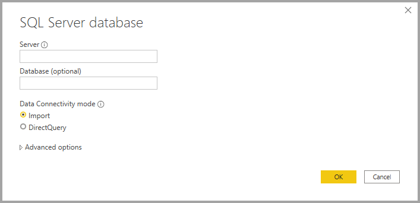
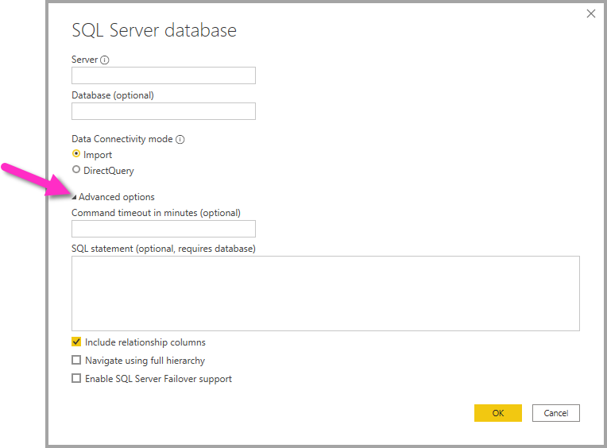
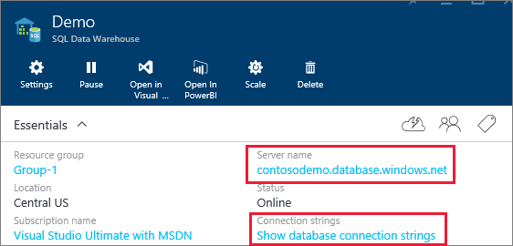

# Azure Synapse Analytics (formerly SQL Data Warehouse) with DirectQuery

Azure Synapse Analytics (formerly SQL Data Warehouse) with DirectQuery allows you to create dynamic reports based on data and metrics you already have in Azure Synapse Analytics. With DirectQuery, queries are sent back to your Azure Synapse Analytics in real time as you explore the data. Real-time queries, combined with the scale of Synapse Analytics enables users to create dynamic reports in minutes against terabytes of data. In addition, the **Build dashboards + reports** link allows users to create Power BI reports using their Synapse Analytics.

When using the Azure Synapse AnalyticsAzure Synapse Analytics connector:

* Specify the fully qualified server name when connecting (see below for details)
* Ensure firewall rules for the server are configured to "Allow access to Azure services"
* Every action such as selecting a column or adding a filter will directly query the data warehouse
* Tiles are set to refresh approximately every 15 minutes and refresh does not need to be scheduled.  Refresh can be adjusted in the Advanced settings when you connect.
* Q&A isn't available for DirectQuery datasets
* Schema changes aren't picked up automatically

These restrictions and notes may change as we continue to improve the experience. The steps to connect are detailed below.

## Build dashboards and reports in Power BI

> [!Important]
> We have been improving our connectivity to Azure Synapse Analytics. For the best experience to connect to your Azure Synapse Analytics data source, use Power BI Desktop. Once you've built your model and report, you can publish it to the Power BI service. The previously available direct connector for Azure Synapse Analytics in the Power BI service is no longer available.

The easiest way to move between your Synapse Analytics and Power BI is to create reports in Power BI Desktop. You can use the **Build dashboards + reports** button within the Azure portal.

1. To get started, download and install Power BI Desktop. See the [get Power BI Desktop](../fundamentals/desktop-get-the-desktop.md) article for information about downloading and installing, or go directly to the next step.

2. You can also click the **Build dashboards + reports** link to download Power BI Desktop.

    

## Connecting through Power BI Desktop

You can connect to an Azure Synapse Analytics using the **Get data** button in Power BI Desktop. 

1. Select the **Get data** button from the **Home** menu.  

    

2. Select **More...** to see all available data sources. From the window that appears, select **Azure** from the left pane, then select **Azure Synapse Analytics** from the list of available connectors in the right pane.

    

3. In the window that appears, input your Server and optionally state the Database to which you want to connect. You can also select your data connectivity mode: Import or DirectQuery. For real-time access to information in your Azure Synapse Analytics, use DirectQuery.

    

4. For advanced options for the Azure Synapse Analytics connection, select the down arrow beside **Advanced options** to display additional options for your connection.

    

The next section describes how to find parameter values for your connection. 

## Finding Parameter Values

Your fully qualified server name and database name can be found in the Azure portal. Note that Azure Synapse Analytics only has a presence in the Azure portal at this time.

> [!NOTE]
> If your Power BI tenant is in the same region as the Azure Synapse Analytics there will be no egress charges. You can find where your Power BI tenant is located using [these instructions](../admin/service-admin-where-is-my-tenant-located.md).

[!INCLUDE [direct-query-sso](../includes/direct-query-sso.md)]

## Next steps

* [About using DirectQuery in Power BI](desktop-directquery-about.md)
* [What is Power BI?](../fundamentals/power-bi-overview.md)  
* [Get Data for Power BI](service-get-data.md)  
* [Azure Synapse Analytics](/azure/sql-data-warehouse/sql-data-warehouse-overview-what-is/)

More questions? [Try the Power BI Community](https://community.powerbi.com/)
