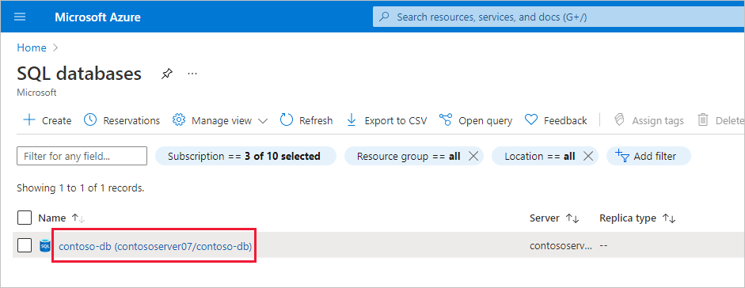
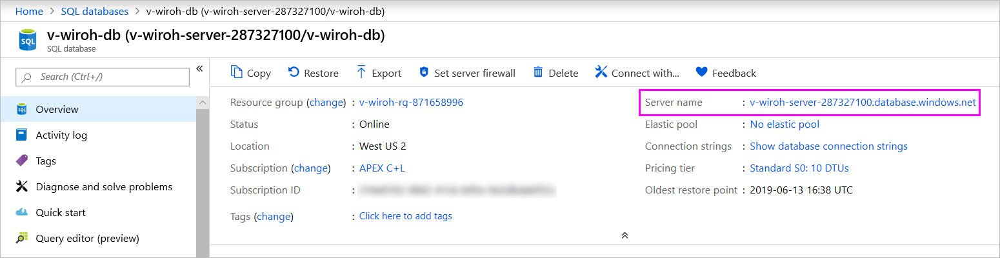

# Azure SQL Database with DirectQuery

Learn how you can connect directly to Azure SQL Database and create reports that use live data. You can keep your data at the source and not in Power BI.

With DirectQuery, queries are sent back to your Azure SQL Database as you explore the data in the report view. This experience is suggested for users who are familiar with the databases and entities they connect to.

> [!IMPORTANT]
> This description assumes that Azure SQL database is not behind a VNET or has private link endpoint enabled.

**Notes:**

* Specify the fully qualified server name when connecting (see below for more details).
* Ensure firewall rules for the database are configured to"[Allow access to Azure services](/azure/sql-database/sql-database-networkaccess-overview#allow-azure-services).
* Every action such as selecting a column or adding a filter will send a query back to the database.
* Tiles are refreshed every hour (refresh doesn't need to be scheduled). You can adjust how often to refresh in the Advanced settings when you connect.
* Schema changes aren't picked up automatically.
* Changing the data source connection string alias from `xxxx.database.windows.net` to `xxxx.domain.com` indicates to the Power BI service that it's an on-premises datasource and always requires a gateway connection to be established.

These restrictions and notes may change as we continue to improve the experiences. The steps to connect are detailed below.

> [!IMPORTANT]
> We have been improving our connectivity to Azure SQL Database. For the best experience to connect to your Azure SQL Database data source, use Power BI Desktop. Once you've built your model and report, you can publish it to the Power BI service. The direct connector for Azure SQL Database in the Power BI service is now deprecated.

## Power BI Desktop and DirectQuery

To connect to Azure SQL Database using DirectQuery, you must use Power BI Desktop. This approach provides more flexibility and capabilities. Reports created using Power BI Desktop can then be published to the Power BI service. To learn more about how to connect to Azure SQL Database in Power BI Desktop, see [Use DirectQuery in Power BI Desktop](desktop-use-directquery.md).

## Find parameter values

You can find your fully qualified server name and database name in the Azure portal.

[!INCLUDE [direct-query-sso](../includes/direct-query-sso.md)]

## Related content

* [Use DirectQuery in Power BI Desktop](desktop-use-directquery.md)  
* [What is Power BI?](../fundamentals/power-bi-overview.md)  
* [Data sources for the Power BI service](service-get-data.md)  

More questions? [Try the Power BI community](https://community.powerbi.com/)
