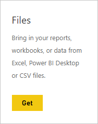
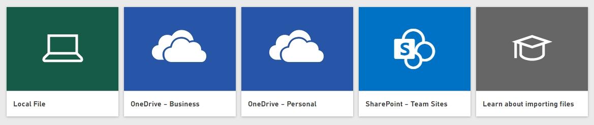

# Get data from Comma Separated Value (.CSV) files

Comma separated value files, often known as a .CSV, are simple text files with rows of data where each value is separated by a comma. These types of files can contain very large amounts of data within a relatively small file size, making them an ideal data source for Power BI. You can download a sample .CSV file [here](https://go.microsoft.com/fwlink/?LinkID=619356).

If you have a .CSV, it’s time to get it into your Power BI site as a dataset where you can begin exploring your data, create some dashboards, and share your insights with others.

>[!TIP]
>Many organizations output a .CSV with updated data each day. To make sure your dataset in Power BI stays in-sync with your updated file, be sure the file is saved to OneDrive with the same name.

## Where your file is saved makes a difference
**Local** - If you save your .CSV file to a local drive on your computer or another location in your organization, from Power BI you can *import* your file into Power BI. Your file will actually remain on your local drive, so the whole file isn’t really imported into Power BI. What really happens is a new dataset is created in Power BI and data from the .CSV file is loaded into the dataset.

**OneDrive - Business** – If you have OneDrive for Business and you sign into it with the same account you sign into Power BI with, this is by-far the most effective way to keep your .CSV file and your dataset, reports, and dashboards in Power BI in-sync. Because both Power BI and OneDrive are in the cloud, Power BI *connects* to your file on OneDrive about every hour. If any changes are found, your dataset, reports, and dashboards are automatically updated in Power BI.

**OneDrive - Personal** – If you save your files to your own OneDrive account, you’ll get many of the same benefits as you would with OneDrive for Business. The biggest difference is when you first connect to your file (using Get Data > Files > OneDrive – Personal) you’ll need to sign in to your OneDrive with your Microsoft account, which is usually different from what you use to sign in to Power BI. When signing into your OneDrive with your Microsoft account, be sure to select the Keep me signed in option. This way, Power BI will be able to connect to your file about every hour and make sure your dataset in Power BI is in-sync.

**SharePoint Team-Sites** – Saving your Power BI Desktop files to SharePoint – Team Sites is much the same as saving to OneDrive for Business. The biggest difference is how you connect to the file from Power BI. You can specify a URL or connect to the root folder.

## Import or connect to a .CSV file
>[!IMPORTANT]
>The maximum file size you can import into Power BI is 1 gigabyte.

1. In Power BI, in the navigator pane, click **Get data**.
   
   
2. In **Files**, click **Get**.
   
   
3. Find your file.
   
   

## Next steps
**Explore your data** - Once you get data from your file into Power BI, it's time to explore. Just right-click the new dataset and then click **Explore**.

**Schedule refresh** - If your file is saved to a local drive, you can setup scheduled refresh so your dataset and reports in Power BI stay up-to-date. To learn more, see [Data refresh in Power BI](refresh-data.md). If your file is saved to OneDrive, Power BI will automatically synchronize with it about every hour.

