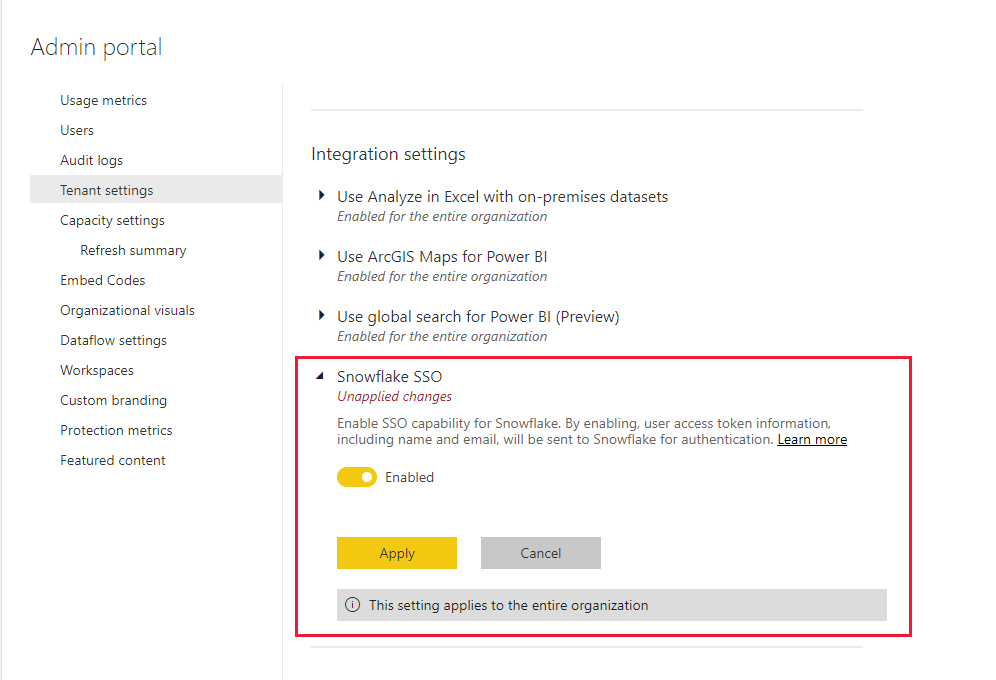

# Connect to Snowflake in Power BI Service

## Introduction

Connecting to Snowflake in the Power BI service  differs from other connectors in only one way. Snowflake has an additional capability for Azure Active Directory (AAD), with an option for SSO. Parts of the integration require different administrative roles across Snowflake, Power BI, and Azure. You can also choose to enable AAD authentication without using SSO. Basic authentication works similarly to other connectors in the service.

To configure AAD integration and optionally enable SSO, follow the steps in this article:

* If you're the Snowflake admin, read the [Power BI SSO to Snowflake - Getting Started](https://docs.snowflake.com/en/user-guide/oauth-powerbi.html) article in the Snowflake documentation.
* If you're a Power BI admin, reference [Power BI Service configuration - Admin Portal](service-connect-snowflake.md#admin-portal) to learn how to enable SSO.
* If you're a Power BI dataset creator, reference [Power BI Service configuration - Configuring a dataset with AAD](service-connect-snowflake.md#configuring-a-dataset-with-aad) to learn how to enable SSO.

## Power BI Service configuration

### Admin portal

To enable SSO, a global admin has to turn on the setting in the Power BI Admin portal. This setting approves sending AAD credentials to Snowflake for authentication for the entire organization. Follow these steps to enable SSO:

1. [Sign in to Power BI](https://app.powerbi.com) using global admin credentials.
1. Select **Settings** from the page header menu, then select **Admin portal**.
1. Select **Tenant settings**, then scroll to locate **Integration settings**.

   

4. Expand **Snowflake SSO**, toggle the setting to **Enabled**, then select **Apply**.

This step is required to consent to sending your AAD token to the  Snowflake  servers. After you enable the setting, it may take up to an hour for it to take effect.

After SSO is enabled you can use reports with SSO.

### Configuring a Dataset with AAD

After a report that is based on the Snowflake connector is published to the Power BI service, the dataset creator has to update settings for the appropriate workspace so that it will use SSO.

For more information about using AAD and SSO, refer to the following announcement that describes the steps and support for using AAD and SSO with Snowflake: [Data gateway support for SSO with AAD](https://powerbi.microsoft.com/blog/announcing-data-gateway-support-for-single-sign-on-sso-with-azure-active-directory/).

Learn more about how to use the on-premises data gateway, in [What is an on-premises data gateway?](service-gateway-onprem.md)

If you aren't using the gateway, you're all set. When you have Snowflake credentials configured on your on-premises data gateway, but are only using that data source in your model, you can click the toggle on the Dataset settings page to turn off the gateway for that data model.

To turn on SSO for a dataset, follow these steps:

1. [Sign in to Power BI](https://app.powerbi.com) using dataset creator credentials.
1. Select the appropriate workspace, then choose **Settings** from the more options menu that's located next to the dataset name.
  
1. Select **Data source credentials** and sign in. The dataset can be signed into Snowflake with Basic or OAuth2 (AAD) credentials. if you use AAD, you can enable SSO in the next step.
1. Select the option **End users use their own OAuth2 credentials when accessing this data source via DirectQuery**. This setting will enable AAD SSO. Whether the first user signs in with Basic authentication or OAuth2 (AAD), the AAD credentials are what will be sent for SSO.

    

After these steps are done, users should automatically use their AAD authentication to connect to data from that Snowflake dataset.

If you choose not to enable SSO, then users refreshing the report will use the credentials of the user who signed in, like most other Power BI reports.

### Troubleshooting

If you run into any issues with the integration, refer to the Snowflake [troubleshooting guide](https://docs.snowflake.com/en/user-guide/oauth-powerbi.html#troubleshooting).

## Next steps

* [Data sources for the Power BI service](service-get-data.md)
* [Connect to datasets in the Power BI service from Power BI desktop](desktop-report-lifecycle-datasets.md)
* [Connect to a Snowflake computing warehouse](desktop-connect-snowflake.md)