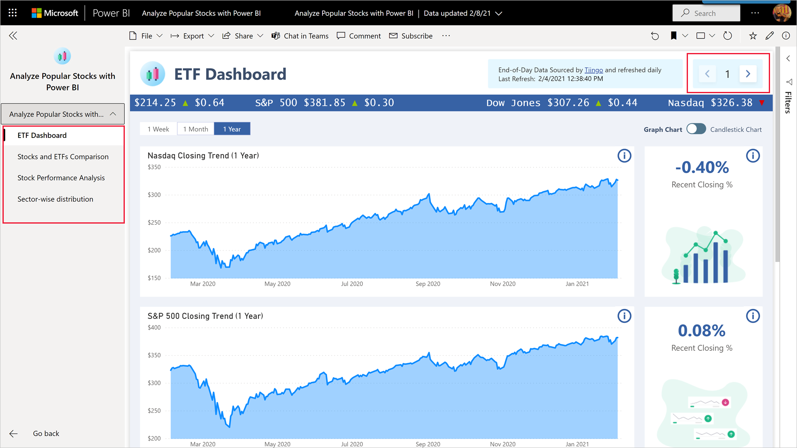
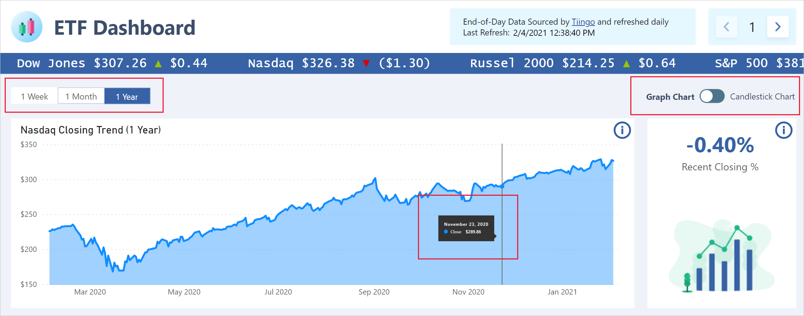
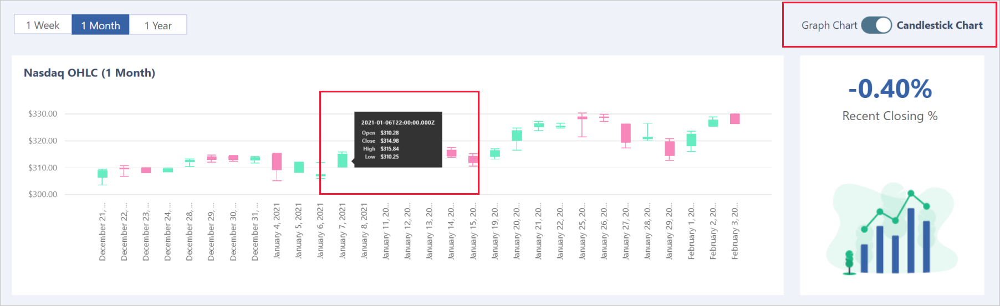
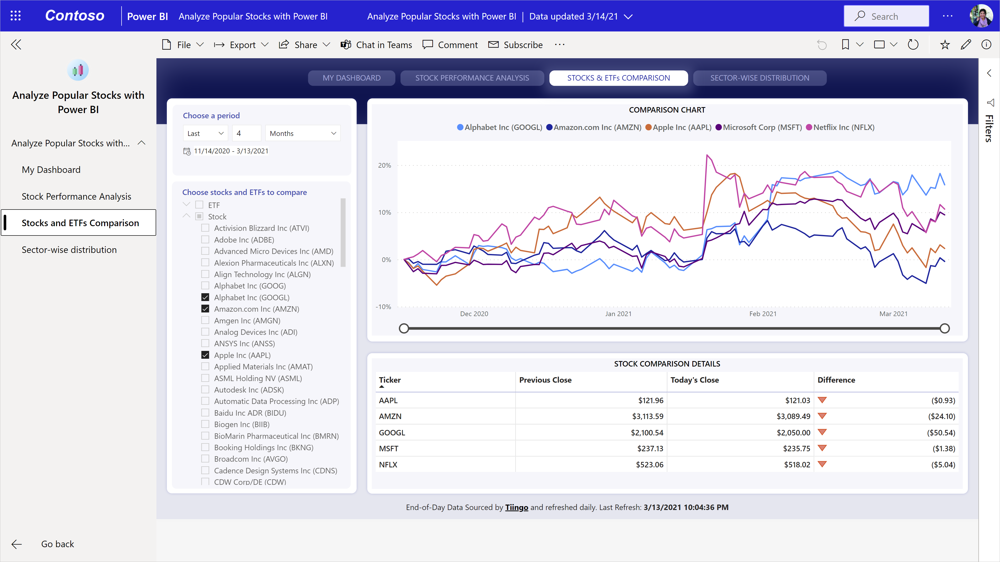
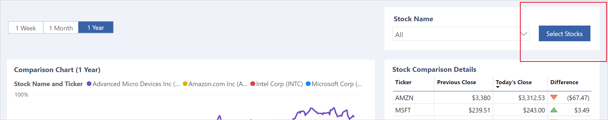
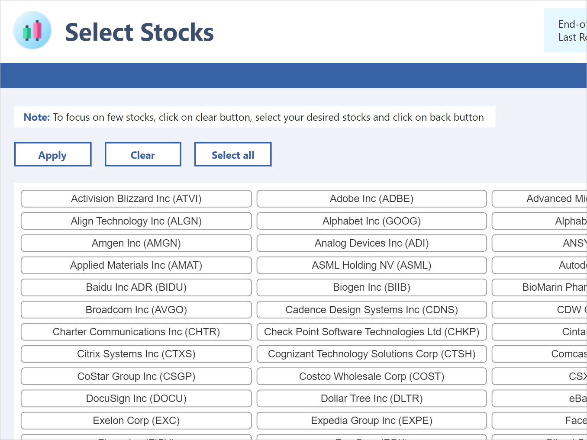
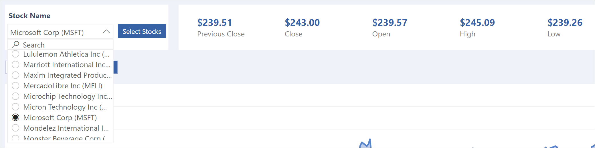

# Analyze popular stocks with Power BI

The stock market app shows you multiple KPIs to start your analytics journey in Power BI. You can use it to track end-of-day quotes as well as weekly, monthly, or yearly trends for popular stocks and ETFs. The app shows you Power BI in action, with tracking of stock highs and lows, moving averages, sector-wise distribution, Bollinger bands, and even performance comparisons for popular stocks over time.

The app features four dashboards:
* **ETF Dashboard**: Shows you closing trends for four major indexes. 
* **Stocks and ETFs Comparison**: Provides normalized charts make it easily for you to compare stocks and EFTs.
* **Stock Performance Analysis**: Enables detailed analysis of selected stocks with visuals for closing trends, volume, OHLC, and Bollinger bands.
* **Sector-wise distribution**: Allows you to break out stock performance by sector.

You can navigate between the dashboards using the navigation side pane or the forward and back arrows at the top right of the page.

## ETF Dashboard

The ETF dashboard has visuals showing the closing trends for four major indexes. 
* **Nasdaq**: The NASDAQ Composite Index measures the change in more than 3,000 stocks traded on the NASDAQ exchange.
* **S&P 500**: S&P 500 is regarded as the best single gauge of large-cap U.S. equities.
* **Dow Jones**: The Dow Jones shows you the market growth of leaders of the IT industry, such as Microsoft. The closing trend of Dow Jones signifies at which trend have the stocks under this index have closed by the end of day.
* **Russell 2000**: Russel 2000 is the most common benchmark for mutual funds. The Russell 2000 closing trend visual can be used provide investment guidance about more than 2000 low-range stocks.

A running banner at the top of the dashboard shows you the current day's close and the price change from the previous days close for the four indexes shown on the page.

The default view - graph view - helps you to understand how drastically the trend has changed over time. You can use the time scale buttons at the top left of the dashboard to choose to see the trend for a week, month or a year. Hover the pointer over the chart to get the exact data point of a specific day.

  

On the x-axis you see the time period and on y-axis you see the closing value.

You can also switch to a candlestick chart by clicking on the toggle switch at the top right of the dashboard. In candlestick view you can see the open, high, low, and close prices for each data point. Hover the pointer over the chart to get the exact data point of a specific day.

## Stocks and ETFs Comparison

The Stocks and ETFs Comparison dashboard shows you two normalized charts that make it easy to compare selected stocks and ETFs.

To use this page, first select the stocks you wish to compare. 
1. Click the **Select** button
    
1. On the **Select Stocks** page that appears, click **Clear** to remove any previous selections, and then select the stocks you wish to compare
    
1. Click **Apply**

After you have selected the stocks you're interested in, use the dropdown arrow to select the particular stocks you wish to compare.

## Stock Performance Analysis

 Stock Performance Analysis dashboard shows you important KPI’s about selected stock, such as the previous day's close, close, open, high, and low. Select the dropdown to choose the stock you want to see from among the stocks you've selected for analysis. You will see that the value changes after clicking on the stock of your choice.

 
### Closing trend

You can see the closing trend for the selected stock, and you can choose to switch it to month view or year view by clicking on the buttons at the top left of the page. Having a year view will help you see in which part of the year the stock gained or lost value.

  

### Volume

You can look at the volume of selected stock by scrolling down to the next visual. You can hover at a time interval to see the volume of stock at that part of the year.

 
### OHLC chart

OHLC Charts are highly useful since they show four major datapoints for a given stock at same time. So, in the next visual down the page you will see OHLC visual which shows you opening, closing, high, and low of the stock selected. You can also look deeper into the data by changing the moving average. 

### Bollinger band

Bollinger bands use complex mathematics to show the trends. You can see a number of KPI’s which were in OHLC, and along with that you can see another three lines. The middle line shows the moving average. The top line is shifted up by certain number of standard deviation and the bottom line is shifted down by a standard deviation.

 

## Sectorwise distribution

On the sector-wise distribution page, you see the various stocks and the market they belong to. If you click on any of the sectors, the stocks get filtered out, and the stocks belonging to the selected sector will start appearing. 

 
You can then hover over the stock to see the important KPI’s, such as previous close, close and the difference. The difference will help you understand how much the stock has gained or lost since yesterday.

You can scroll down to see all of the stocks in that category.
 
To see the distribution of market for different sectors we have the “Sector-wise distribution” visual which shows from top to down the sectors having the highest difference in their closing price from last day.

## Next steps

* [What are Power BI template apps](service-template-apps-overview.md)
* [Create a template app in Power BI](service-template-apps-create.md)
* [Install and distribute template apps in your organization](service-template-apps-install-distribute.md)
* Questions? [Try asking the Power BI Community](https://community.powerbi.com/)
