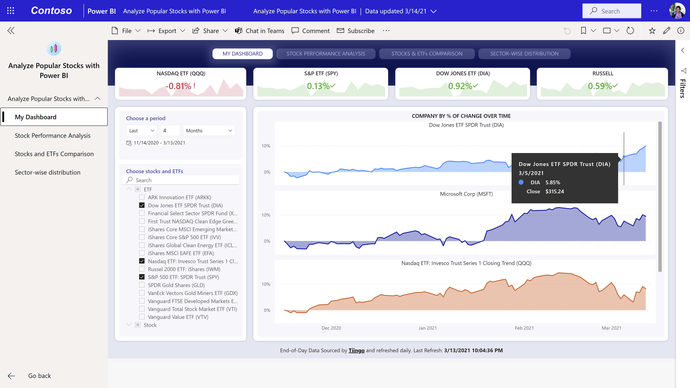
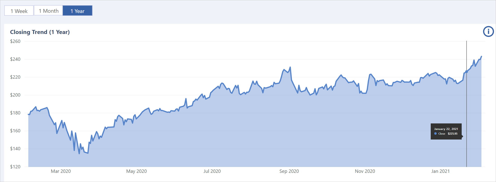
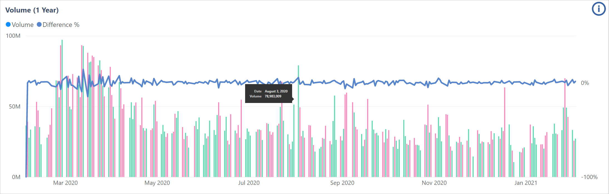
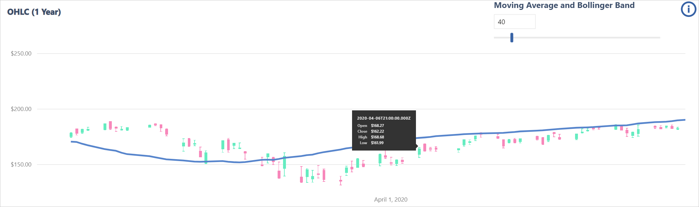
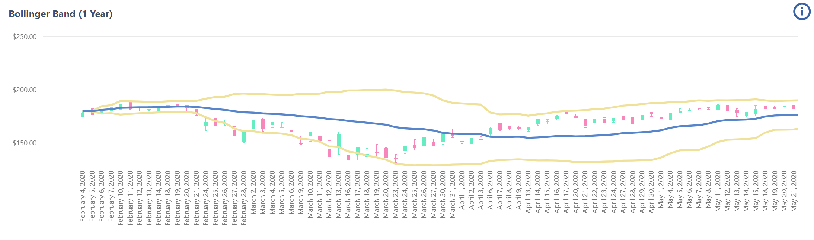
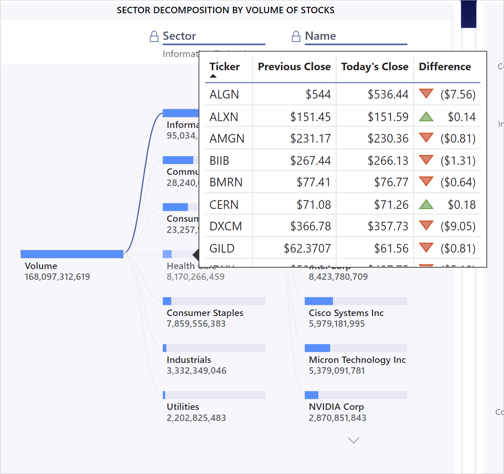

# Analyze popular stocks with Power BI

The stock market app shows you multiple KPIs to start your analytics journey in Power BI. You can use it to track end-of-day quotes as well as weekly, monthly, or yearly trends for popular stocks and ETFs. The app shows you Power BI in action, with tracking of stock highs and lows, moving averages, sector-wise distribution, Bollinger bands, and even performance comparisons for popular stocks over time.

The app features four dashboards:
* **My Dashboard**: Shows percent of change over time for companies you select. 
* **Stock Performance Analysis**: Enables detailed analysis of selected stocks with visuals for closing trends, volume, OHLC, and Bollinger bands.
* **Stocks and ETFs Comparison**: Provides normalized charts make it easily for you to compare stocks and EFTs.
* **Sector-wise distribution**: Allows you to break out stock performance by sector.

You can navigate between the dashboards using the navigation side pane or the buttons at the top the page.

## My Dashboard

My dashboard shows you the percent of change over time for companies you select. You can choose as many stocks and ETFs as you want. 

Above the dashboard you can see the XXX of four major indexes.

  

## Stock Performance Analysis

Stock Performance Analysis dashboard shows you important KPI’s about selected stock, such as the previous day's close, close, open, high, and low. At the bottom of each chart is a slider you can use to zoom in for more granularity.

### Closing trend

You can see the closing trend for the selected stock. You can adjust the time period to help you see in which part of the year the stock gained or lost value. Use the slider at the bottom of the chart to zoom in for more granularity.

  

### Volume

You can look at the volume of selected stock by scrolling down to the next visual. You can hover at a time interval to see the volume of stock at that point. Use the slider at the bottom of the chart to zoom in for more granularity. 

### OHLC chart

OHLC Charts are highly useful since they show four major datapoints for a given stock at same time. So, in the next visual down the page you will see OHLC visual which shows you opening, closing, high, and low of the stock selected. You can also look deeper into the data by changing the moving average. Use the slider at the bottom of the chart to zoom in for more granularity.

### Bollinger band

Bollinger bands use complex mathematics to show the trends. You can see a number of KPI’s which were in OHLC, and along with that you can see another three lines. The middle line shows the moving average. The top line is shifted up by certain number of standard deviation and the bottom line is shifted down by a standard deviation. Use the slider at the bottom of the chart to zoom in for more granularity.

 

### Stocks and ETFs Comparison

The Stocks and ETFs Comparison dashboard shows you a chart that makes it easy to compare selected stocks and ETFs. You can choose as many stocks and ETFs to compare as you like. Use the slider at the bottom of the chart to zoom in for more granularity.

## Sectorwise distribution

On the sector-wise distribution page, you see the various stocks and the market they belong to. If you click on any of the sectors, the stocks get filtered out, and the stocks belonging to the selected sector will start appearing. 

 
You can then hover over the stock to see the important KPI’s, such as previous close, close and the difference. The difference will help you understand how much the stock has gained or lost since yesterday.

You can scroll down to see all of the stocks in that category.
 
To see the distribution of market for different sectors we have the “Sector-wise distribution” visual which shows from top to down the sectors having the highest difference in their closing price from last day.

## Next steps

* [What are Power BI template apps](service-template-apps-overview.md)
* [Create a template app in Power BI](service-template-apps-create.md)
* [Install and distribute template apps in your organization](service-template-apps-install-distribute.md)
* Questions? [Try asking the Power BI Community](https://community.powerbi.com/)
