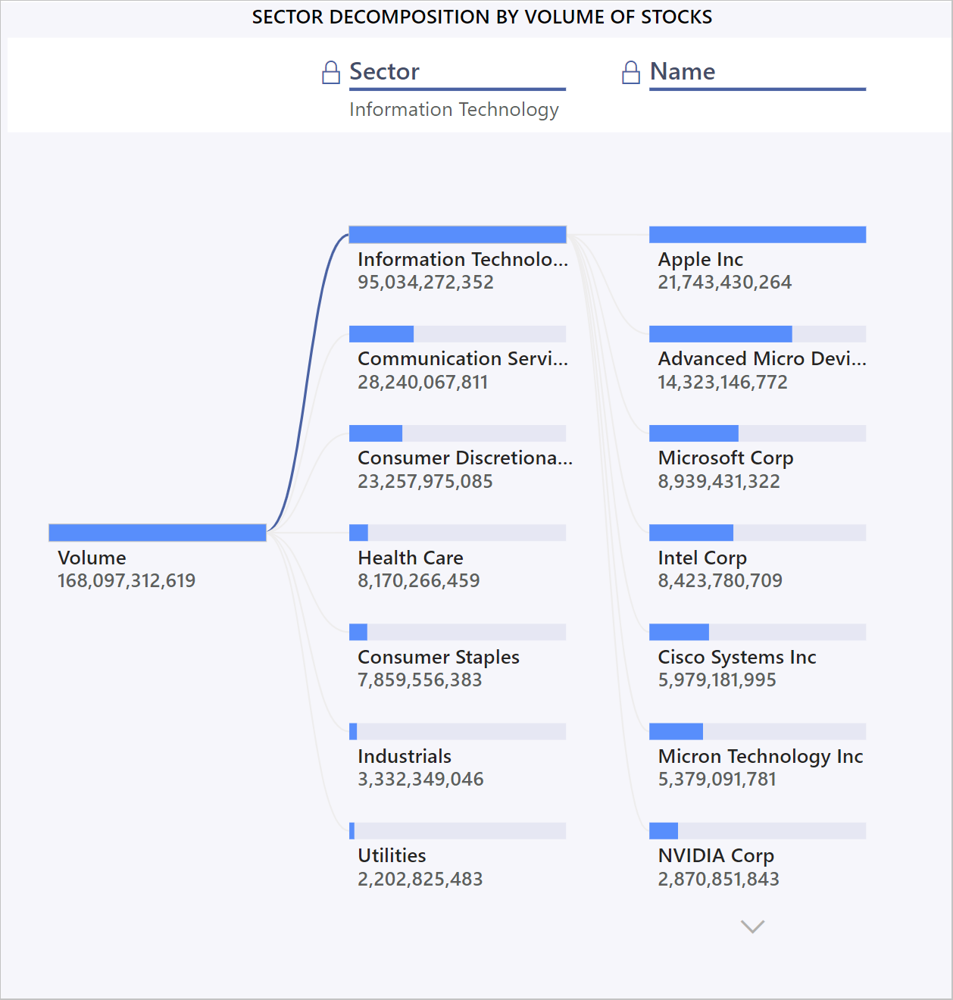

# Analyze popular stocks with Power BI

Meaning: Explain that it’s for tutorial/new user example, track popular stocks for personal use, compare stocks in power bi

The stock market app shows you multiple KPIs to start your analytics journey in Power BI. Use it to track end-of-day quotes as well as weekly, monthly, or yearly trends for popular stocks and ETFs. See Power BI in action with tracking of stock highs and lows, moving averages, sector-wise distribution, Bollinger bands, and even performance comparisons for popular stocks over time. 

## ETF Dashboard

The ETF dashboard includes the closing trends for four major indexes. You can choose to see the trend for a week, month or a year. The default view - graph view, helps you to understand how drastically the trend has changed over time. You can also switch to candlestick chart by clicking on the toggle switch at the top right of the page.

Hover the pointer over a chart to get the exact data point of a specific day.

The running banner at the top of the page shows you the current day's close and the price change from the previous days close for the four indexes shown on the page.

### Nasdaq closing trend

Nasdaq closing trend visual shows the closing trend of the stock market.

On the x-axis you can see the time period and on y-axis you can see the closing value. 

### S&P 500

The S&P 500 visual shows you the closing trend for the S&P 500 index. The S&P 500 index is regarded as the best single gauge of large-cap U.S. equities.

 
### Dow Jones

The Dow Jones index is another top index which is used to see closing trends. You can use Dow Jones to see the market growth of leaders in the IT industry, such as Microsoft. 

### Russell 3000

Russell 3000 is the most common benchmark for mutual funds. You can refer to “Russell 2000 closing trend” visual to invest in more than 2000 low range stocks. 

 
## Stocks and ETFs Comparison

The Stocks and ETFs Comparison page shows you normalized charts that enable you to compare selected stocks and ETFs.

To use this page, first select the stocks you wish to compare. 
1. Click the **Select** button
1. Click **Clear** to remove any previous selections
1. Select the stocks you wish to compare
1. Click **Apply** 

At the top of the page a banner shows you the current day's close and the difference from the previous day's close for the selected stocks.

The normalized comparison charts charts allow you to compare the performance of selected stocks and ETFs.

## Stock Performance Analysis

 Stock Performance Analysis page shows you important KPI’s about selected stock, such as the previous day's close, close, open, high, and low. Select the dropdown choose the stock you want to see from among the stocks you've selected for analysis. You will see that the value changes after clicking on the stock of your choice.
 
### Closing trend

You can see the closing trend for the selected stock, and you can choose to switch it to month view or year view by clicking on the buttons at the top left of the page. Having a year view will help you see how in which part of the year the stock has grown or fallen.

  

### Volume

You can look at the volume of selected stock by scrolling down to the next visual. You can hover at a time interval to see the volume of stock at that part of the year.

 
### OHLC chart

OHLC Charts are highly useful since they show four major datapoints for a given stock at same time. So, in the next visual down the page you will see OHLC visual which shows you opening, closing, high, and low of the stock selected. You can also look deeper into the data by changing the moving average. 

### Bollinger band

Bollinger band eases your decision making and helps you choose the right stock. Bollinger bands use complex mathematics to show the trends. You can see a number of KPI’s which were in OHLC, and along with that you can see another three lines. The middle line shows the moving average. The top line is shifted up by certain number of standard deviation and the bottom line is shifted down by a standard deviation.

 

## Sectorwise distribution

On the sector wise distribution page, you see the various stocks and the market they belong to. If you click on any of the sectors, the stocks will get filtered out, and the stocks belonging to the selected sector will start appearing. 

 

You can then hover over the stock to see the important KPI’s, such as previous close, close and the difference. The difference will help you understand how much the stock has fallen or grown since yesterday. You can scroll down to see all of the stocks in that category.
 
To see the distribution of market for different sectors we have the “Sector-wise distribution” visual which shows from top to down the sectors having the highest difference in their closing price from last day. You can choose to invest in high- or low-end sector by seeing this visual.

## Next steps

* [Tutorial: Connect to a GitHub repo with Power BI](service-tutorial-connect-to-github.md)
* [Create the new workspaces in Power BI](../collaborate-share/service-create-the-new-workspaces.md)
* [Install and use apps in Power BI](../consumer/end-user-apps.md)
* [Connect to Power BI apps for external services](service-connect-to-services.md)
* Questions? [Try asking the Power BI Community](https://community.powerbi.com/)
