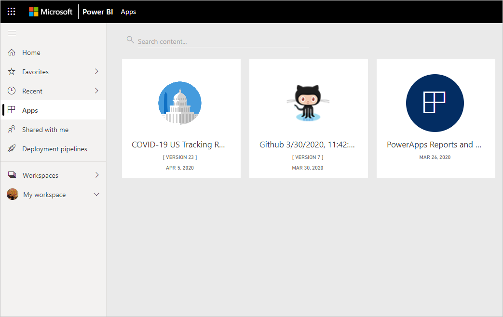
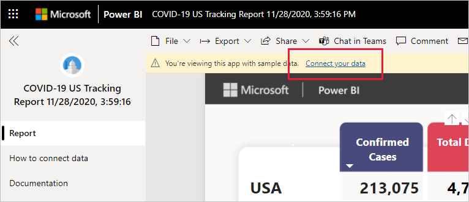
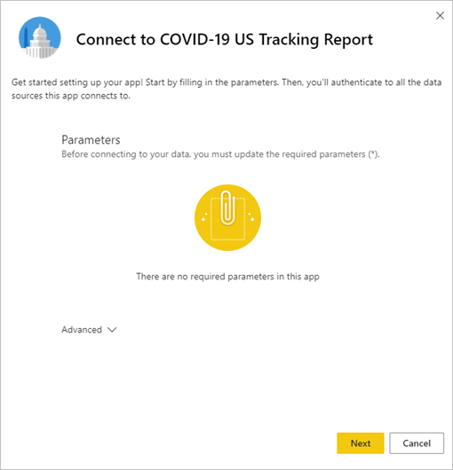
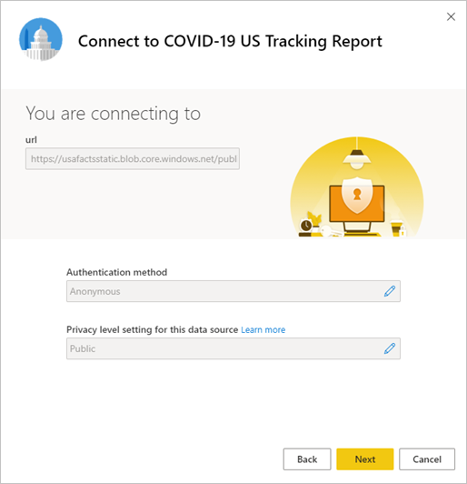
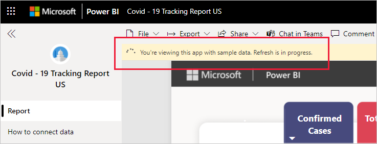

# Connect to the COVID-19 US tracking report
This article tells  you how to install the template app for the COVID-19 tracking report, and how to connect to the data sources.

For detailed information about the report itself, including disclaimers and information about the data, see [COVID-19 tracking sample for US state and local governments](../create-reports/sample-covid-19-us.md).

After you've installed the template app and connected to the data sources, you can customize the report as per your needs. You can then distribute it as an app to colleagues in your organization.

## Install the app

1. Click the following link to get to the app: [COVID-19 US Tracking Report template app](https://app.powerbi.com/groups/me/getapps/services/pbi-contentpacks.covid19ms)

1. Once you're on the App's AppSource page, click [**GET IT NOW**](https://app.powerbi.com/groups/me/getapps/services/pbi-contentpacks.covid19ms).

    

1. When prompted , click **Install**. Once the app has installed, you will see it on your Apps page.

   

## Connect to data sources

1. Click the icon on your Apps page to open the app. The app opens, showing sample data.

1. Select the **Connect your data** link on the banner at the top of the page.

   

1. The parameters dialog will appear. There are no required parameters. Click **Next**.

   

1. The authentication method dialog will appear. Recommended values are prepopulated. Don't change these unless you have specific knowledge of different values.

    Click **Next**.

   

1. Click **Sign in**.

   
 
   The report will connect to the data sources and be populated with up-to-date data. During this time you will see sample data and that refresh is in progress.

   

## Schedule report refresh

When the data refresh has completed, you will be in the workspace associated with the app. [Set up a refresh schedule](../connect-data/refresh-scheduled-refresh.md) to keep the report data up to date.

## Customize and share

See [Customize and share the app](../connect-data/service-template-apps-install-distribute.md#customize-and-share-the-app) for details. Be sure to review the [report disclaimers](../create-reports/sample-covid-19-us.md#disclaimers) before publishing or distributing the app.

## Related content

* [COVID-19 tracking sample for US state and local governments](../create-reports/sample-covid-19-us.md)
* Questions? [Try asking the Power BI Community](https://community.powerbi.com/)
* [What are Power BI template apps?](../connect-data/service-template-apps-overview.md)
* [Install and distribute template apps in your organization](../connect-data/service-template-apps-install-distribute.md)
