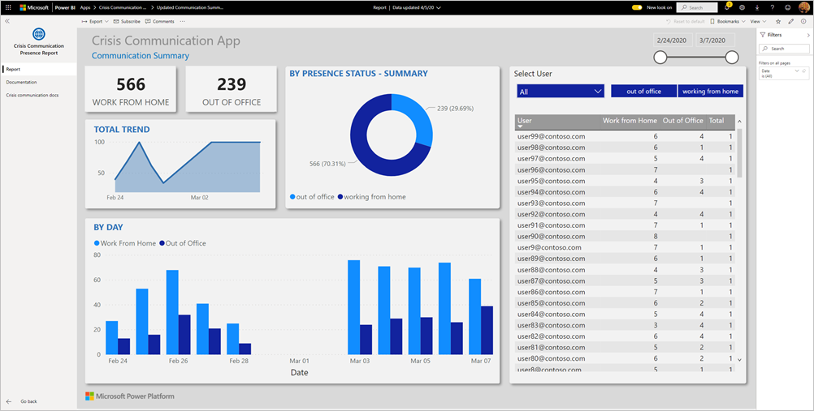
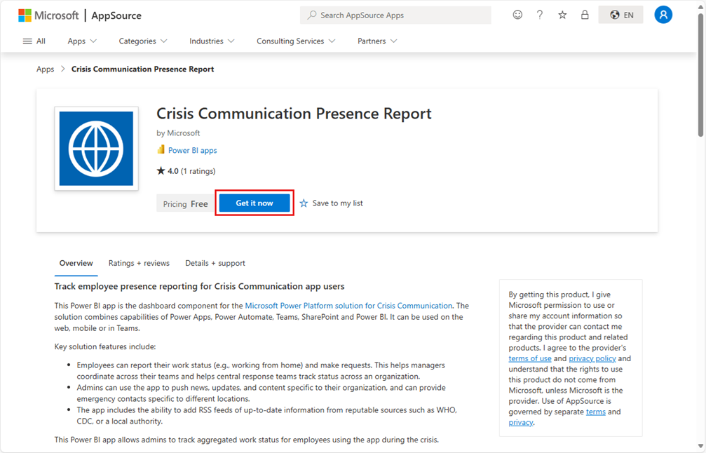
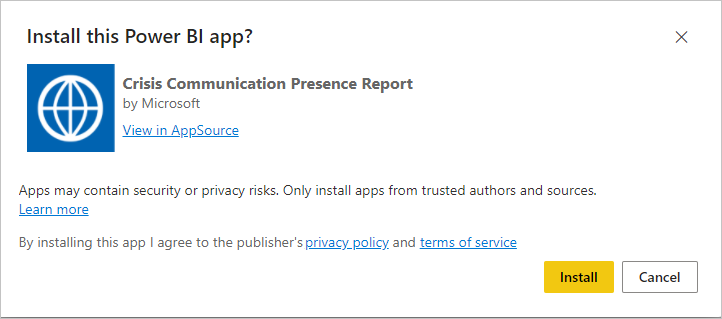
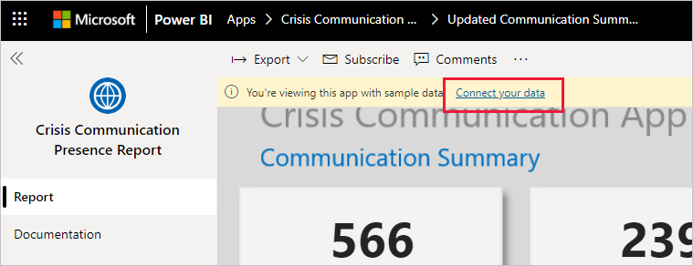
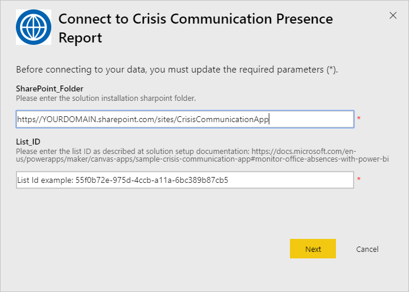
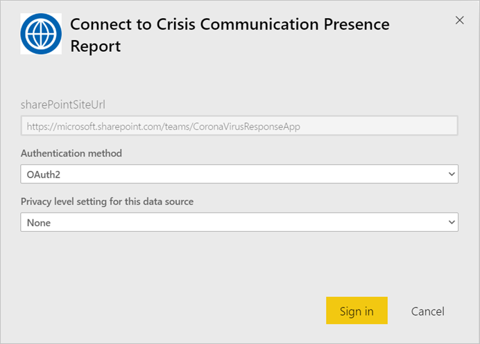
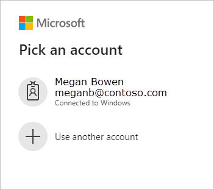
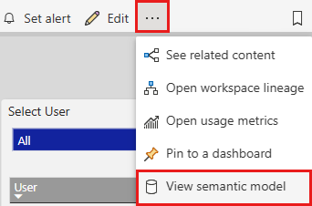

# Connect to the Crisis Communication Presence Report

This Power BI app is the report/dashboard artifact in the Microsoft Power Platform solution for Crisis Communication. It tracks worker location for Crisis Communication app users. The solution combines the capabilities of Power Apps, Power Automate, Teams, SharePoint, and Power BI. It can be used on the web, on mobile, or in Teams.

The dashboard shows emergency managers aggregate data across their health system to help them to make timely, correct decisions.

This article tells  you how to install the app and how to connect to the data sources. For more information about the Crisis Communication app, see [Set up and learn about the Crisis Communication sample app in Power Apps](/powerapps/maker/canvas-apps/sample-crisis-communication-app).

After you've installed the template app and connected to the data sources, you can customize the report as per your needs. You can then distribute it as an app to colleagues in your organization.

## Prerequisites

Before installing this template app, you must first install and set up the [Crisis Communication sample](/powerapps/maker/canvas-apps/sample-crisis-communication-app). Installing this solution creates the data source references necessary to populate the app with data.

When installing the Crisis Communication sample, take note of the [SharePoint list folder path of "CI_Employee Status" and list ID](/powerapps/maker/canvas-apps/sample-crisis-communication-app#monitor-office-absences-with-power-bi).

## Install the app

1. Click the following link to get to the app: [Crisis Communication Presence Report template app](https://appsource.microsoft.com/en-us/product/power-bi/pbi-contentpacks.crisiscomms)

1. On the AppSource page for the app, select [**Get it now**](https://appsource.microsoft.com/en-us/product/power-bi/pbi-contentpacks.crisiscomms).

    

1. In the installation dialog that appears, select **Install**.

    

    Once the app has installed, you see it on your Apps page.

## Connect to data sources

1. Select the entry in the list on your Apps page to open the app.

   The app opens, showing sample data.

1. Select the **Connect your data** link on the banner at the top of the page.

   

1. In the dialog:
   1. In the SharePoint_Folder field, enter your ["CI_Employee Status" SharePoint list path](/powerapps/maker/canvas-apps/sample-crisis-communication-app#monitor-office-absences-with-power-bi).
   1. In the List_ID field, enter your list ID that you got from list settings. When done, select **Next**.

   

1. In the next dialog that appears, set the authentication method to **OAuth2**. You don't have to do anything to the privacy level setting.

   Select **Sign in**.

   

1. At the Microsoft sign-in screen, sign in to Power BI.

   

   After you've signed in, the report connects to the data sources and is populated with up-to-date data. During this time, the activity monitor turns.

   

## Schedule report refresh

When the data refresh has completed, [set up a refresh schedule](../connect-data/refresh-scheduled-refresh.md) to keep the report data up to date.

1. In the ribbon at the top of the report, select the three horizontal dots icon, then select **View semantic model**.

   

1. On the page for the semantic model, select **Refresh** from the ribbon, then select **Schedule refresh** and follow the instructions described in the [Configure scheduled refresh](../connect-data/refresh-scheduled-refresh.md) article.

## Customize and share

See [Customize and share the app](../connect-data/service-template-apps-install-distribute.md#customize-and-share-the-app) for details. Be sure to review the [report disclaimers](../create-reports/sample-covid-19-us.md#disclaimers) before publishing or distributing the app.

## Related content

* [Set up and learn about the Crisis Communication sample template in Power Apps](/powerapps/maker/canvas-apps/sample-crisis-communication-app)
* Questions? [Try asking the Power BI Community](https://community.powerbi.com/)
* [What are Power BI template apps?](../connect-data/service-template-apps-overview.md)
* [Install and distribute template apps in your organization](../connect-data/service-template-apps-install-distribute.md)
