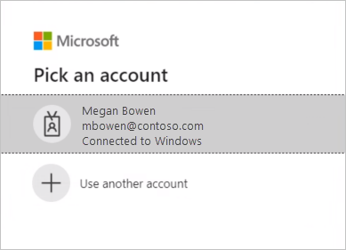
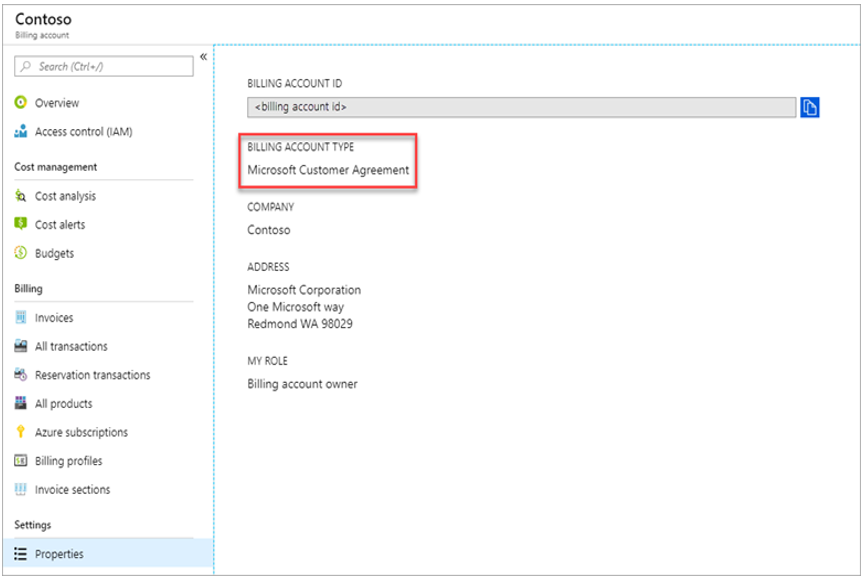

# Connect to the Emissions Impact Dashboard for Azure

Calculate your cloud-based carbon emissions today with the Emissions Impact Dashboard for Azure.

Accurate carbon accounting requires good information from partners, vendors, and suppliers. The Emissions Impact Dashboard for Azure gives you transparency on the carbon emissions generated by your usage of Azure and Microsoft Dynamics. Microsoft’s carbon accounting extends across all three scopes of emissions with a methodology validated by Stanford University in 2018. It uses consistent and accurate carbon accounting to quantify the impact of Microsoft cloud services on customers’ environmental footprint. Microsoft is the only cloud provider to provide this level of transparency to customers while compiling reports for voluntary or statutory reporting requirements.

> [!IMPORTANT]
> In February 2024, your data will undergo recalculation due to an update in the methodology that now allows for a more detailed attribution of carbon emissions. For more information about these changes, go to [Calculations update FAQ](#calculations-update-faq).

## Prerequisites

To install the Emissions Impact Dashboard for Azure in Power BI and connect it to your data, make sure you have a Power BI Pro license. If you don’t have a Power BI Pro license, [get a free trial now](https://powerbi.microsoft.com/power-bi-pro).

The Emissions Impact Dashboard for Azure is supported for EA Direct, MCA, and MPA accounts with direct billing relationships with Microsoft.

* If you have an EA Direct account, you must be a Billing Account Administrator (formerly known as an Enrollment Administrator) with either read or write permissions and have your company's [billing account ID](#finding-your-companys-billing-account-id) (formerly known as the enrollment number).

* If you have an MCA or MPA and direct billing relationship with Microsoft, you must be a Billing Account Administrator with a role as Billing Account Reader/Contributor/Owner and have your company's [billing account ID](#finding-your-companys-billing-account-id).

> [!IMPORTANT]
> Cloud solution providers (CSPs) are supported. Customers who purchase Azure from a CSP aren't supported and must work directly with their CSP partner to learn about their cloud emissions. Legacy accounts and China enrollments aren't supported.

## Install the app

1. Select the following link to get to the app: [Emissions Impact Dashboard template app](https://appsource.microsoft.com/en-us/marketplace/apps?search=emissions%20impact%20dashboard&page=1). 

1. On the AppSource page for the app, select **GET IT NOW**.

    :::image type="content" source="media/service-connect-to-emissions-impact-dashboard/appsource.png" alt-text="Screenshot of Emissions Impact Dashboard for Azure on AppSource.":::

    You can also search for the app in Power BI.

1. When prompted, select **Install**.

    :::image type="content" source="media/service-connect-to-emissions-impact-dashboard/install-app.png" alt-text="Screenshot of install dialog.":::

1. When the app finishes installing, it appears on your Power BI Apps page. Select the app and open it.

    :::image type="content" source="media/service-connect-to-emissions-impact-dashboard/app-on-app-page.png" alt-text="Screenshot of app installed on app page.":::

1. Select **Connect your data**.

    :::image type="content" source="media/service-connect-to-emissions-impact-dashboard/connect-your-data.png" alt-text="Screenshot of connect your data.":::

1. In the **Connect to Emissions Impact Dashboard** dialog that appears, under **EnrollmentIDorBillingAccountID**, enter either your billing account ID (formerly known as the enrollment number) for EA Direct customers or billing account ID for MCA/MPA.

    :::image type="content" source="media/service-connect-to-emissions-impact-dashboard/connect-enterprise-agreement.png" alt-text="Screenshot of connect to dialog 1.":::

    When done, select **Next**.
    
1. Connect your account:

    * For **Authentication method**, select **OAuth2**.
    * For **Privacy level setting for this data source**, select **Organizational**.
    * When done, select **Sign in and connect**.

    :::image type="content" source="media/service-connect-to-emissions-impact-dashboard/authentication-dialog.png" alt-text="Screenshot of authentication first dialog.":::

1. Select the user account. Be sure to sign in with the credentials that have access to the enrollmentID/Billing AccountID with valid permissions as explained in the [prerequisites](#prerequisites).

    

1. Wait for the view to build, which can take up to 24 hours. Refresh the dataset after 24 hours.

## Update the app

Periodically you might receive update notifications from Appsource/Power BI about a new version of the app. When you install the new version, the following options are available:

:::image type="content" source="media/service-connect-to-emissions-impact-dashboard/update-app.png" alt-text="Screenshot of Update app dialog.":::

Select **Update the workspace and the app**, and then select **Install**. The update installs, overwriting the existing/installed workspace and app.

### Issues

If there are any issues with the dataset refresh/app update during the updating process, validate these steps and refresh the dataset.

Follow these steps to make sure your dataset configurations are set correctly:

1. Go to the workspace panel and open the app workspace.

1. Open the **Scheduled Refresh** option in the dataset settings and make sure the [billing account ID](#finding-your-companys-billing-account-id) is correct.

    :::image type="content" source="media/service-connect-to-emissions-impact-dashboard/schedule-refresh.png" alt-text="Screenshot of schedule refresh.":::

1. Open the **Parameters** section and configure the data source again in the **Data Source** section with the credentials that have access to the **Enrollment ID / Billing Account ID** with valid permissions, mentioned in the [prerequisites](#prerequisites).

    :::image type="content" source="media/service-connect-to-emissions-impact-dashboard/data-source-credentials-parameters.png" alt-text="Screenshot of Data source Credentials Parameters.":::

1. After the above steps are validated, go back to the app workspace and select the **Refresh** option.

    :::image type="content" source="media/service-connect-to-emissions-impact-dashboard/data-refresh.png" alt-text="Screenshot of data refresh.":::

1. After the dataset refreshes successfully, select the **Update App** option at the top-right corner of the app workspace.

    :::image type="content" source="media/service-connect-to-emissions-impact-dashboard/updating-app.png" alt-text="Screenshot of Updating App.":::

## Additional resources

- [How-to video](https://learn-video.azurefd.net/vod/player?id=5f68866b-2e9b-4b84-bcc1-c862676cd456)
- [The carbon benefits of cloud computing: A study on the Microsoft Cloud in partnership with WSP](https://download.microsoft.com/download/7/3/9/739BC4AD-A855-436E-961D-9C95EB51DAF9/Microsoft_Cloud_Carbon_Study_2018.pdf)

## Finding your company's billing account ID

Follow these steps to find your company's billing account ID, or ask your organization’s Azure administrator.

1. In the [Azure portal](https://portal.azure.com), navigate to **Cost Management + Billing**.

1. In the **Billing Scopes** menu, select your billing account.

1. Under **Settings**, select **Properties**. Your billing account ID displays under **Billing account**.

   

## Calculations update FAQ

### Why are there updated values for my organization’s Azure emissions data?

In January 2024, we refined our methodology for attributing carbon estimates. This update allows for a more granular and precise allocation of carbon emissions to each Azure resource, subscription, and customer.

### What is the difference between the old and new methodologies?

The new methodology now allows for a more enhanced and detailed attribution of carbon emissions when a resource belongs to a nonspecific region such as **All**, **Null**, or **Global**. Instead of only subscription-level carbon emissions data, you can now access emissions information for each of your individual Azure resources. This granular data is accessible through the Cloud for Sustainability export APIs, Project ESG lake, and Azure Carbon Optimization capabilities. It enhances transparency and control over environmental impact.

### Is there a plan to update the Emissions Impact Dashboard for Azure to display granular, resource-grain emissions data?

At this time, we aren't enhancing the Emissions Impact Dashboard for Azure to display resource-level emissions data. The dashboard maintains its current functionality, continuing to present data at the subscription level. This data, powered by our updated methodology, aggregates all resource-level data in the background and displays it at the subscription level for a comprehensive view.

### Has all the historical data been updated to reflect the new methodology?

Yes, all historical Azure emissions data for your organization is recalculated using the new methodology.

### Is the data on the Emissions Impact Dashboard for Azure and Cloud for Sustainability API the same?

The Emissions Impact Dashboard and the Cloud for Sustainability API provide data based on the same source, and are the same.

### Is there an option for me to access my Azure emissions data using the old methodology?

Unfortunately, it isn't possible for us to provide the emissions data using the old methodology.

### Why can't I see emissions data for the previous month?

Emissions data for a given month will be available by the 15th day after the end of that month (including nonbusiness days).

## General FAQs

### App setup

**I’m receiving an error at the time of connecting my data with the dashboard. What can I do?**

First, check Microsoft Cost Management and verify that you have Admin privileges. If you don’t, request this access from your administrator. Next, ensure you’re using the correct billing account ID or enrollment number.

**I entered my enrollment number/billing account ID, but my company data isn’t loading. What’s the issue?**

The Emissions Impact Dashboard for Azure might take up to 24 hours to load your data. Return after 24 hours and select the **Refresh** button in Power BI.

**Is Microsoft trying to shift responsibility for emissions from Microsoft to me?**

No. Carbon emissions from Azure services are reported as Microsoft's scope 1 and 2 emissions, consistent with the industry-standard [Greenhouse Gas (GHG) Protocol](https://ghgprotocol.org/). The GHG Protocol defines scope 3 emissions as emissions another entity emits on your behalf, and are inherently double-counted. The Emissions Impact Dashboard for Azure provides new transparency to your scope 3 emissions associated with the use of Azure services, specifically Scope 3 Category 1 "Purchased goods and services."

**Why are my emissions from use of the Microsoft cloud so much lower than they would be if I were using an on-premises solution?**

Microsoft conducted [a study, published in 2018](https://blogs.microsoft.com/on-the-issues/2018/05/17/microsoft-cloud-delivers-when-it-comes-to-energy-efficiency-and-carbon-emission-reductions-study-finds/) that evaluated the difference between the Microsoft cloud and on-premises or traditional datacenters. The results show that Azure Compute and Storage are between 52 and 79 percent more energy-efficient than traditional enterprise datacenters. These numbers depend on the specific comparison too low, medium, or high efficiency on-premises alternative being made. If you take into account our renewable energy purchases, Azure is between 79 and 98 percent more carbon efficient. These savings are due to four key features of the Microsoft Cloud: IT operational efficiency, IT equipment efficiency, datacenter infrastructure efficiency, and renewable electricity.

**If Microsoft's operations are carbon neutral and powered by renewables, why aren't customer emissions from Azure services zero?**

There are two primary reasons why customer emissions from Microsoft aren’t zero. The first is related to GHG accounting practices, and the second has to do with the boundary of this analysis. To achieve carbon neutral operations, Microsoft uses carbon offsets to reduce certain emission sources such as onsite fuel combustion for backup generators, refrigerants, and vehicle fleets. These reduce Microsoft’s *net* emissions to zero. The dashboard reports *gross* GHG emissions before the application of these offsets, though the volume of offsets applied and net emissions is reported in the **GHG Reporting** tab for further transparency. The second reason is that in addition to the energy and emissions associated with the operation of Microsoft's datacenters, the emissions footprint includes the energy used by Internet Service Providers outside of Microsoft’s operational boundary to transmit data between Microsoft datacenters and Azure customers.

**How am I supposed to use this data, and where do I report it?**

Your emissions can be reported as part of your company's Scope 3 indirect carbon emissions. Scope 3 emissions are often disclosed in sustainability reports, CDP climate change, and other reporting outlets. In addition to the emissions totals, the emissions savings provide a clear example of how your company's decision to use Microsoft Azure services is contributing to global emissions reductions. To contextualize, the app indicates the equivalent vehicle miles avoided corresponding to the reduction in GHG emissions, based on EPA’s equivalency calculator factors as of January 2020.

**What can I do to reduce emissions further?**

Being resource and cost efficient in Azure reduces the environmental impact from your use of Azure. As an example, unused virtual machines are wasteful whether in the cloud or on-premises. Right-sizing virtual machines to improve compute utilization factors (CUF) decreases energy use per useful output, just as it does with physical servers. [Microsoft Cost Management](/azure/cost-management-billing/costs/cost-mgt-best-practices) and [Azure carbon optimization](/azure/carbon-optimization/overview) give you the tools to plan for, analyze and reduce your spending to maximize your cloud investment. The [sustainability guidance within the Azure Well-Architected Framework (WAF)](/azure/architecture/framework/sustainability/) is also designed to help you optimize your cloud workloads and reduce your operational footprint.

**My company contract renewal process is underway and we'll have a new account number. Will I lose my historical emissions data?**

Yes, you will. Before your renewal, be sure to download all historical data and reports you need for your records.

**Can I export emissions data to Microsoft Excel?**

You can export data from the **GHG Preparation** report, **Usage** report, and dashboard page on a per-visualization level. You can't export the overall report’s data from the **Export** button on the top header.

> [!NOTE]
> Export to Excel is limited to 150,000 rows, and export to CSV is limited to 30,000 rows.

### Methodology

**What is the methodology behind the tool?**

The Emissions Impact Dashboard for Azure reflects the specific cloud services consumed and the associated energy requirements, efficiency of the datacenters providing those services, electricity fuel mixes in the regions in which those datacenters operate, and Microsoft’s purchases of renewable energy.

As part of the app’s development, the methodology and its implementation went through third-party verification to ensure that it aligns to the World Resources Institute (WRI)/World Business Council for Sustainable Development (WBCSD) Greenhouse Gas (GHG) Protocol Corporate Accounting and Reporting Standard. The scope of the verification, conducted in accordance with ISO 14064-3: Greenhouse gases--Part 3: Specification with guidance for the validation and verification of greenhouse gas assertions, included the estimation of emissions from Azure services, but excluded the estimation of on-premises emissions given the counterfactual nature of that estimate. A more detailed description of the carbon calculation is documented in the **Calculation Methodology** tab in the tool.

**What data is required to calculate the Azure carbon footprint? Do you access my company's data?**

The estimated carbon calculations are performed based on consumption of Azure services accessed using Azure Consumed Revenue. The dashboard doesn't access any of your stored customer data. The consumption data is combined with Microsoft's energy and carbon tracking data to compute the estimated emissions associated with your consumption of Azure services based on the datacenters that provide those services.

**Does this calculation include all Azure services and all Azure regions?**

The estimates include all Azure services in all Azure regions associated with the tenant ID provided during setup.

### Characterizing on-premises emissions

**Where does the Emissions Impact Dashboard for Azure obtain data about my on-premises emissions and operations?**

The Emissions Impact Dashboard for Azure doesn’t obtain any information specifically about your on-premises datacenters *except* what you provide. As described in subsequent FAQs, the Emissions Impact Dashboard for Azure relies on industry research and user inputs about the efficiency and energy mix of on-premises alternatives to develop an estimate of on-premises emissions.

**What are the assumptions regarding on-premises estimations? Are efficiency savings just from improvements in Power Usage Effectiveness (PUE)?**

Efficiencies associated with Microsoft cloud services include far more than improved PUE. While Microsoft datacenters strive to optimize PUE, the primary efficiency improvements come from IT operational efficiency (dynamic provisioning, multitenancy, server utilization) and IT equipment efficiency (tailoring hardware to services ensuring more energy goes towards useful output), in addition to datacenter infrastructure efficiency (PUE improvements). Our [2018 study](https://blogs.microsoft.com/on-the-issues/2018/05/17/microsoft-cloud-delivers-when-it-comes-to-energy-efficiency-and-carbon-emission-reductions-study-finds/) quantifies these savings compared to a range of on-premises alternatives ranging from low-efficiency to high-efficiency datacenters. These findings are used to estimate the energy use required for a corresponding on-premises datacenter to provide the same services that each customer consumes on the Microsoft cloud.

**What is the assumed energy mix for the on-premises infrastructure?**

By default, the Emissions Impact Dashboard for Azure estimates on-premises emissions based on the mix of renewables and nonrenewables on the grid. It's assumed that the on-premises datacenter would be located on the same grid as Microsoft’s datacenters. However, for customers who purchase renewable electricity *in addition to* what’s on the grid (for example, through Power Purchase Agreements), users can select the percentage of renewable electricity, and the Emissions Impact Dashboard for Azure adjusts on-premises emissions accordingly.

**When should I choose Low, Medium, or High for the efficiency of the on-premises infrastructure?**

Users should select the efficiency most representative of the on-premises deployment they would like to compare against, based on the equipment and datacenter characteristics here:

- **Low**: Physical servers and direct attached storage in small localized datacenter (500-1,999 square feet)
- **Medium**: Mix of physical/virtualized servers and attached/dedicated storage in mid-tier internal datacenter (2,000-19,999 square feet)
- **High**: Virtualized servers and dedicated storage in high-end internal datacenter (>20,000 square feet)
