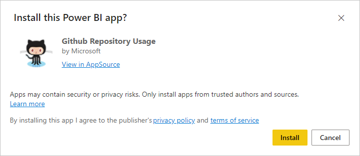
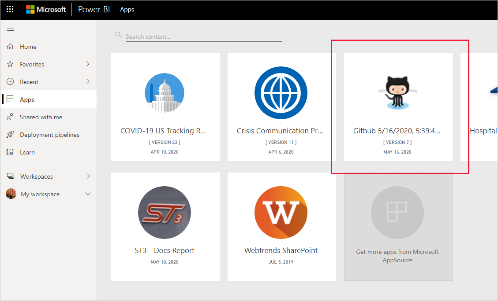
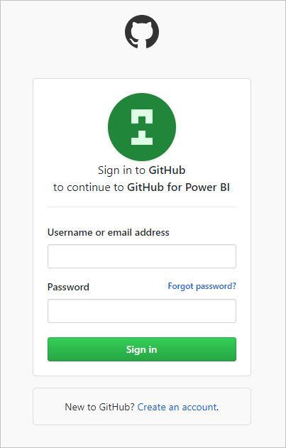
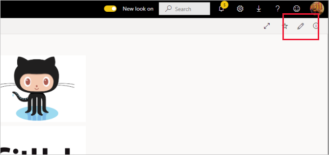

# Connect to GitHub with Power BI
This article walks you through pulling your data from your GitHub account with a Power BI template app. The template app generates a workspace with a dashboard, a set of reports, and a semantic model to allow you to explore your GitHub data. The GitHub app for Power BI shows you insights into your GitHub repository, also known as repo, with data around contributions, issues, pull requests, and active users.


After you've installed the template app, you can change the dashboard and report. Then you can distribute it as an app to colleagues in your organization.

Connect to the [GitHub template app](https://app.powerbi.com/groups/me/getapps/services/pbi-contentpacks.pbiapps-github) or read more about the [GitHub integration](https://powerbi.microsoft.com/integrations/github) with Power BI.

You can also try the [GitHub tutorial](service-tutorial-connect-to-github.md). It installs real GitHub data about the public repo for the  Power BI documentation.

>[!NOTE]
>This template app requires the GitHub account to have access to the repo. More details on requirements below.
>
>This template app does not support GitHub Enterprise.

## Install the app

1. Click the following link to get to the app: [GitHub template app](https://app.powerbi.com/groups/me/getapps/services/pbi-contentpacks.pbiapps-github)

1. On the AppSource page for the app, select [**GET IT NOW**](https://app.powerbi.com/groups/me/getapps/services/pbi-contentpacks.pbiapps-github).

    [](https://app.powerbi.com/groups/me/getapps/services/pbi-contentpacks.pbiapps-github)

1. Select **Install**. 

    

    Once the app has installed, you see it on your Apps page.

   

## Connect to data sources

1. Select the icon on your Apps page to open the app.

   The app opens, showing sample data.

1. Select the **Connect your data** link on the banner at the top of the page.

   

1. This opens the parameters dialog, where you change the data source from the sample data to your own data source (see [known limitations](service-template-apps-overview.md#known-limitations)), followed by the authentication method dialog. You may have to redefine the values in these dialogs.

   


1. Enter your GitHub credentials and follow the GitHub authentication process (this step might be skipped if you're already signed in with your browser).

   


Once you've finished filling out the connection dialogs and signed in to GitHub, the connection process starts. A banner informs you that the data is being refreshed, and that in the meantime you are viewing sample data.


Your report data will automatically refresh once a day, unless you disabled this during the sign-in process. You can also [set up your own refresh schedule](./refresh-scheduled-refresh.md) to keep the report data up to date if you so desire.

## Customize and share

To customize and share your app, select the pencil icon at the top right corner of the page.




For information about editing items in the workspace, see
* [Tour the report editor in Power BI](../create-reports/service-the-report-editor-take-a-tour.md)
* [Basic concepts for designers in the Power BI service](../fundamentals/service-basic-concepts.md)

Once you are done making any changes you wish to the items in the workspace, you are ready to publish and share the app. See [Create and publish your app](../collaborate-share/service-create-distribute-apps.md) to learn how to do this.

## What's included in the app
The following data is available from GitHub in Power BI:     

| Table name | Description |
| --- | --- |
| Contributions |The contributions table gives the total additions, deletions, and commits authored by the contributor aggregated per week. The top 100 contributors are included. |
| Issues |List all issues for the selected repo and it contains calculations like total and average time to close an issue, Total open issues,  Total closed issues. This table will be empty when there are no issues in the repo. |
| Pull requests |This table contains all the Pull Requests for the repo and who pulled the request. It also contains calculations around how many open, closed, and total pull requests, how long it took to pull the requests and how long the average pull request took. This table will be empty when there are no pull requests in the repo. |
| Users |This table provides a list of GitHub users or contributors who have made contributions, filed issues, or solved Pull requests for the repo selected. |
| Milestones |It has all the Milestones for the selected repo. |
| DateTable |This table contains dates from today and for years in the past that allow you to analyze your GitHub data by date. |
| ContributionPunchCard |This table can be used as a contribution punch card for the selected repo. It shows commits by day of week and hour of day. This table is not connected to other tables in the model. |
| RepoDetails |This table provides details for the repo selected. |

## System requirements
* The GitHub account that has access to the repo.  
* Permission granted to the Power BI for GitHub app during first login. See details below on revoking access.  
* Sufficient API calls available to pull and refresh the data.
>[!NOTE]
>This template app does not support GitHub Enterprise.

### De-authorize Power BI
To de-authorize Power BI from being connected to your GitHub repo, you can Revoke access in GitHub. See this [GitHub help](https://help.github.com/articles/keeping-your-ssh-keys-and-application-access-tokens-safe/#reviewing-your-authorized-applications-oauth) topic for details.

<a name="FindingParams"></a>
## Finding parameters
You can determine the owner and repository by looking at the repository in GitHub itself:


The first part "Azure" is the owner and the second part "azure-sdk-for-php" is the repository itself.  You see these same two items in the URL of the repository:

```console
<https://github.com/Azure/azure-sdk-for-php> .
```

## Troubleshooting
If necessary, you can verify your GitHub credentials.  

1. In another browser window, go to the GitHub web site and sign in to GitHub. You can see you’re logged in, in the upper-right corner of the GitHub site.    
2. In GitHub, navigate to the URL of the repo you plan to access in Power BI. For example: https://github.com/dotnet/corefx.  
3. Back in Power BI, try connecting to GitHub. In the Configure GitHub dialog box, use the names of the repo and repo owner for that same repo.  

## Related content

* [Tutorial: Connect to a GitHub repo with Power BI](service-tutorial-connect-to-github.md)
* [Create workspaces in Power BI](../collaborate-share/service-create-the-new-workspaces.md)
* [Install and use apps in Power BI](../consumer/end-user-apps.md)
* [Connect to Power BI apps for external services](service-connect-to-services.md)
* Questions? [Try asking the Power BI Community](https://community.powerbi.com/)
