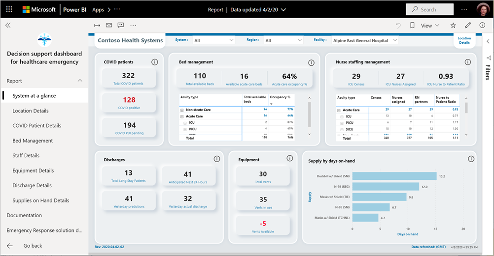
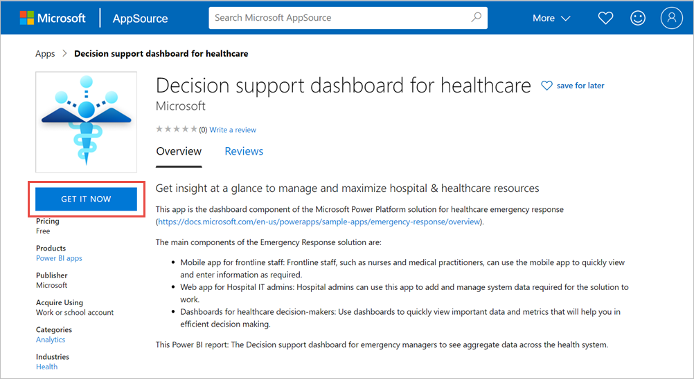
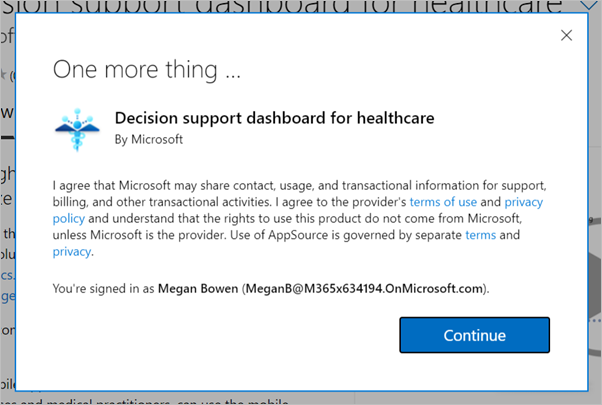
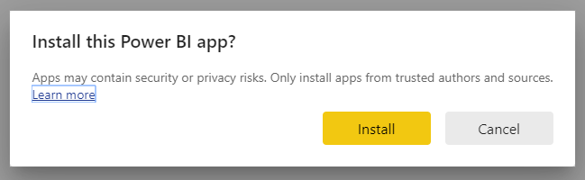
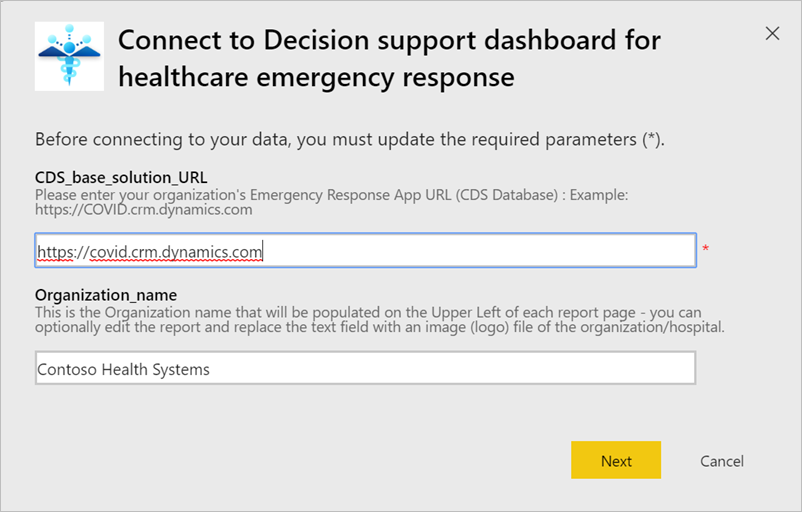
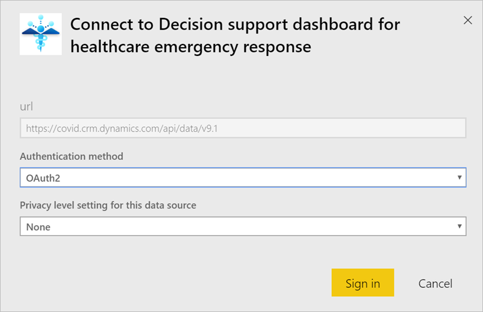
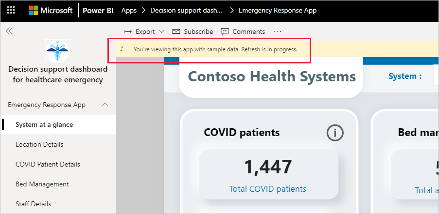
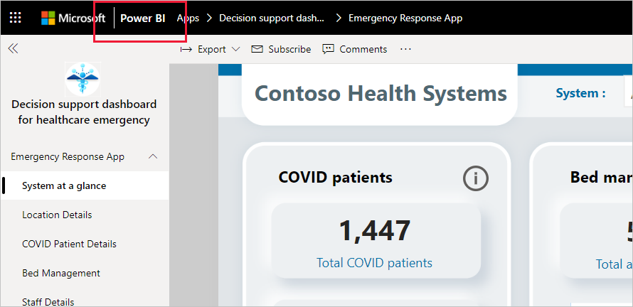

# Connect to the Hospital Emergency Response Decision Support Dashboard
The Hospital Emergency Response Decision Support Dashboard template app is the reporting component of the [Microsoft Power Platform solution for healthcare emergency response](https://powerapps.microsoft.com/blog/emergency-response-solution-a-microsoft-power-platform-solution-for-healthcare-emergency-response/). The dashboard shows emergency managers aggregate data across their health system to help them to make timely, correct decisions.

This article tells  you how to install the app and how to connect to the data sources. To learn how to use the report that you will see with this app, see the [Hospital Emergency Response Decision Support Dashboard documentation](/powerapps/sample-apps/emergency-response/deploy-configure#view-the-power-bi-dashboard).

After you've installed the template app and connected to the data sources, you can customize the report as per your needs. You can then distribute it as an app to colleagues in your organization.

## Prerequisites

Before installing this template app, you must first install and set up the [Hospital Emergency Response Power Platform solution](/powerapps/sample-apps/emergency-response/deploy-configure). Installing this solution creates the datasource references necessary to populate the app with data.

When installing Hospital Emergency Response Power Platform solution, take note of the [URL of your Common Data Service environment instance](/powerapps/sample-apps/emergency-response/deploy-configure#publish-the-power-bi-dashboard). You will need it to connect the template app to the data.

## Install the app

1. Click the following link to get to the app: [Hospital Emergency Response Decision Support Dashboard template app](https://aka.ms/AppSource_Hospital_offer)

1. On the AppSource page for the app, select [**GET IT NOW**](https://aka.ms/AppSource_Hospital_offer).

    

1. Read the information in **One more thing**, and select **Continue**.

    

1. Select **Install**. 

    

    Once the app has installed, you see it on your Apps page.

   

## Connect to data sources

1. Select the icon on your Apps page to open the app.

1. On the splash screen, select **Explore**.

   

   The app opens, showing sample data.

1. Select the **Connect your data** link on the banner at the top of the page.

   

1. In the dialog box:
   1. In the organization name field, enter the name of your organization, for example, "Contoso Health Systems". This field is optional. This name appears in the upper-left side of the dashboard.
   1. In the CDS_base_solution field, Type the [URL of your Common Data Service environment instance](/powerapps/sample-apps/emergency-response/deploy-configure#publish-the-power-bi-dashboard). For example: https://[myenv].crm.dynamics.com. When done, click **Next**.

   

1. In the next dialog that appears, set the authentication method to **OAuth2**. You don't have to do anything to the privacy level setting.

   Select **Sign in**.

   

1. At the Microsoft sign-in screen, sign in to Power BI.

   

   After you've signed in, the report connects to the data sources and is populated with up-to-date data. During this time, the activity monitor turns.

   

## Schedule report refresh

When the data refresh has completed, [set up a refresh schedule](../connect-data/refresh-scheduled-refresh.md) to keep the report data up to date.

1. In the top header bar, select **Power BI**.

   

1. In the left navigation pane, look for the Hospital Emergency Response Decision Support Dashboard workspace under **Workspaces**, and follow the instructions described in the [Configure scheduled refresh](../connect-data/refresh-scheduled-refresh.md) article.

## Customize and share

See [Customize and share the app](../connect-data/service-template-apps-install-distribute.md#customize-and-share-the-app) for details. Be sure to review the [report disclaimers](../create-reports/sample-covid-19-us.md#disclaimers) before publishing or distributing the app.

## Related content

* [Understanding the Hospital Emergency Response report](/powerapps/sample-apps/emergency-response/deploy-configure#view-the-power-bi-dashboard)
* [Set up and learn about the Crisis Communication sample template in Power Apps](/powerapps/maker/canvas-apps/sample-crisis-communication-app)
* Questions? [Try asking the Power BI Community](https://community.powerbi.com/)
* [What are Power BI template apps?](../connect-data/service-template-apps-overview.md)
* [Install and distribute template apps in your organization](../connect-data/service-template-apps-install-distribute.md)