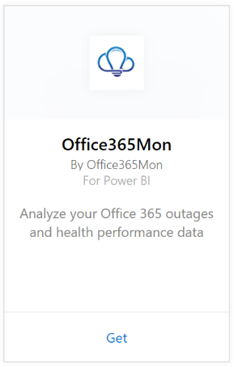

# Connect to Office365Mon with Power BI

Analyzing your Office 365 outages and health performance data is easy with Power BI and the Office365Mon template app. Power BI retrieves your data, including outages and health probes, and then builds an out-of-the-box dashboard and reports based on that data.

Connect to the [Office365Mon template app](https://msit.powerbi.com/groups/me/getapps/services/office365mon.office365mon_powerbi_v3) for Power BI.

>[!NOTE]
>You need an Office365Mon admin account to connect to and load the Power BI template app.

## How to connect

1. Select **Connect your data** at the top of the screen:
   
   :::image type="content" source="media/service-connect-to-office365mon/connect-your-data.png" alt-text="Screenshot that shows the Connect your data link." lightbox="media/service-connect-to-office365mon/connect-your-data.png":::

2. In the **Connect to Office365 PowerBI Template Pack** window, select **Next**:
   
   :::image type="content" source="media/service-connect-to-office365mon/connect-template.png" alt-text="Screenshot that shows the Connect to Office365 PowerBI Template Pack window.":::

3. Select **Office365Mon** \> **Get**.
   
   
4. For Authentication Method, select **oAuth2** \> **Sign In**.
   
   When prompted, enter your Office365Mon admin credentials and follow the authentication process.
   
   
   
   
5. After Power BI imports the data you will see a new dashboard, report, and dataset in the nav pane. New items are marked with a yellow asterisk \*, select the Office365Mon entry.
   
   

**What now?**

* Try [asking a question in the Q&A box](../consumer/end-user-q-and-a.md) at the top of the dashboard
* [Change the tiles](../create-reports/service-dashboard-edit-tile.md) in the dashboard.
* [Select a tile](../consumer/end-user-tiles.md) to open the underlying report.
* While your dataset will be scheduled to refresh daily, you can change the refresh schedule or try refreshing it on demand using **Refresh Now**

## Troubleshooting
If you get a **"login failed"** error after using your Office365Mon subscription credentials to login, then the account you are using doesn't have permissions to retrieve the Office365Mon data from your account. Verify it is an admin account and try again.

## Next steps
[What is Power BI?](../fundamentals/power-bi-overview.md)

[Get Data for Power BI](service-get-data.md)
