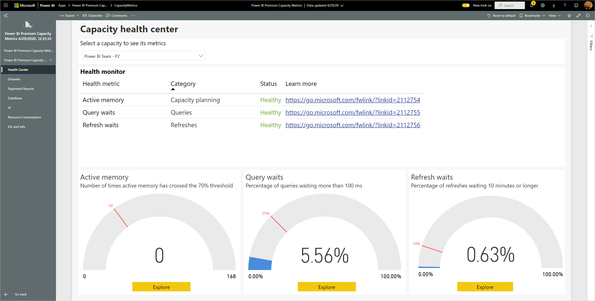
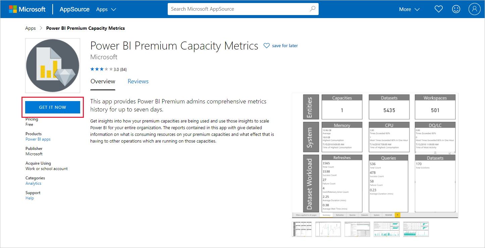
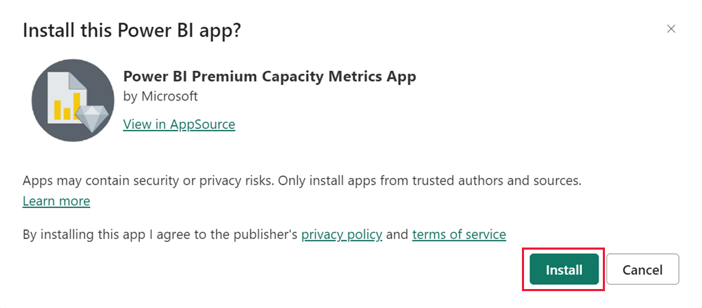
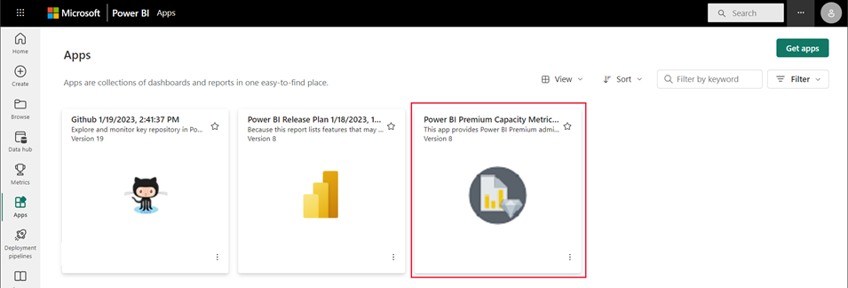
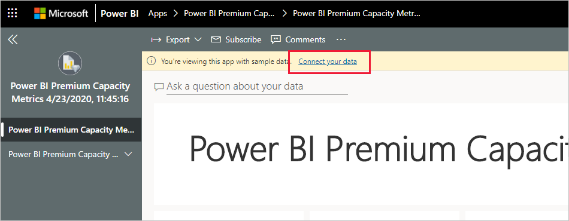
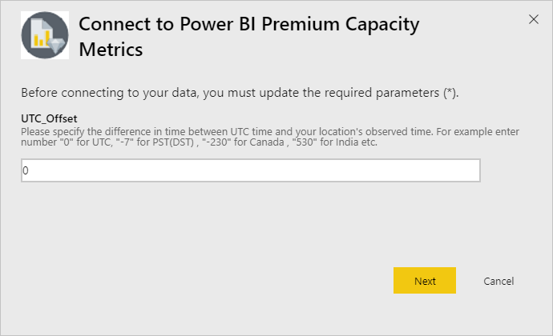
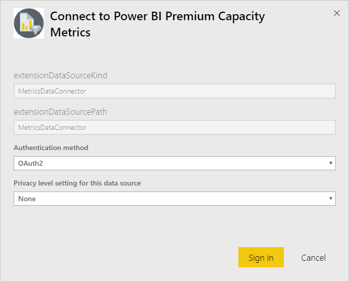
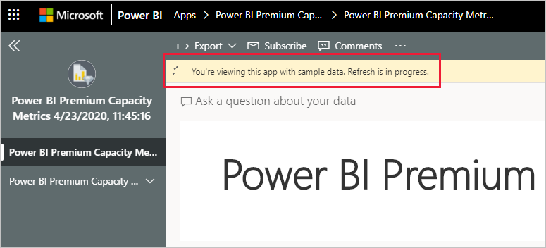
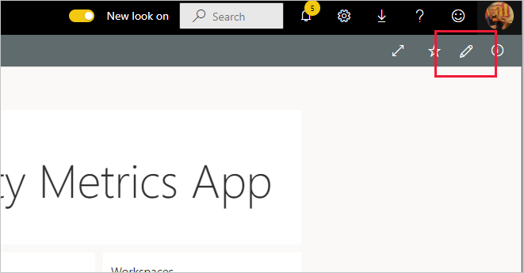

# Connect to Power BI Premium Capacity Metrics

Monitoring your capacities is essential to making informed decisions on how best to utilize your Premium capacity resources. The Power BI Premium Capacity Metrics app provides the most in-depth information into how your capacities are performing.

This article describes how to install the app and connect to data sources. For information about the contents of the report and how to use it, see [Monitor Premium capacities with the app](../enterprise/service-premium-gen2-metrics-app.md), and the [Premium Capacity Metrics app blog post](https://powerbi.microsoft.com/blog/premium-capacity-metrics-app-new-health-center-with-kpis-to-explore-relevant-metrics-and-steps-to-mitigate-issues/).

After you've installed the app and connected to the data sources, you can customize the report as per your needs. You can then distribute it to colleagues in your organization.

> [!NOTE]
> Installing template apps requires [permissions](./service-template-apps-install-distribute.md#prerequisites). Contact your Power BI admin if you find you don't have sufficient permissions.

## Install the app

1. Click the following link to get to the app: [Power BI Premium Capacity Metrics template app](https://app.powerbi.com/groups/me/getapps/services/pbi_pcmm.capacity-metrics-dxt)

1. On the AppSource page for the app, select [**GET IT NOW**](https://app.powerbi.com/groups/me/getapps/services/pbi_pcmm.capacity-metrics-dxt).

    

1. Select **Install**. 

    

    > [!NOTE]
    > If you've installed the app previously, you will be asked whether you want to [overwrite that installation](./service-template-apps-install-distribute.md#update-a-template-app) or install to another workspace.

    Once the app has installed, you see it on your Apps page.

   

## Connect to data sources

1. Select the icon on your Apps page to open the app.

1. On the splash screen, select **Explore**.

   

   The app opens, showing sample data.

1. Select the **Connect your data** link on the banner at the top of the page.

   

1. In the dialog box that appears, set the UTC offset, that is, the difference in hours between Coordinated Universal Time and the time in your location. Then click **Next**.
  
   
   **Note: The format for half hours should be decimal (for example, 5.5, 2.5, etc.).**

1. In the next dialog that appears, you don't have to do anything. Just select **Sign in**.

   

1. At the Microsoft sign-in screen, sign in to Power BI.

   

   After you've signed in, the report connects to the data sources and is populated with up-to-date data. During this time, the activity monitor turns.

   

   Your report data will automatically refresh once a day, unless you disabled this during the sign-in process. You can also [set up your own refresh schedule](./refresh-scheduled-refresh.md) to keep the report data up to date if you so desire.

## Customize and share

To start customizing the app, click the pencil icon in the upper right corner.

 

See [Customize and share the app](./service-template-apps-install-distribute.md#customize-and-share-the-app) for details.

## Next steps
* [Monitor Premium capacities with the app](../enterprise/service-premium-gen2-metrics-app.md)
* [Premium Capacity Metrics app blog post](https://powerbi.microsoft.com/blog/premium-capacity-metrics-app-new-health-center-with-kpis-to-explore-relevant-metrics-and-steps-to-mitigate-issues/)
* [What are Power BI template apps?](./service-template-apps-overview.md)
* [Install and distribute template apps in your organization](./service-template-apps-install-distribute.md)
* Questions? [Try asking the Power BI Community](https://community.powerbi.com/)