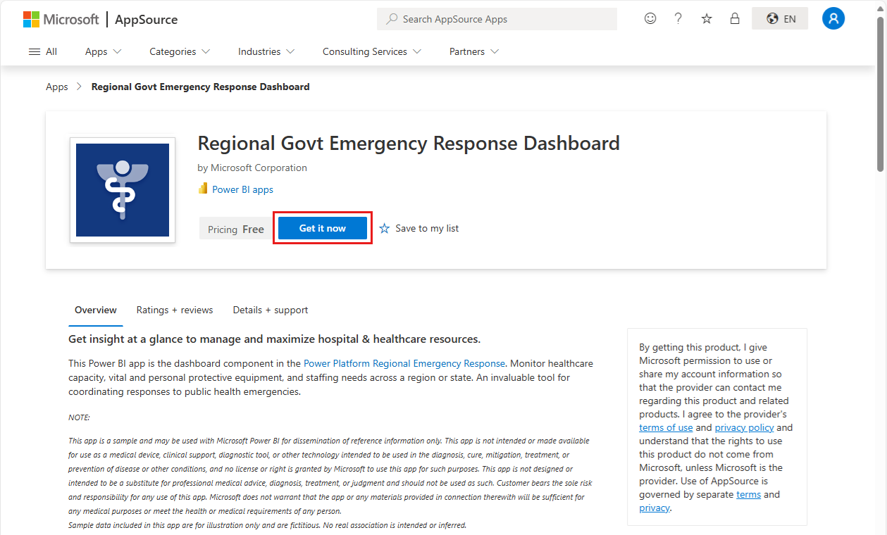

# Connect to the Regional Emergency Response Dashboard
The Regional Emergency Response Dashboard is the reporting component of the [Microsoft Power Platform Regional Emergency Response solution](/powerapps/sample-apps/regional-emergency-response/overview). Regional organization admins can view the dashboard in their Power BI tenant, enabling them to quickly view important data and metrics that will help them make efficient decisions.

This article tells  you how to install the Regional Emergency Response app using the Regional Emergency Response Dashboard template app, and how to connect to the data sources.

For detailed information about what is presented in the dashboard, see [Get insights](/powerapps/sample-apps/regional-emergency-response/portals-admin-reporting#get-insights).

After you've installed the template app and connected to the data sources, you can customize the report as per your needs. You can then distribute it as an app to colleagues in your organization.

## Prerequisites

Before installing this template app, you must first install and set up the [Regional Emergency Response solution](/powerapps/sample-apps/regional-emergency-response/deploy). Installing this solution creates the datasource references necessary to populate the app with data.

When installing Regional Emergency Response solution, take note of the [URL of your Common Data Service environment instance](/powerapps/sample-apps/regional-emergency-response/deploy#step-5-configure-and-publish-power-bi-dashboard). You will need it to connect the template app to the data.

## Install the app

1. Click the following link to get to the app: [Regional Emergency Response Dashboard template app](https://appsource.microsoft.com/product/power-bi/powerapps_cxo.regional_response)

1. On the AppSource page for the app, select [**GET IT NOW**](https://appsource.microsoft.com/product/power-bi/powerapps_cxo.regional_response).

    

1. Select **Install**. 

    

    Once the app has installed, you see it on your Apps page.

   

## Connect to data sources

1. Select the icon on your Apps page to open the app.

1. On the splash screen, select **Explore**.

   

   The app opens, showing sample data.

1. Select the **Connect your data** link on the banner at the top of the page.

   

1. In the dialog box that appears, type the [URL of your Common Data Service environment instance](/powerapps/sample-apps/emergency-response/deploy-configure#publish-the-power-bi-dashboard). For example: https://[myenv].crm.dynamics.com. When done, click **Next**.

   

1. In the next dialog that appears, set the authentication method to **OAuth2**. You don't have to do anything to the privacy level setting.

   Select **Sign in**.

   

1. At the Microsoft sign-in screen, sign in to Power BI.

   

   After you've signed in, the report connects to the data sources and is populated with up-to-date data. During this time, the activity monitor turns.

   

## Schedule report refresh

When the data refresh has completed, [set up a refresh schedule](../connect-data/refresh-scheduled-refresh.md) to keep the report data up to date.

1. In the top header bar, select **Power BI**.

   

1. In the left navigation pane, look for the Regional Emergency Response Dashboard workspace under **Workspaces**, and follow the instructions described in the [Configure scheduled refresh](../connect-data/refresh-scheduled-refresh.md) article.

## Customize and share

See [Customize and share the app](../connect-data/service-template-apps-install-distribute.md#customize-and-share-the-app) for details. Be sure to review the [report disclaimers](/powerapps/sample-apps/regional-emergency-response/overview#disclaimer) before publishing or distributing the app.

## Related content

* [Understanding the Regional Emergency Response dashboard](/powerapps/sample-apps/regional-emergency-response/portals-admin-reporting#get-insights)
* [Set up and learn about the Crisis Communication sample template in Power Apps](/powerapps/maker/canvas-apps/sample-crisis-communication-app)
* Questions? [Try asking the Power BI Community](https://community.powerbi.com/)
* [What are Power BI template apps?](../connect-data/service-template-apps-overview.md)
* [Install and distribute template apps in your organization](../connect-data/service-template-apps-install-distribute.md)