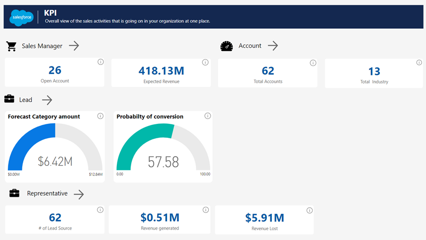

# Salesforce Analytics for Sales Managers

The Salesforce Analytics for Sales Managers template app includes visuals and insights for analyzing your marketing effort.

The app's out-of-the-box dashboard provides key metrics, such as your sales pipeline, best accounts, and KPI's. You can drill down into the report for more details on each aspect. Fully interactive visuals help you explore your data further.

In this article we will walk through the app using sample data, to give you an idea of how you can use the app to gain key insights into your sales data.

## Install the app

1. Click the following link to get to the app: [Salesforce Analytics for Sales Managers template app.](https://app.powerbi.com/groups/me/getapps/services/pbi-contentpacks.salesforceanalytics)

1. Once you're on the App's AppSource page, click [**GET IT NOW**](https://app.powerbi.com/groups/me/getapps/services/pbi-contentpacks.salesforceanalytics).

    

1. When prompted , click **Install**. Once the app has installed, you will see it on your Apps page.

   

## Connect to data sources

1. Click the icon on your Apps page to open the app. The app opens, showing sample data.

1. Select the **Connect your data** link on the banner at the top of the page.

   

1. The parameters dialog will appear. There are no required parameters. Click **Next**.

   

1. The authentication method dialog will appear. Recommended values are prepopulated. Don't change these unless you have specific knowledge of different values. Click **Sign in and connect**.

   

1. When prompted, sign into Salesforce. 
 
   The report will connect to the data sources and be populated with up-to-date data. During this time you will see sample data and that refresh is in progress.

    

## What does the Sales manager dashboard tell us?

The Sales Manager sample dashboard and underlying report focus on a typical sales challenge: providing a total sales analysis over a certain period. 
This sample has three main objectives:
•	Understand how much we can generate from the total open opportunities that a Sales company has.
•	Identify which are the area we need to focus on the total sales life cycle.
•	What are the loopholes where we need to put our focus on?

Now let us analyze the elements in the dashboard 
1.	The top two visual shows us the total number of open opportunities we have and the expected revenue we can generate from it.

## Next steps
[What is Power BI?](../fundamentals/power-bi-overview.md)

[Data sources for the Power BI service](service-get-data.md)
