# Salesforce Analytics for Sales Managers

The Salesforce Analytics for Sales Managers template app includes visuals and insights for analyzing your marketing effort.

The app's out-of-the-box dashboard provides key metrics, such as your sales pipeline, best accounts, and KPI's. You can drill down into the report for more details on each aspect. Fully interactive visuals help you explore your data further.

In this article we will walk through the app using sample data, to give you an idea of how you can use the app to gain key insights into your sales data.

## Install the app

1. Click the following link to get to the app: [Salesforce Analytics for Sales Managers template app.](https://app.powerbi.com/groups/me/getapps/services/pbi-contentpacks.salesforceanalytics)

1. Once you're on the App's AppSource page, click [**GET IT NOW**](https://app.powerbi.com/groups/me/getapps/services/pbi-contentpacks.salesforceanalytics).

    [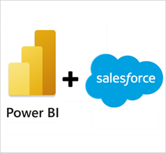](https://app.powerbi.com/groups/me/getapps/services/pbi-contentpacks.salesforceanalytics)

1. When prompted , click **Install**. Once the app has installed, you will see it on your Apps page.

   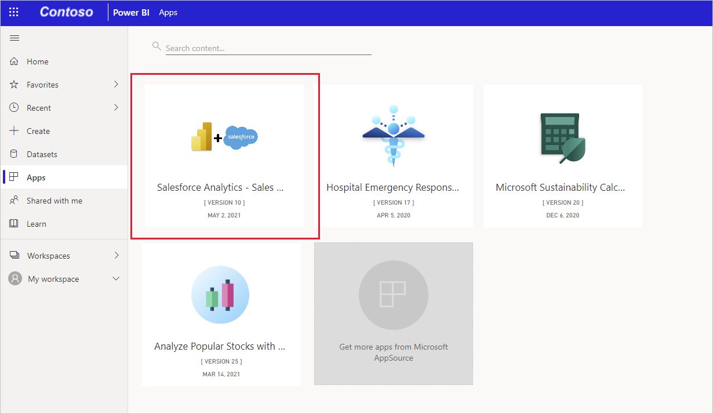

## Connect to data sources

1. Click the icon on your Apps page to open the app. The app opens, showing sample data.

1. Select the **Connect your data** link on the banner at the top of the page.

   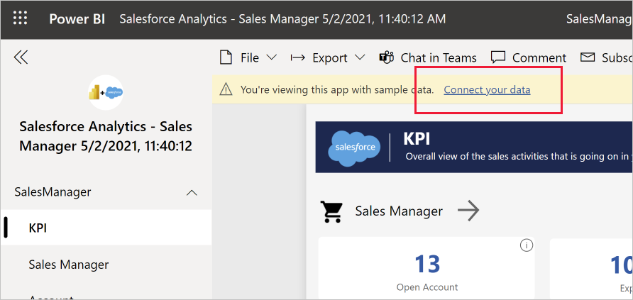

1. The parameters dialog will appear. There are no required parameters. Click **Next**.

   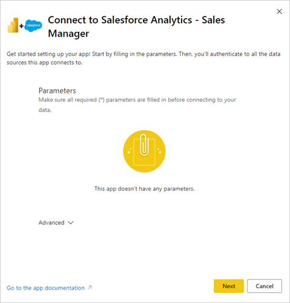

1. The authentication method dialog will appear. Recommended values are prepopulated. Don't change these unless you have specific knowledge of different values. Click **Sign in and connect**.

   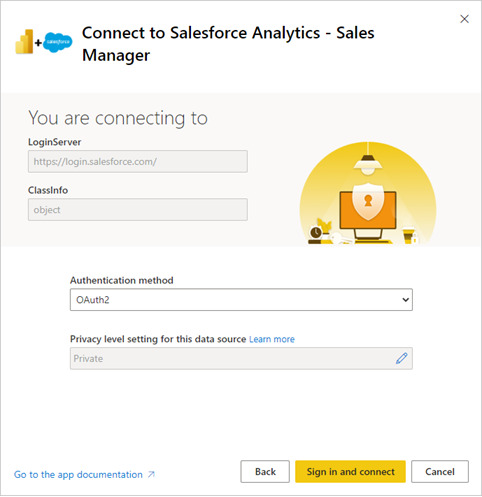

1. When prompted, sign into Salesforce. 
 
   The report will connect to the data sources and be populated with up-to-date data. During this time you will see sample data and that refresh is in progress.

   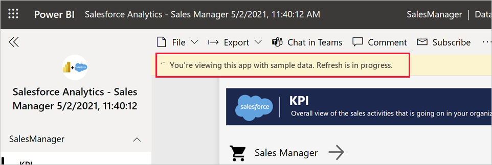 

## What does the KPI dashboard tell us?

When you open the app, you'll see the KPI dashboard. The KPI dashboard shows us an overall view of the key metrics from all the dashboards. Click the arrows to get to the individual dashboards.

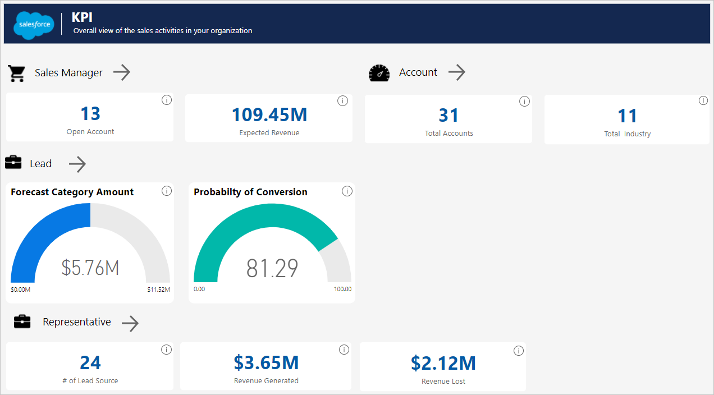

## What does the Sales Manager dashboard tell us?

The Sales Manager sample dashboard and underlying report focus on a typical sales challenge: providing a total sales analysis over a certain period. 

Using the sample dashboard, we're going see how to
* Understand how much we can generate from the total open opportunities that a Sales company has.
* Identify which areas we should focus on in the total sales life cycle.
* Spot loopholes we should look into.

Now let's analyze various components of the dashboard.

The top two visuals show us the total number of open opportunities we have and the revenue we can expect to generate from them.

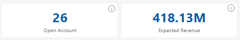

The Opportunity Sales Stage visual shows the position of the opportunities in the sales pipeline. Select any stage on the sales pipeline stage to see its impact on the whole sales process. Now we can analyze the revenue that corresponds with that stage.

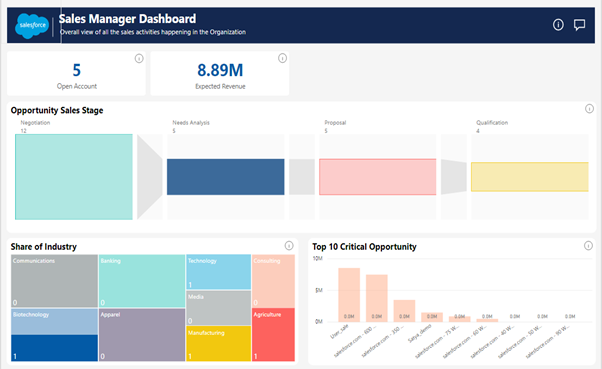

If you click on any one of the industries in the Share of Industry visual, it shows the share of the industry your sales team is working on. Let's click on "Communication" for example.

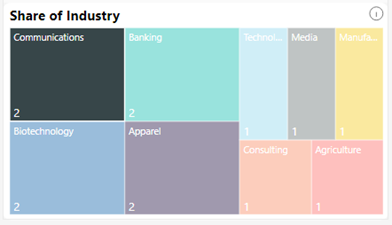 
 
When we click on "Communication", we see that one of the accounts we have in this sector is in the top ten critical opportunities with respect to revenue. We can conclude that we should put our focus on this opportunity on a priority basis, since the expected revenue is the highest as compared to other accounts.

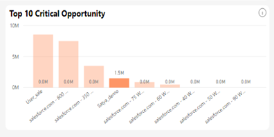
 
## What does the Account dashboard tell us?

The Account dashboard lets you oversee how you are performing in all your accounts. It tells you which are among your most profitable accounts. Let's analyze the accounts for technology.

On the dashboard, select “Manufacturing” in the Account dashboard's Account Share Industry Wise visual.

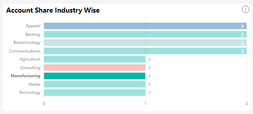

 You'll see the tiles get updated. Notice that there is a total of one industry in manufacturing, for which we have 20 accounts. 
 

If we look at the Account Area Wise map visual, you'll see the areas under which we have manufacturing accounts.

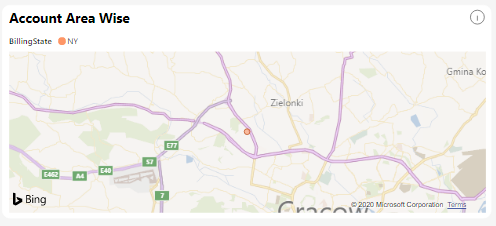
 
Let’s look at the revenue for all the accounts under manufacturing. In the Revenue by Account visual you can see that the accounts for manufacturing are highlighted, describing the revenue being generated.

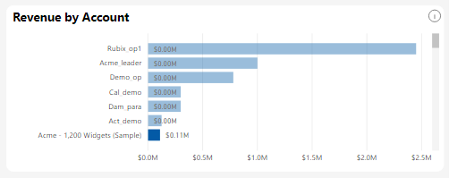

We can also see a comparison of revenue won vs lost. If we hover over the bar, we see the exact revenue for apparel out of the total revenue.

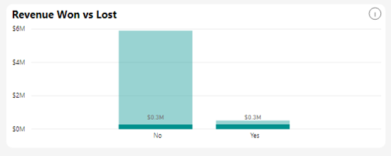

## What does the Lead dashboard tell us?

The Lead dashboard lets you oversee what the sources of your leads are. It tells you which are among your most profitable sources of lead.

You can look at the Probability of conversion visual to examine what the probability is that the lead from a source is going to be converted. For example, selecting for Google AdWords shows that the probability of conversion is 51.25%, and the total forecasted amount for it is 1.92 million dollars.

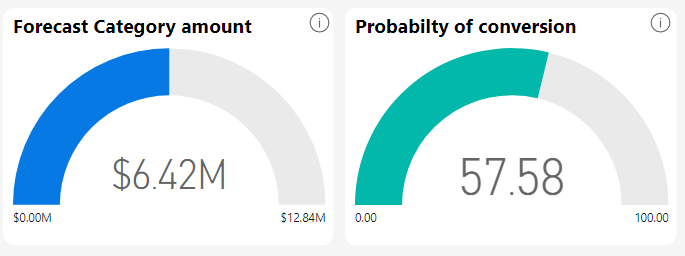
 
Similarly, you can also see the distribution of customers in the sales lead by looking at the Sales Lead by Customer Type visual. You can see it for a single lead by hovering over it. So, for Google AdWords, you can see that there are three new customers belonging to the “New Business” category.

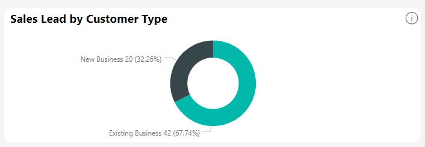
 
We can also see the overall number of lead statuses that we have, and in which stage.

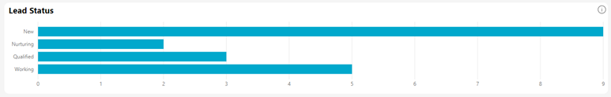
 
## What does Representative dashboard tell us?

The Representative dashboard lets you measure the performance of the sales representatives by a number of matrices.

We can see all the industries a sales representative works in, and all the representatives of an industry.

To see the performance of the sales representatives, we selected "Media" as the industry from the Share of Industry visual on the Sales Manager dashboard. Then, in the Total Opportunities Gained visual, we can see the names of the sales representatives and the number of opportunities which belong to the selected industry.

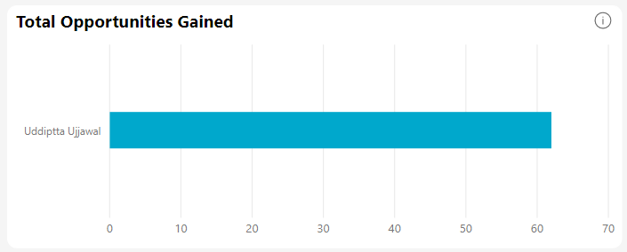
 
The top three visuals show us the number of leads generated by the sales representatives and the revenue they have generated and the share of amount that they have lost. 

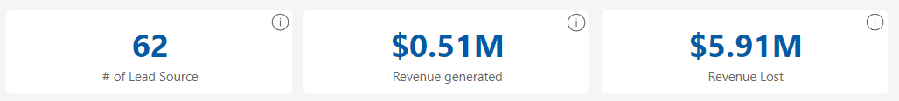

At same time, we can use the Month Wise Performance visual to measure the month-wise performance of the sales representatives.

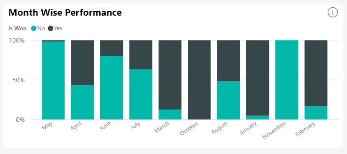

## System requirements and considerations

* Connected with a production Salesforce account that has API access enabled.
* Permission granted to the Power BI app during sign in.
* The account has sufficient API calls available to pull and refresh the data.
* A valid authentication token is required for refresh. Salesforce has a limit of five authentication tokens per application so make sure you've five or less Salesforce data sets imported.
* The Salesforce Reports API has a restriction that supports up to 2,000 rows of data.

## Troubleshooting

* If you encounter any errors, review the requirements above.
* Signing in to a custom or sandbox domain isn't currently supported.

### "Unable to connect to the remote server" message

If you get an "Unable to connect to the remote server" message when trying to connect to your Salesforce account, see this solution on the following forum: [Salesforce Connector sign in Error Message: Unable to connect to the remote server](https://www.outsystems.com/forums/Forum_TopicView.aspx?TopicId=17674&TopicName=log-in-error-message-unable-to-connect-to-the-remote-server&)
 
* [What are Power BI template apps](service-template-apps-overview.md)
* [Create a template app in Power BI](service-template-apps-create.md)
* [Install and distribute template apps in your organization](service-template-apps-install-distribute.md)
* Questions? [Try asking the Power BI Community](https://community.powerbi.com/)
