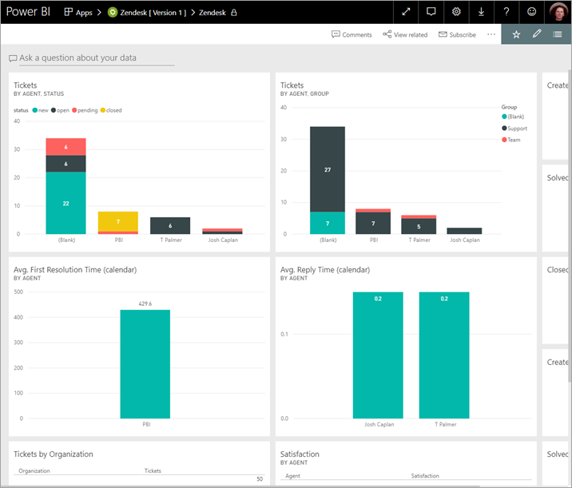
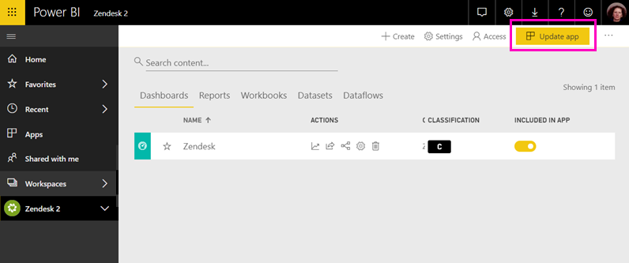

# Connect to Zendesk with Power BI

This article walks you through pulling your data from your Zendesk account with a Power BI template app. The Zendesk app offers a Power BI dashboard and a set of Power BI reports that provide insights about your ticket volumes and agent performance. The data is refreshed automatically once a day. 

After you've installed the template app, you can customize the dashboard and report to highlight the information you care about most. Then you can distribute it as an app to colleagues in your organization.

Connect to the [Zendesk template app](https://app.powerbi.com/groups/me/getapps/services/pbi-contentpacks.pbiapps-zendesk) or read more about the [Zendesk integration](https://powerbi.microsoft.com/integrations/zendesk) with Power BI.

After you've installed the template app, you can change the dashboard and report. Then you can distribute it as an app to colleagues in your organization.

>[!NOTE]
>You need a Zendesk Admin account to connect. More details on [requirements](#system-requirements) below.

>[!WARNING]
>Before Oct 15, 2019, the Zendesk Support Search API allowed for a total of 200,000 results to be received through pagination of large queries. To align search usage with its intended scope, Zendesk now limits the maximum number of results returned to 1,000 total results, with a maximum of 100 results per page. However, the current Power BI Zendesk connector can still create API calls that exceed these new limits, resulting in possibly misleading results.

## Install the app

[!INCLUDE [powerbi-service-apps-get-more-apps](../includes/powerbi-service-apps-get-more-apps.md)]

1. Select **Zendesk** \> **Get it now**.

1. When prompted, select **Install**. Once the app has installed, you'll see it listed on your Apps page.

## Connect to your Zendesk data source

1. Select the Zendesk tile on your Apps page to open the app. The app opens, showing sample data.

1. Select the **Connect your data** link on the banner at the top of the page.

1. Provide the URL associated with your account. The URL has the form **https://company.zendesk.com**. See details on [finding these parameters](#finding-parameters) below.
   
   :::image type="content" source="./media/service-connect-to-zendesk/pbi_zendeskconnect.png" alt-text="Screenshot of Zendesk URL dialog.":::

1. When prompted, enter your Zendesk credentials.  Select **oAuth 2** as the Authentication Mechanism and select **Sign In**. Follow the Zendesk authentication flow. (If you're already signed in to Zendesk in your browser, you may not be prompted for credentials.)
   
   > [!NOTE]
   > This template app requires that you connect with a Zendesk Admin account. 
   > 
   
   :::image type="content" source="./media/service-connect-to-zendesk/pbi_zendesksignin.png" alt-text="Screenshot of Zendesk sign-in dialog.":::

1. Select **Allow** to allow Power BI to access your Zendesk data.
   
   :::image type="content" source="./media/service-connect-to-zendesk/zendesk2.jpg" alt-text="Screenshot of Zendesk allow access dialog.":::

1. Select **Connect** to begin the import process. 

1. After Power BI imports the data, you see the content list for your Zendesk app: a new dashboard, report, and semantic model.

1. Select the dashboard to start the exploration process.

    
   
## Modify and distribute your app

You've installed the Zendesk template app. That means you've also created the Zendesk workspace. In the workspace, you can change the report and dashboard, and then distribute it as an *app* to colleagues in your organization. 

1. To view all the contents of your new Zendesk workspace, in the nav pane, select **Workspaces** > **Zendesk**. 

    

    This view is the content list for the workspace. In the upper-right corner, you see **Update app**. When you're ready to distribute your app to your colleagues, that's where you'll start. 

    

2. Select **Reports** and **Semantic models** to see the other elements in the workspace.

    Read about [distributing apps](../collaborate-share/service-create-distribute-apps.md) to your colleagues.

## System requirements
A Zendesk Administrator account is required to access the Zendesk template app. If you're an agent or an end user and are interested in viewing your Zendesk data, add a suggestion and review the Zendesk connector in the [Power BI Desktop](desktop-connect-to-data.md).

## Finding parameters
Your Zendesk URL will be the same as the URL you use to sign into your Zendesk account. If you're not sure of your Zendesk URL, you can use the Zendesk [login help](https://www.zendesk.com/login/).

## Troubleshooting
If you're having issues connecting, check your Zendesk URL and confirm you're using a Zendesk administrator account.

## Related content

* [Create workspaces in Power BI](../collaborate-share/service-create-the-new-workspaces.md)
* [Install and use apps in Power BI](../consumer/end-user-apps.md)
* [Connect to Power BI apps for external services](service-connect-to-services.md)
* Questions? [Try asking the Power BI Community](https://community.powerbi.com/)
