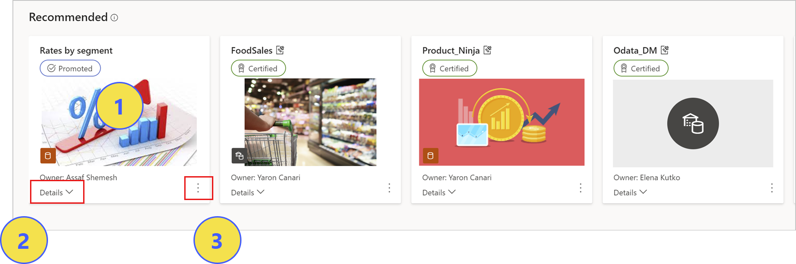
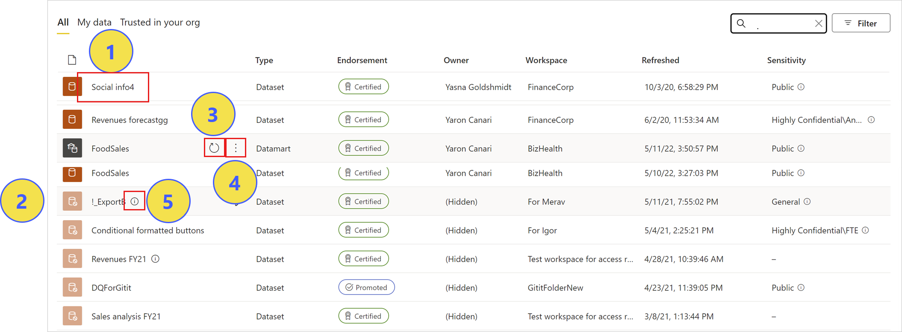

# Data discovery using the data hub

The data hub makes it easy to find, explore, and use the data items in your organization, such as datasets and datamarts. It provides information about the items as well as entry points for working with them, such as creating reports on top of them, using them with Analyze in Excel, accessing settings, managing permissions, and more.

:::image type="content" source="./media/service-data-hub/data-hub-main-page.png" alt-text="Screenshot of data hub main page.":::

The data hub can be useful in many scenarios:
* Data item owners can see usage metrics, refresh status, related reports, and lineage to help monitor and manage their data items.
* Report creators can use the hub to find suitable items to build their reports on and use links to easily create the reports.
* Report consumers can use hub to find reports based on trustworthy data items.

By making it easy to find quality data items and their related reports, the data hub helps prevent the creation of redundant reports. It also makes it easy to find good reports to use as starting points for creating new reports.

This article explains what you see on the data hub and describes how to use it.

## What data items do I see in the data hub?

# [Datasets](#tab/datasets)

* Datasets that you have at least [build permission](service-datasets-build-permissions.md) for.
* Datasets that you have [read-only permission](#read-only-permission-for-datasets) for. With read-only permission you have limited access to dataset info and capabilities. You can [request build permission](#read-only-permission-for-datasets) for more complete access to the dataset. 
* Datasets that have been made [discoverable](../collaborate-share/service-discovery.md) for you. Discoverable datasets appear grayed out. While you can find them, you need to [request access](#discoverable-datasets) in order to be able to access dataset info and capabilities.

# [Datamarts](#tab/datamarts)

* Datamarts that you have at least [build permission](service-datasets-build-permissions.md) for. This means datamarts that have been shared with you or that are located in workspaces where you have an Admin, Member, or Contributor role.

---

For a data item to show up in the datasets hub, it must be located in a [workspace that you have access to](../collaborate-share/service-new-workspaces.md).

If you're a free user, see [Users with free licenses](#users-with-free-licenses) for details about viewing data items and using the capabilities available on the data hub.

>[!NOTE]
> To be fully functional, the data hub requires that the [Use datasets across workspaces](../admin/service-admin-portal-workspace.md#use-datasets-across-workspaces) admin setting be enabled. If this setting is not enabled, you won't be able to access the data items you see listed in the data hub unless the item is in your *My Workspace* or you have an Admin, Member, or Contributor role in the workspace where the item is located.

## Find the data you need

The dataset discovery experience starts on the data hub. To get to the data hub:
* In the Power BI service: Select **Data hub** in the navigation pane.
* In the Power BI app in Teams: Select either the **Data hub** tab or **Data hub** in the navigation pane.

The data hub has two sections:
* Recommended data items
* A filterable list of data items

## Recommended items

Recommended data items are data items that have been certified or promoted by someone in your organization or have recently been refreshed or accessed.

1. Open the data item's details page.
1. Show a summary of the data item's details.
1. Open the actions menu.

## Data item list

1. Open the data item's details page.
1. A grayed-out icon indicates that you don't have permissions to access that data item's details page. Data items with grayed-out icons only show up for you in the list if [data discoverability](../collaborate-share/service-discovery.md) is enabled for you.
1. Request access.
1. Open the actions menu.
1. Refresh the data item.
1. Hover to view the data item's description. 

The list has three tabs to filter the list of data items.
* **All**: Shows all the data items that you are [allowed to find](#what-data-items-do-i-see-in-the-data-hub).
* **My data**: Shows all the data resources that you are the owner of.
* **Trusted in your org**: Shows all the endorsed data resources in your organization that you are [allowed to find](#what-data-items-do-i-see-in-the-data-hub). Certified data resources are listed first, followed by promoted data resources.

Use the search box and filters to narrow down the list of items. You can type into the **Filter by Keyword** box to search for a particular string, or you can use the filters to display only the selected data item types.

The columns of the list are described below. 
* **Name**: The data item name. Click the name to open the item's details page.
* **Endorsement**: Endorsement status.
* **Owner**: Data item owner (All and Trusted in your org tabs only).
* **Workspace**: The workspace the data item is located in.
* **Refreshed**: Last refresh time (rounded to hour, day, month, and year. See the details section on the item's detail page for the exact time of the last refresh).
* **Next refresh**: The time of the next scheduled refresh (My data tab only).
* **Sensitivity**: Sensitivity, if set. Click on the info icon to view the sensitivity label description.

## Create new reports or pull data into Excel via Analyze in Excel

To create a new report based on a data item, or to pull the data into Excel with [Analyze in Excel](../collaborate-share/service-analyze-in-excel.md), select **More options (...)**, either at the bottom right corner of a recommended tile or on a data item's line in the list of data items. Other actions may appear on the drop-down menu, depending on the permissions you have on the item.

When you create a new report based on a data item, the report edit canvas opens. When you save the new report, it will be saved in the workspace that contains the data item if you have write permissions on that workspace. If you don't have write permissions on that workspace, or if you are a free user and the data item resides in a Premium-capacity workspace, the new report will be saved in your *My workspace*.

## View data item details and explore related reports

To see more information about a data item, to explore related reports, or to create a new report based on the item, select the item from the recommended items or from the items list. The item's detail page will open. This page shows you information about the item, lists the reports that are built on top of it, and provides entry points for creating new reports or pulling the data into Excel via [Analyze in Excel](../collaborate-share/service-analyze-in-excel.md). See [Data details page](./service-data-details-page.md) for more information.

## Read-only permission for datasets

You get read-only permission on a dataset when someone shares a report or dataset with you but doesn’t grant you build permission on the dataset.

With read-only access, you can view some information about the dataset on the data hub and on the dataset's details page, as well as perform a limited number of actions on the dataset, but you can’t build new content based on the dataset. To be able to create content based on the dataset, or to perform other actions, you must have at least [build permissions](service-datasets-build-permissions.md) on the dataset.

To request build permission on a dataset, do one of the following:

* From the data hub: Find the dataset in the data items list, hover over it with the mouse, and click the **Request access** icon that appears

    :::image type="content" source="media/service-data-hub/datasets-request-access-icon.png" alt-text="Screenshot of the request access icon on the data hub.":::

* From the dataset's details page, click the **Request access** button at the top right corner of the page.

    :::image type="content" source="media/service-data-hub/datasets-request-access-button.png" alt-text="Screenshot of the request access icon on the dataset details page.":::

## Users with free licenses

Users with free licenses are known as free users. Free users can see all the datasets in their "My workspace", and most data hub capabilities will be available to them on those datasets, with the exception of **Share**, **Save a copy**, **Manage permissions**, and **Create from template**.

For datasets in other workspaces, free users can see all the datasets that have been shared with them and that they have sufficient permissions to access, but they won’t be able to use most of the dataset hub’s capabilities on those datasets unless the dataset they're working on is hosted in a Premium capacity. In that case more capabilities will be available.

See the [free users feature list](../consumer/end-user-features.md#feature-list) for a detailed list of the actions free users can perform on datasets in the datasets hub and on the dataset's details page.

To be able to perform all available dataset actions, a free user needs an upgraded license, in addition to any necessary access permissions. When a free user tries to perform an action that is not available under the terms of the free user license, a pop-up message gives them the opportunity to upgrade their license. If a Power BI administrator has approved automatic upgrade, the upgrade happens automatically.

Free users cannot use datamarts on the data hub.

## Discoverable datasets

Dataset owners can make it possible for you to find their dataset without actually granting you access to it by making it [discoverable](../collaborate-share/service-discovery.md). Discoverable datasets appear grayed out in the list of datasets, and you don't have access to the dataset's details page or capabilities. To see dataset info and to be able to use the dataset, you can request access.

To request access, on the data hub, hover the mouse over the desired "discoverable" dataset and then click the **Request access** icon that appears

:::image type="content" source="media/service-data-hub/datasets-request-access-icon-discoverable.png" alt-text="Screenshot of the request access icon for discoverable datasets.":::
  
## Next steps
* [Data details pages](./service-data-details-page.md)
* [Use datasets across workspaces](service-datasets-across-workspaces.md)
* [Create reports based on datasets from different workspaces](service-datasets-discover-across-workspaces.md)
* [Endorse your dataset](../collaborate-share/service-endorse-content.md)
* Questions? [Try asking the Power BI Community](https://community.powerbi.com/)
