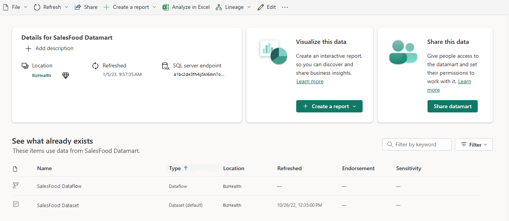

# Datamart details

The datamart details page helps you explore, monitor, and leverage datamarts. When you click on a datamart in the [data hub](./service-data-hub.md), the details page for that datamart opens.

The datamart details page
* Shows you metadata about the datamart, including description, endorsement, and sensitivity, and connection string.
* Provides actions that you can perform on the datamart, such as share, refresh, create new, Analyze in Excel, and more.
* Lists the reports that are built on top of the datamart.

## Supported actions

The datamart details page enables you to perform a number of actions. The actions available vary from user to user depending on their permissions on the datamart, and thus not all actions are available for all users.

| Action | Description | On Action bar, choose: |
|--|--|
| **Manage permissions** | Opens the manage datamart permissions page. | **File > Manage permissions** |
| **Settings** | Opens the datamart settings page. | **File > Settings** |
| **Refresh now** | Launches a refresh of the dataset. | **Refresh > Refresh now** |
| **Schedule refresh** | Opens the dataset settings page where you can set scheduled refresh. | **Refresh > Schedule refresh** |
| **Refresh history** | Opens Refresh history window where you see the time, duration, and status of each refresh. You can download the history as a *.csv* file. | **Refresh > Refresh history** |
| **Share** | Opens the **Share datamart** dialog. Sharing a datamart allows recipients to build content based on the underlying dataset and query the corresponding SQL endpoint. | **Share**, or use the [Share this data tile](#share-this-data). |
| **Create a report from scratch** | Opens the report editing canvas where you can create a new report based on the datamart. | **Create a report > From scratch**, or use the [Visualize this data tile](#visualize-this-data). |
| **Analyze in Excel** | Launches [Analyze in Excel](../collaborate-share/service-analyze-in-excel.md) using this datamart. | **Analyze in Excel** |
| **Open lineage view** | Opens the [lineage view](../collaborate-share/service-data-lineage.md) for the datamart. | **Lineage > Open lineage view** |
| **Impact analysis** | Opens the [impact analysis side pane](../collaborate-share/service-dataset-impact-analysis.md) for this datamart. | **Lineage > Impact analysis** |
| **Edit** | Opens the datamart in the Datamart editor. | **Edit** |

## View datamart metadata

:::image type="content" source="media/service-datamart-details-page/datamart-details-page-datamart-details.png" alt-text="Screenshot of datamart details section on the datamart details page.":::

The datamart details section shows
* The name of the workspace where the item is located.
* Endorsement status and certifier (if certified).
* The exact time of the last refresh.
* Sensitivity (if set).
* T-SQL connection string.
* Description (if any). You can create or edit the description from here.

## Explore related reports

The **See what already exists section** shows you reports that are built on top of the datamart's auto-generated dataset. You can create a copy of a report by selecting the line the item is on and clicking the **Save a copy** icon that appears. This section also shows you usage metrics for the related items.

:::image type="content" source="media/service-datamart-details-page/datamart-details-page-explore-related-reports.png" alt-text="Screenshot of datamart explore related reports section on datamart details page.":::

>[!NOTE]
> Reports build on top of other datasets created from the datamart **aren't** shown in this section. 

The columns in the list of related reports are:
* **Name**: Report name. If the name ends with (template), it means that this report has been specially constructed to be used as a template. For example, "Sales (template)".
* **Type**: Item type, for example, report or scorecard.
* **Endorsement**: Endorsement status.
* **Workspace**: The name of the workspace where the related item is located.
* **Unique viewers**: Shows the total number of unique users who viewed the item at least once in the last 30 days, excluding the current day's views.
* **Views**: Shows the total number of times an item was viewed in the last 30 days, excluding the current day's views.

## Visualize this data

To create a report based on the dataset, click the **Create report** button on this tile and choose the desired option.

:::image type="content" source="media/service-datamart-details-page/datamart-details-page-visualize-data.png" alt-text="Screenshot of datamart related section on datamart details page.":::

* **From scratch**: Opens the report editing canvas to a new report built on the dataset. When you save your new report, it will be saved in the workspace that contains the dataset if you have write permissions on that workspace. If you don't have write permissions on the workspace, or if you are a free user and the dataset resides in a Premium-capacity workspace, the new report will be saved in *My workspace*.

## Share this data

You can share the datamart with other users in your organization. Clicking the **Share datamart** button opens the [Share datamart dialog](service-datasets-share.md). People you share the datamart with will be able to build content based on the underlying dataset and query the corresponding SQL endpoint.

:::image type="content" source="media/service-datamart-details-page/datamart-details-page-share-datamart.png" alt-text="Screenshot of datamart share this data section on datamart details page.":::
  
## Next steps
* [Use datasets across workspaces](service-datasets-across-workspaces.md)
* [Create reports based on datasets from different workspaces](service-datasets-discover-across-workspaces.md)
* [Endorse your dataset](../collaborate-share/service-endorse-content.md)
* Questions? [Try asking the Power BI Community](https://community.powerbi.com/)