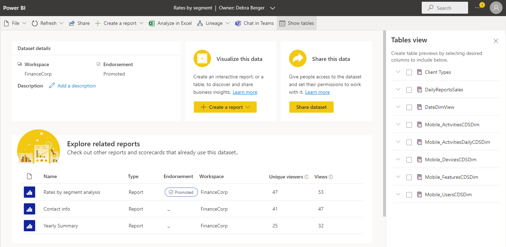

# Semantic model details

The semantic model details page helps you explore, monitor, and leverage semantic models. When you select a semantic model in the [data hub](./service-data-hub.md), a workspace, or other place in Power BI, the details page for that semantic model opens.

This article provides an overview of the semantic model details page in Power BI, explaining its features, functionalities, and how you can interact with it.

The semantic model details page:

* Shows you metadata about the semantic model, including description, endorsement, and sensitivity.
* Provides actions that you can perform on the semantic model, such as share, refresh, Analyze in Excel, and more.
* Lists the reports and scorecards that are built on top of the semantic model.

The page header displays the semantic model name and endorsement (if any). To contact the semantic model owner or semantic model certifier (if any), select the the header, then select the name of the owner.

## Supported actions

The semantic model details page enables you to perform a number of actions. The actions available vary from user to user depending on their permissions on the data item, and thus not all actions are available for all users.

| Action | Description | On Action bar, choose: |
|--|--|
| **Download this file** | Downloads the .pbix file for this semantic model. | **File > Download this file** |
| **Manage permissions** | Opens the manage semantic model permissions page. | **File > Manage permissions** |
| **Settings** | Opens the semantic model settings page. | **File > Settings** |
| **Refresh now** | Launches a refresh of the semantic model. | **Refresh > Refresh now** |
| **Schedule refresh** | Opens the semantic model settings page where you can set scheduled refresh. | **Refresh > Schedule refresh** |
| **Share** | Opens the **Share semantic model** dialog. | **Share**, or use the [Share this data tile](#share-this-data). |
| **Explore this data** | Opens the formatted table editing canvas. | **Explore this data > Explore this data**, or use the [Explore this data tile](#explore-this-data). |
| **Auto-create a report** | Creates a report based on the semantic model's data. | **Explore this data > Auto-create a report**, or use the [Explore this data tile](#explore-this-data). |
| **Create a blank report** | Opens the report editing canvas where you can create a new report based on the semantic model.| **Explore this data > Create a blank report**, or use the [Explore this data tile](#explore-this-data). |
| **Create a paginated report** | Opens the paginated report editing canvas. | Use the command from the dropdown on the [Explore this data tile](#explore-this-data).|
| **Analyze in Excel** | Launches [Analyze in Excel](../collaborate-share/service-analyze-in-excel.md#analyze-in-excel) using this semantic model. | **Analyze in Excel** |
| **Open workspace lineage** | Opens the [lineage view](../collaborate-share/service-data-lineage.md) for the semantic model. | **Lineage > Open workspace lineage** |
| **Impact analysis** | Opens the [impact analysis side pane](../collaborate-share/service-dataset-impact-analysis.md) for this semantic model. | **Lineage > Impact analysis** |
| **Chat in Teams** | Invite people to start [chatting in Teams](../collaborate-share/service-share-report-teams.md). People you invite will receive a Teams chat message from you with a link to this semantic model details page. If they have access to the semantic model, the link will open this semantic model details page in Teams. | **... > Chat in Teams** |
| **Show tables** | Opens a side panel showing the semantic model's tables. In the tables view you can create table previews by selecting desired columns. | **... > Show tables** |

## View semantic model metadata

:::image type="content" source="media/service-dataset-details-page/dataset-details-page-dataset-details.png" alt-text="Screenshot of semantic model details section on data details page.":::

The semantic model details section shows:

* The name of the workspace where the item is located.
* The exact time of the last refresh.
* Endorsement status and certifier (if certified).
* Sensitivity (if set).
* Description (if any). You can create or edit the description from here.

## See what already exists

The see what already exists section shows you all the reports and scorecards that are built on the semantic model. You can create a copy of an item by selecting the three horizontal dots icon in the line for the semantic model to open the **More options** menu, then selecting **Save a copy**.

The columns in the list of related reports are:

* **Name**: Report name. If the name ends with (template), it means that this report has been specially constructed to be used as a template. For example, "Sales (template)".
* **Type**: Item type, for example, report or scorecard.
* **Relation**: Relation to the semantic model, for example, downstream.
* **Location**: The name of the workspace where the related item is located.
* **Refreshed**: The date when the item was last refreshed.
* **Endorsement**: Endorsement status.
* **Sensitivity**: Sensitivity label (if set).

## Explore this data

To create a report based on the semantic model, select the **Explore this data** button on this tile or select the dropdown and choose the desired option.

:::image type="content" source="media/service-dataset-details-page/dataset-details-page-visualize-data-1.png" alt-text="Screenshot of visualize this data section on data details page.":::

* **Explore this data**: Opens the formatted table editing canvas.
* **Auto-create a report**: Creates a report based on the semantic model's data.
* **Create a blank report**: Opens the report editing canvas to a new report built on the semantic model. When you save your new report, it will be saved in the workspace that contains the semantic model if you have write permissions on that workspace. If you don't have write permissions on the workspace, or if you're a free user and the semantic model resides in a Premium-capacity workspace, the new report will be saved in *My workspace*.
* **Create a paginated report**: Opens the paginated report editing canvas.

## Share this data

You can share the semantic model with other users in your organization. Selecting the **Share semantic model** button opens the [Share semantic model dialog](service-datasets-share.md), where you can choose which permissions to grant on the semantic model.

:::image type="content" source="media/service-dataset-details-page/dataset-details-page-share-dataset.png" alt-text="Screenshot of datamart share this data section on data details page.":::

## Data preview

Data preview enables you to view a selected table or columns from the semantic model. You can also export the data to supported file formats or create a [paginated report](../paginated-reports/web-authoring/paginated-formatted-table.md).

### Prerequisites

* The semantic model can be inside Premium or non-Premium workspaces. Classic workspaces aren't supported. [Read about workspaces](../collaborate-share/service-new-workspaces.md).
* You need [Build permission](./service-datasets-build-permissions.md) for the semantic model.

### Select data to preview

To preview a semantic models's data from the semantic model details page, select a table or columns on the **Tables** side panel.

:::image type="content" source="media/service-dataset-details-page/dataset-details-page-tables-side-panel-1.png" alt-text="Screenshot of the Tables side panel on the semantic model details page.":::

If you don't see the side panel, select **Show tables** on the action bar.

:::image type="content" source="./media/service-dataset-details-page/dataset-details-page-show-tables-option.png" alt-text="Screenshot of Show tables option on Semantic model details page.":::

An entirely filled and checked parent checkbox on the semantic model's table indicates that all its sub-tables and columns have been selected. A partially filled parent checkbox with no check mark means that only a subset of them has been selected.

:::image type="content" source="media/service-dataset-details-page/dataset-details-page-selection-3.png" alt-text="Screenshot showing all columns selected."::: 

When you select a table or columns in a table, they'll be displayed on the **Table preview** page that opens.

:::image type="content" source="media/service-dataset-details-page/dataset-details-page-table-preview-page-1.png" alt-text="Screenshot showing the table preview page.":::

Table preview might not show all of the data you've selected. To see more, you can [export](#export-data) or build a [paginated report](#build-a-paginated-report).

#### Show query

Show query enables you to copy the DAX query used to create the table preview to the clipboard. This makes it possible to reuse the query for future actions.

:::image type="content" source="./media/service-dataset-details-page/dataset-details-page-show-query-1.png" alt-text="Screenshot showing table preview with the query displayed.":::

#### Back

At any time, you can return to the semantic model details page by selecting the **Back** button on the action bar. Selecting the Back button clears all your selections and brings you back to semantic model details page.

>[!NOTE]
> Table preview is intended to quickly explore the underlying data of tables within your semantic model. You cannot view measures or select more than one table or columns across tables. You can select [**Create paginated report**](#build-a-paginated-report) for that.
>

### Export data

Select the **Export** button on the Table preview page to export the data to one of the supported file formats.

:::image type="content" source="./media/service-dataset-details-page/dataset-details-page-export-1.png" alt-text="Screenshot showing table preview export option.":::

### Build a paginated report

Select the **Create paginated report** button to open the [editor](../paginated-reports/web-authoring/paginated-formatted-table.md).

>[!NOTE]
> Data will change from underlying data to summarized data. You can switch to underlying data using **More options** next to the table name in the Data pane.

In the editor you can select multiple tables, measure, fields across tables, apply table styles, change aggregates, and so on.

:::image type="content" source="./media/service-dataset-details-page/dataset-details-page-table-formatted-table-editor-2.png" alt-text="Screenshot showing formatted table editor.":::

You can then export the report to any of the supported file formats, and the file will be saved to your default downloads folder. Or you can save it as a [paginated report](../paginated-reports/paginated-reports-report-builder-power-bi.md) to a workspace of your choice. Paginated reports fully preserve your report formatting.

### Switch from summarized to underlying data in the editor

Select **More options (...)** to switch from **Summarized data** to **Underlying data**.

:::image type="content" source="./media/service-dataset-details-page/dataset-details-page-data-switch.png" alt-text="Screenshot showing more options in the Data pane."

## Considerations and limitations

Streaming datasets do not have a details page.

## Related content

* [Use semantic models across workspaces](service-datasets-across-workspaces.md)
* [Create reports based on semantic models from different workspaces](service-datasets-discover-across-workspaces.md)
* [Endorse your semantic model](../collaborate-share/service-endorse-content.md)
* Questions? [Try asking the Power BI Community](https://community.powerbi.com/)
