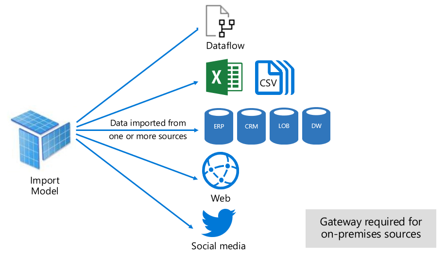

# Semantic model modes in the Power BI service

This article provides a technical explanation of Power BI semantic model modes. It applies to semantic models that represent a live connection to an external-hosted Analysis Services model, and also to models developed in Power BI Desktop. The article emphasizes the rationale for each mode, and possible impacts on Power BI capacity resources.

The three semantic model modes are:

- [Import](#import-mode)
- [DirectQuery](#directquery-mode)
- [Composite](#composite-mode)

## Import mode

_Import_ mode is the most common mode used to develop semantic models. This mode delivers fast performance thanks to in-memory querying. It also offers design flexibility to modelers, and support for specific Power BI service features (Q&A, Quick Insights, etc.). Because of these strengths, it's the default mode when creating a new Power BI Desktop solution.

It's important to understand that imported data is always stored to disk. When queried or refreshed, the data must be fully loaded into memory of the Power BI capacity. Once in memory, Import models can then achieve very fast query results. It's also important to understand that there's no concept of an Import model being partially loaded into memory.

When refreshed, data is compressed and optimized and then stored to disk by the VertiPaq storage engine. When loaded from disk into memory, it's possible to see 10-times compression. So, it's reasonable to expect that 10 GB of source data can compress to about 1 GB in size. Storage size on disk can achieve a 20% reduction from the compressed size. The difference in size can be determined by comparing the Power BI Desktop file size with the Task Manager memory usage of the file.

Design flexibility can be achieved in three ways:

- Integrate data by caching data from dataflows, and external data sources, whatever the data source type or format.
- Use the entire set of [Power Query M formula language](/powerquery-m/), referred to as _M_, functions when creating data preparation queries.
- Apply the entire set of [Data Analysis Expressions (DAX)](/dax/) functions when enhancing the model with business logic. There's support for calculated columns, calculated tables, and measures.

As shown in the following image, an Import model can integrate data from any number of supported data source types.

However, while there are compelling advantages associated with Import models, there are disadvantages, too:

- The entire model must be loaded to memory before Power BI can query the model, which can place pressure on available capacity resources, especially as the number and size of Import models grow.
- Model data is only as current as the latest refresh, and so Import models need to be refreshed, usually on a scheduled basis.
- A full refresh removes all data from all tables and reloads it from the data source. This operation can be expensive in terms of time and resources for the Power BI service, and the data sources.

> [!NOTE]
> Power BI can achieve incremental refresh to avoid truncating and reloading entire tables. For more information, including supported plans and licensing, see [Incremental refresh and real-time data for semantic models](../connect-data/incremental-refresh-overview.md).

From a Power BI service resource perspective, Import models require:

- Sufficient memory to load the model when it's queried or refreshed.
- Processing resources and extra memory resources to refresh data.

## DirectQuery mode

_DirectQuery_ mode is an alternative to Import mode. Models developed in DirectQuery mode don't import data. Instead, they consist only of metadata defining the model structure. When the model is queried, native queries are used to retrieve data from the underlying data source.

There are two main reasons to consider developing a DirectQuery model:

- When data volumes are too large, even when [data reduction methods](../guidance/import-modeling-data-reduction.md) are applied, to load into a model, or practically refresh.
- When reports and dashboards need to deliver *near real-time* data, beyond what can be achieved within scheduled refresh limits. Scheduled refresh limits are eight times a day for shared capacity, and 48 times a day for a Premium capacity.

There are several advantages associated with DirectQuery models:

- Import model size limits don't apply.
- Models don't require scheduled data refresh.
- Report users see the latest data when interacting with report filters and slicers. Also, report users can refresh the entire report to retrieve current data.
- Real-time reports can be developed by using the [Automatic page refresh](../create-reports/desktop-automatic-page-refresh.md) feature.
- Dashboard tiles, when based on DirectQuery models, can update automatically as frequently as every 15 minutes.

However, there are some limitations associated with DirectQuery models:

- Power Query/Mashup expressions can only be functions that can be transposed to native queries understood by the data source.
- DAX formulas are limited to use only functions that can be transposed to native queries understood by the data source. Calculated tables aren't supported.
- Quick Insights features aren't supported.

From a Power BI service resource perspective, DirectQuery models require:

- Minimal memory to load the model (metadata only) when it's queried.
- Sometimes the Power BI service must use significant processor resources to generate and process queries sent to the data source. When this situation arises, it can affect throughput, especially when concurrent users are querying the model.

For more information, see [Use DirectQuery in Power BI Desktop](desktop-use-directquery.md).

## Composite mode

_Composite_ mode can mix Import and DirectQuery modes, or integrate multiple DirectQuery data sources. Models developed in Composite mode support configuring the storage mode for each model table. This mode also supports calculated tables, defined with DAX.

The table storage mode can be configured as Import, DirectQuery, or Dual. A table configured as Dual storage mode is both Import and DirectQuery, and this setting allows the Power BI service to determine the most efficient mode to use on a query-by-query basis.

Composite models strive to deliver the best of Import and DirectQuery modes. When configured appropriately, they can combine the high query performance of in-memory models with the ability to retrieve near real-time data from data sources.

For more information, see [Use composite models in Power BI Desktop](../transform-model/desktop-composite-models.md).

## Pure Import and DirectQuery tables

Data modelers who develop Composite models are likely to configure dimension-type tables in Import or Dual storage mode, and fact-type tables in DirectQuery mode. For more information about model table roles, see [Understand star schema and the importance for Power BI](../guidance/star-schema.md).

For example, consider a model with a **Product** dimension-type table in Dual mode, and a **Sales** fact-type table in DirectQuery mode. The **Product** table could be efficiently and quickly queried from in-memory to render a report slicer. The **Sales** table could also be queried in DirectQuery mode with the related **Product** table. The latter query could enable the generation of a single efficient native SQL query that joins **Product** and **Sales** tables, and filters by the slicer values.

## Hybrid tables

Data modelers who develop Composite models can also configure fact tables as hybrid tables. A hybrid table is a table with one or multiple Import partitions and one DirectQuery partition. The advantage of a hybrid table is that it could be efficiently and quickly queried from in-memory while at the same time including the latest data changes from the data source that occurred after the last import cycle, as the following visualization illustrates.

:::image type="content" source="media/service-dataset-modes-understand/hybrid-tables-partition.gif" alt-text="Screenshot shows a hybrid table partition with Archived, Incremental refresh, and Real time rows marked.":::

The easiest way to create a hybrid table is to configure an incremental refresh policy in Power BI Desktop and enable the option **Get the latest data in real time with DirectQuery (Premium only)**. When Power BI applies an incremental refresh policy that has this option enabled, it partitions the table like the partitioning scheme displayed in the previous diagram. To ensure good performance, configure your dimension-type tables in Dual storage mode so that Power BI can generate efficient native SQL queries when querying the DirectQuery partition.

> [!NOTE]
> Power BI supports hybrid tables only when the semantic model is hosted in workspaces on Premium capacities. Accordingly, you must upload your semantic model to a Premium workspace if you configure an incremental refresh policy with the option to get the latest data in real time with DirectQuery. For more information, see [Incremental refresh and real-time data for semantic models](incremental-refresh-overview.md).

It's also possible to convert an Import table to a hybrid table by adding a DirectQuery partition using Tabular Model Scripting Language (TMSL) or the Tabular Object Model (TOM) or by using a third-party tool. For example, you can partition a fact table such that the bulk of the data is left in the data warehouse while only a fraction of the most recent data is imported. This approach can help to optimize performance if the bulk of this data is historical data that is infrequently accessed. A hybrid table can have multiple Import partitions, but only one DirectQuery partition.

## Related content

- [Storage mode in Power BI Desktop](../transform-model/desktop-storage-mode.md)
- [Using DirectQuery in Power BI](desktop-directquery-about.md)
- [Use composite models in Power BI Desktop](../transform-model/desktop-composite-models.md)
- More questions? [Try asking the Power BI Community](https://community.powerbi.com/)
