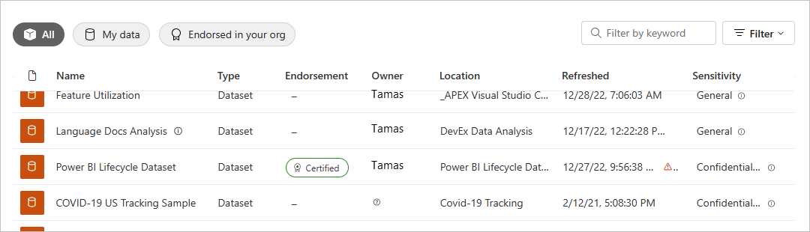

# Intro to datasets across workspaces

Business intelligence is a collaborative activity. It's important to establish standardized datasets that can be the 'one source of truth.' Then discovering and reusing those standardized datasets is key. When expert data modelers in your organization create and share optimized datasets, report creators can start with those datasets to build accurate reports. Then your organization has consistent data for making decisions, and a healthy data culture.

In Power BI, dataset creators can control who has access to their data by using the [Build permission](service-datasets-build-permissions.md). Dataset creators can also *certify* or *promote* datasets so others can discover them. That way, report authors know which datasets are high quality and official, and they can use those datasets wherever they author in Power BI. Admins have a new tenant setting to [govern the use of datasets across workspaces](service-datasets-admin-across-workspaces.md).

## Dataset sharing and the new workspace experience

Building reports based on datasets in different workspaces, and copying reports to different workspaces, are tightly coupled with the [new workspace experience](../collaborate-share/service-create-the-new-workspaces.md):

- In the service, when you open the dataset catalog from a new workspace experience, the dataset catalog shows datasets that are in your My Workspace and in other new workspace experience workspaces. 
- When you open the dataset catalog from a classic workspace, you only see the datasets in that workspace, not the ones in other workspaces.
- In Power BI Desktop, you can publish Live Connect reports to different workspaces, as long as their datasets are in new experience workspaces.
- When copying reports across workspaces, the target workspace needs to be a new experience workspace.

## Discover datasets

When building a report on top of an existing dataset, the first step is to connect to the dataset, either in the Power BI service or Power BI Desktop. Read about [discovering datasets from different workspaces](service-datasets-discover-across-workspaces.md)

## Copy a report

When you find a report you like, in a workspace or an app, you can make a copy of it, and then modify it to fit your needs. You don't have to worry about creating the data model. That's already created for you. And it's much easier to modify an existing report than it is to start from scratch. Read more about [copying reports](service-datasets-copy-reports.md).

## Build permission for datasets

With Build permission type, if you're a dataset creator you can determine who in your organization can build new content on your datasets. People with Build permission can also build new content on the dataset outside Power BI, such as Excel sheets via Analyze in Excel, XMLA, and export. Read more about the [Build permission](service-datasets-build-permissions.md).

## Promotion and certification

If you create datasets, when you create one that others can benefit from, you can make it easier for them to discover it by [promoting your dataset](../collaborate-share/service-endorse-content.md#promote-content). You can also request that experts in your organization [certify your dataset](../collaborate-share/service-endorse-content.md#request-content-certification).

## Licensing

The specific features and experiences built on shared dataset capabilities are licensed according to their existing scenarios. For example:

- In general, discovering and connecting to shared datasets is available to anyone – it is not a feature restricted to Premium.
- Users without a Pro or Premium Per User (PPU) license can only use datasets across workspaces for report authoring if those datasets reside in the users' personal My Workspace or in a Premium-backed workspace. The same licensing restriction applies whether they author reports in Power BI Desktop or in the Power BI service.
- Copying reports between workspaces requires a Pro or Premium Per User (PPU) license.
- Copying reports from an app requires a Pro or Premium Per User (PPU) license.
- Promoting and certifying datasets requires a Pro or Premium Per User (PPU) license.

## Considerations and limitations

- As an app publisher you have to make sure that your audience has access to datasets outside of the workspace. Otherwise, users will encounter issues when interacting with your app: reports won’t open without dataset access, and dashboard tiles will show as locked. Also, users won’t be able to open the app if the first item in its navigation is a report without access to the dataset.
- Building a report on top of a dataset in a different workspace requires the new workspace experience at both ends: The report needs to be in a new workspace experience and the dataset needs to be in a new workspace experience. You can only copy reports in a new workspace experience to another new workspace experience, and not to classic workspaces or to My Workspace. 
- In a classic workspace, the dataset discovery experience only shows the datasets in that workspace.
- By design, “Publish to web” doesn’t work for a report based on a shared dataset.
- If two people are members of a workspace that is accessing a shared dataset, it's possible that only one of them can see the related dataset in the workspace. Only people with at least Read access to the dataset can see the shared dataset. 

## Next steps

- [Promote datasets](../collaborate-share/service-endorse-content.md#promote-content)
- [Certify datasets](../collaborate-share/service-endorse-content.md#certify-content)
- [Request dataset certification](../collaborate-share/service-endorse-content.md#request-content-certification)
- [Govern the use of datasets across workspaces](service-datasets-admin-across-workspaces.md)
- Questions? [Try asking the Power BI Community](https://community.powerbi.com/)
