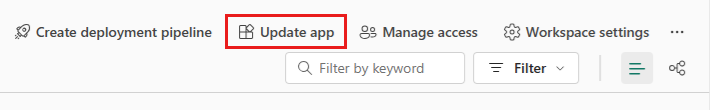
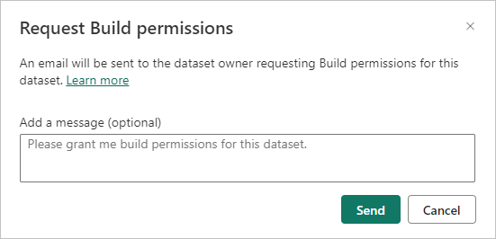
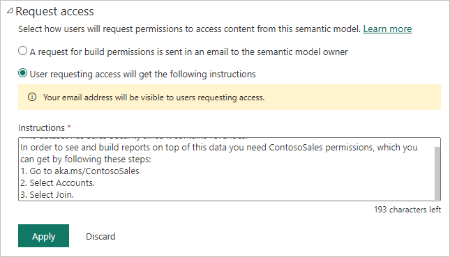
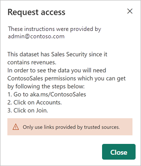

# Build permission for shared semantic models

When you create a report in Power BI Desktop, the data in that report is stored in a *data model*. When you publish a report to the Power BI service, the data model is also published to the service as a *semantic model* at the same time. When you share the report with others, you can give them *Build permission* for the semantic model that the report is built on, so they can discover and reuse it for their own reports, dashboards, etc. This article explains how you control access to the semantic model using Build permission.

Build permission applies to semantic models. When you give users Build permission, they can build new content on your semantic model, such as reports, dashboards, pinned tiles from Q&A, paginated reports, and Insights discovery. If a report outside the semantic model workspace uses your semantic model, you can't delete the semantic model. If you try to do so, you get an error message.

Users also need Build permission to do the following actions:

- Export underlying Power BI data.
- Build new content on the semantic model, such as with [Analyze in Excel](../collaborate-share/service-analyze-in-excel.md).
- Access the data via the XML for Analysis (XMLA) endpoint.

## How users get Build permission

Users get Build permission for a semantic model in a few different ways:

- Users that have at least a Contributor role in a workspace have Build permission on the semantic models in that workspace, as well as permission to copy reports in that workspace. For more information about roles in workspaces, see [Roles in workspaces in Power BI](../collaborate-share/service-roles-new-workspaces.md).
 
- Semantic model owners can assign Build permission to specific users or security groups on the  **Manage permissions** page. For more information, see [Manage semantic model access permissions](service-datasets-manage-access-permissions.md).

- A user with an Admin or Member role in the workspace where the semantic model resides can decide during app publishing that users with permission for the app also get Build permission for the underlying semantic models. For more information, see [Create and manage multiple audiences](../collaborate-share/service-create-distribute-apps.md#create-and-manage-multiple-audiences).

- If you have Reshare and Build permission on a semantic model, and you share a report or dashboard you built on that semantic model, you can specify that the recipients also get Build permission for the semantic model. For more information, see [Share Power BI reports and dashboards with coworkers and others](../collaborate-share/service-share-dashboards.md).

## Remove Build permission

To remove Build permission for users of a shared semantic model, follow the instructions at [Manage direct access](service-datasets-manage-access-permissions.md#manage-direct-access).

If you remove Build permission, the people whose permission you revoked can still see the report, but can no longer edit the report or export underlying data. Users with only read permission can still export summarized data.

### Remove Build permission for a semantic model in an app

If you distribute an app from a workspace, removing people's access to the app doesn't automatically remove their build and reshare permissions. To remove their Build permissions, take the following steps:

1. In the workspace, in list view, select **Update app**. 

   

1. Select the **Audience** tab, and then in the **Manage Audience Access** side pane, hover over the person or group whose access you want to delete and select the trash icon that appears. When you're done, select **Update app**.

    :::image type="content" source="media/service-datasets-build-permissions/power-bi-app-delete-user.png" alt-text="Screenshot that shows selecting the trash can icon next to a person's name to remove their permissions.":::

   You'll see a message that you need to go to **Manage permissions** to remove permissions for users with existing access.

   :::image type="content" source="media/service-datasets-build-permissions/power-bi-dataset-app-remove-message.png" alt-text="Screenshot of the Manage permissions message.":::

1. Select **Update**.

1. Follow the instructions at [Manage permissions](service-datasets-manage-access-permissions.md#manage-direct-access) to see how to remove permissions from users with existing access. When you take away a user's Build permission on a semantic model, they can still see reports built on the semantic model, but they can no longer edit the reports.

## Configure how users request Build permission

Certain actions, such as creating a report based on a semantic model or accessing the details page of a semantic model in the data hub, require Build permission on the semantic model. By default, when users who don't have Build permission try these actions, they get a dialog box that lets them send email to the semantic model owner requesting Build permission. The email includes the user's details, the name of the semantic model they’re requesting access to, and any other information they optionally provide.

 
### Change the access request behavior

If you have an [Admin, Member, or Contributor role](../collaborate-share/service-roles-new-workspaces.md) in the workspace where the semantic model resides, you can change the default access request behavior for a semantic model by going to the semantic model's settings and configuring the **Request access** options as desired.

 
- The default option, not selected in the preceding image, is for Build permission requests to come to you via email. You're responsible for acting on the requests and notifying the requestors.

- The second option is for you to provide instructions about how to get Build permission, rather than receiving requests via email. You might choose this option, for example, if your organization uses an automated system for handling access requests. When users who don't have Build permission try an action that requires Build permission, they see a message with the instructions you provide.

  The **Instructions** text area in the preceding **Request access** example shows sample instructions. Instructions must be in plain text. HTML or any other type of code formatting render as plain text, rather than the code format. The following example shows the instructions users see when they try an action they need Build permission for.

  

  >[!NOTE]
  > When you provide specific instructions, your email address is visible to users who request access.

## More granular permissions

Power BI provides Build permission as a complement to Read and Reshare permissions. All users who already have Read permission for semantic models via app permissions, sharing, or workspace access also get Build permission for those semantic models. Those users get Build permission automatically because Read permission already grants them the right to build new content on the semantic model by using **Analyze in Excel** or **Export**.

With the more granular Build permission, you can choose who can only view the content in an existing report or dashboard, and who can create content connected to the underlying semantic model.

## Related content

* [Use semantic models across workspaces](service-datasets-across-workspaces.md)
* [Share a semantic model](service-datasets-share.md)
* [Roles in workspaces](../collaborate-share/service-roles-new-workspaces.md)
* [Manage semantic model access permissions](service-datasets-manage-access-permissions.md)

Questions? [Try asking the Power BI Community](https://community.powerbi.com)
