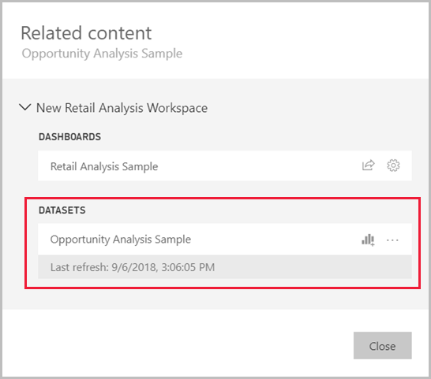
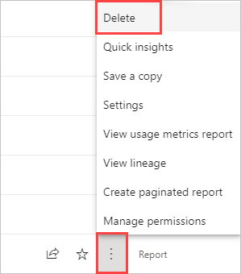

# Copy reports from other workspaces

When you find a report you like in a workspace or an app, you can make a copy of it and save it to a different workspace. Then you can modify your copy of the report, adding or deleting visuals and other elements. You don't have to worry about creating the data model - the copy of report will still reference the same semantic model as the original report. And it's much easier to modify an existing report than it is to start from scratch. However, when you make an app from your workspace, sometimes you can't publish your copy of the report in the app. See [Considerations and limitations in the article "Use semantic models across workspaces"](service-datasets-across-workspaces.md#considerations-and-limitations) for details.

## Prerequisites

- To copy a report, you need a Pro or Premium Per User (PPU) license, even if the original report is in a workspace in a Premium capacity.
- To copy a report to another workspace, or to create a report in one workspace based on a semantic model in another workspace, you need [Build permission for the semantic model](service-datasets-build-permissions.md). If you have at least the Contributor role in the workspace where the semantic model is located, you automatically have Build permission through your workspace role. You also need at least the Contributor role in the workspace where the report you're copying is located, and in the workspace where you want to create the copy of the report. See [Roles in workspaces](../collaborate-share/service-roles-new-workspaces.md) for details.

## Save a copy of a report in a workspace

1. In a workspace, find a report in the list. Open the **More options** menu and **select Save a copy**.

    :::image type="content" source="./media/service-datasets-copy-reports/power-bi-dataset-save-report-copy.png" alt-text="Screenshot of the Save a copy of the report option.":::

    You only see the **Save a copy** option if you have [Build permission](service-datasets-build-permissions.md). Even if you have access to the workspace, you have to have Build permission for the semantic model.

3. In **Save a copy of this report**, give the report a name and select the destination workspace.

    :::image type="content" source="./media/service-datasets-copy-reports/power-bi-dataset-save-report.png" alt-text="Screenshot of the Save a copy dialog box.":::

    You can save the report to the current workspace or a different one in the Power BI service. You only see workspaces in which you're a member.
  
4. Select **Save**.

    Power BI automatically creates a copy of the report in the workspace you selected. In the list view of that workspace, you won't see the referenced semantic model if it is located in another workspace. To see the shared semantic model, on the report copy in list view select **More options** > **View lineage**. 

    :::image type="content" source="./media/service-datasets-copy-reports/power-bi-dataset-actions.png" alt-text="Screenshot showing lineage view with semantic model in another workspace." lightbox="./media/service-datasets-copy-reports/power-bi-dataset-actions.png":::

   In lineage view, semantic models that are located in other workspaces show the name of the workspace they're located in. This makes it easy to see which reports and dashboards use semantic models that are outside the workspace.

    See [Your copy of the report](#your-copy-of-the-report) in this article for more about the report and related semantic model.

## Copy a report in an app

1. In an app, open the report you want to copy.
2. In the menu bar, select **File** > **Save a copy**.

    :::image type="content" source="./media/service-datasets-copy-reports/power-bi-save-copy.png" alt-text="Screenshot of Save a copy of the report from an app.":::

You only see the **Save a copy** option if app permissions grant [Build permission](./service-datasets-build-permissions.md) for the underlying semantic model, and allow users to make copies of the report.

3. Give your report a name, select a destination workspace, and then select **Save**.

    :::image type="content" source="./media/service-datasets-copy-reports/power-bi-save-report-from-app.png" alt-text="Screenshot of Save your report dialog.":::

    Your copy is automatically saved to the workspace you selected.

4. Select **Go to report** to open your copy.

## Your copy of the report

When you save a copy of the report, you create a live connection to the semantic model, and you can open the report creation experience with the full semantic model available. 

:::image type="content" source="./media/service-datasets-copy-reports/power-bi-edit-report-copy.png" alt-text="Screenshot of the Edit button of a report.":::

You haven't made a copy of the semantic model. The semantic model still resides in its original location. You can use all tables and measures in the semantic model in your own report. Row-level security (RLS) restrictions on the semantic model are in effect, so you only see data you have permissions to see based on your RLS role.

## View related semantic models

When you have a report in one workspace based on a semantic model in another workspace, you may need to know more about the semantic model it's based on.

1. In the report, select **More options** > **See related content**.

    :::image type="content" source="./media/service-datasets-copy-reports/power-bi-dataset-view-related.png" alt-text="Screenshot shows See related content under More options.":::

1. The **Related content** dialog box shows all related items. In this list, the semantic model looks like any other. There is no indication of where the semantic model resides.
 
    

## Delete a report copy

If you want to delete the copy of the report, in the list of reports in the workspace, hover over the report you want to delete, select **More options**, and choose **Delete**.

> [!NOTE]
> Deleting a report doesn't delete the semantic model it is built on.

## Related content

- [Use semantic models across workspaces](service-datasets-across-workspaces.md)
- Questions? [Try asking the Power BI Community](https://community.powerbi.com/)
