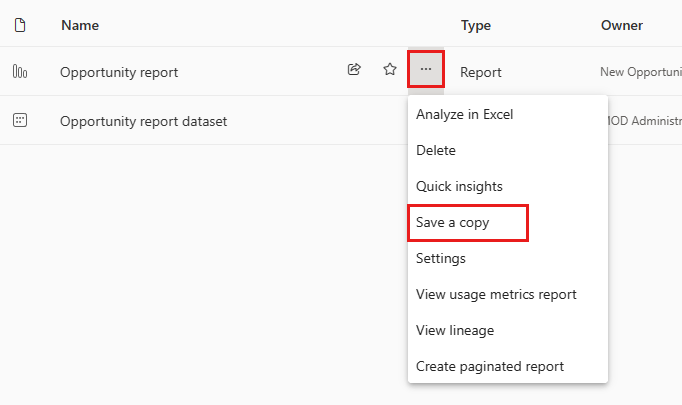
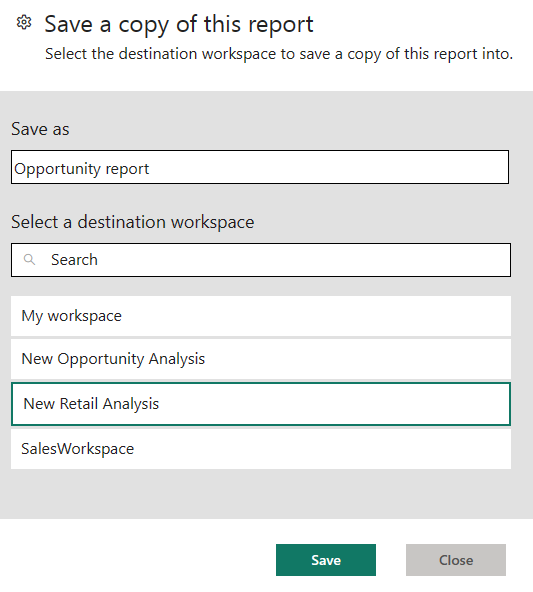
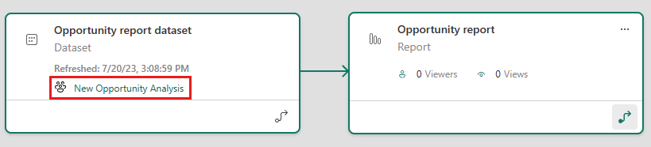
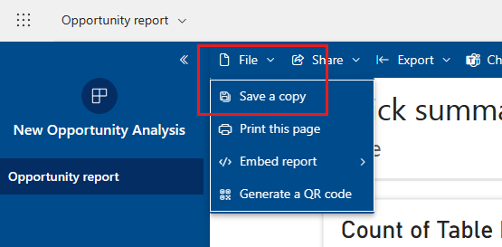
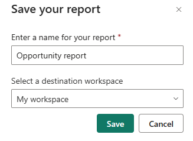
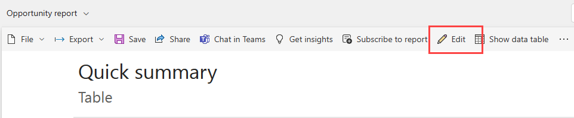

# Copy reports from other workspaces

When you find a report you like in a workspace or an app, you can make a copy of it and save it to a different workspace. Then you can modify your copy of the report, adding or deleting visuals and other elements. You don't have to worry about creating the data model - the copy of report will still reference the same dataset as the original report. And it's much easier to modify an existing report than it is to start from scratch. However, when you make an app from your workspace, sometimes you can't publish your copy of the report in the app. See [Considerations and limitations in the article "Use datasets across workspaces"](service-datasets-across-workspaces.md#considerations-and-limitations) for details.

## Prerequisites

- To copy a report, you need a Pro or Premium Per User (PPU) license, even if the original report is in a workspace in a Premium capacity.
- To copy a report to another workspace, or to create a report in one workspace based on a dataset in another workspace, you need [Build permission for the dataset](service-datasets-build-permissions.md). For datasets in the original workspace, if you have at least the Contributor role you automatically have Build permission through your workspace role. You also need at least the Contributor role in the source and the destination workspaces. See [Roles in workspaces](../collaborate-share/service-roles-new-workspaces.md) for details.

## Save a copy of a report in a workspace

1. In a workspace, find a report in the list. The report has a **More options** menu.

    

1. From **More options**, select **Save a copy**.

    

    You only see the **Save a copy** option if you have [Build permission](service-datasets-build-permissions.md). Even if you have access to the workspace, you have to have Build permission for the dataset.

3. In **Save a copy of this report**, give the report a name and select the destination workspace.

    

    You can save the report to the current workspace or a different one in the Power BI service. You only see workspaces in which you're a member.
  
4. Select **Save**.

    Power BI automatically creates a copy of the report in the workspace you selected. In the list view of that workspace, you won't see the referenced dataset if it is located in another workspace. To see the shared dataset, on the report copy in list view select **More options** > **View lineage**. 

    

   In lineage view, the icon for datasets that are located in other workspaces is different from the icon for datasets that are in the same workspace as the associated report. This makes it easy to see which reports and dashboards use datasets that are outside the workspace.

    See [Your copy of the report](#your-copy-of-the-report) in this article for more about the report and related dataset.

## Copy a report in an app

1. In an app, open the report you want to copy.
2. In the menu bar, select **File** > **Save a copy**.

    

    You only see the **Save a copy** option [Build permission] if app permissions grant [Build permission](service-datasets-build-permissions.md) for the underlying dataset, and allow users to make copies of the report.

3. Give your report a name, select a destination workspace, and then select **Save**.

    

    Your copy is automatically saved to the workspace you selected.

4. Select **Go to report** to open your copy.

## Your copy of the report

When you save a copy of the report, you create a live connection to the dataset, and you can open the report creation experience with the full dataset available. 

You haven't made a copy of the dataset. The dataset still resides in its original location. You can use all tables and measures in the dataset in your own report. Row-level security (RLS) restrictions on the dataset are in effect, so you only see data you have permissions to see based on your RLS role.

## View related datasets

When you have a report in one workspace based on a dataset in another workspace, you may need to know more about the dataset it's based on.

1. In the report, select **More options** > **See related content**.

    

1. The **Related content** dialog box shows all related items. In this list, the dataset looks like any other. You can't tell it resides in a different workspace. This issue is known.
 
    

## Delete a report copy

If you want to delete the copy of the report, in the list of reports in the workspace, hover over the report you want to delete, select **More options**, and choose **Delete**.

> [!NOTE]
> Deleting a report doesn't delete the dataset it is built on.
## Next steps

- [Use datasets across workspaces](service-datasets-across-workspaces.md)
- Questions? [Try asking the Power BI Community](https://community.powerbi.com/)
