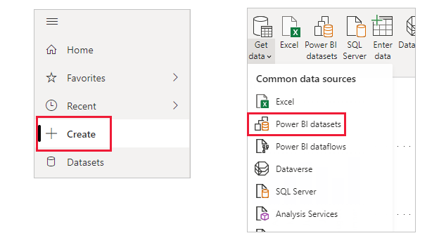
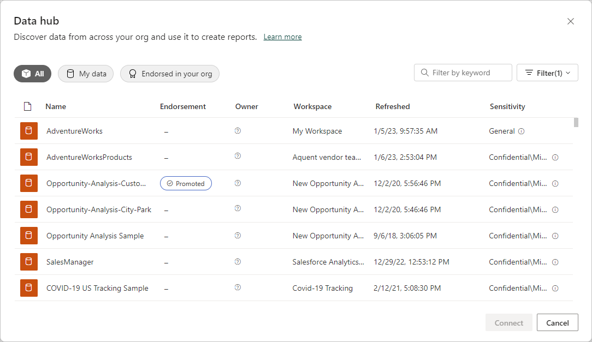
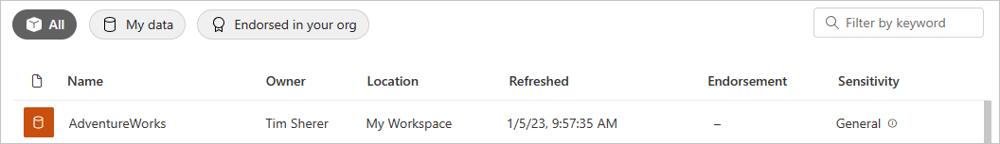
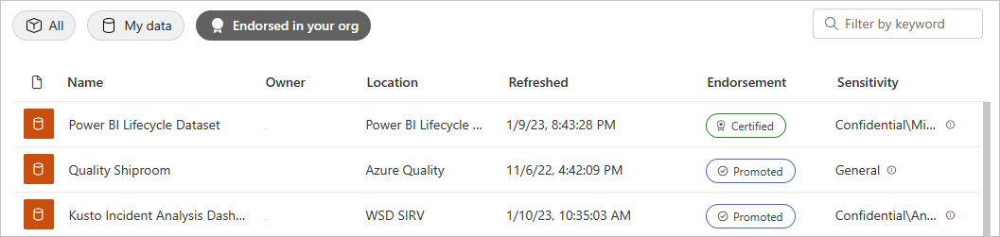

# Create reports based on datasets from different workspaces

Learn how you can create reports in your own workspaces based on datasets in other workspaces. To build a report on top of an existing dataset, you can start from Power BI Desktop or from the Power BI service, in your My Workspace or in a [new workspace experience](../collaborate-share/service-create-the-new-workspaces.md).

- In the Power BI service: **Create** > **Pick a published dataset**.
- In Power BI Desktop: from the **Home** ribbon, select **Get data** > **Power BI datasets**.

    
   
In both cases, the dataset discovery experience starts in this dialog box, **Select a dataset to create a report**. You see all the datasets you have access to, regardless of where they are:

You notice the first one is labeled **Promoted**. We'll get to that in [Find an endorsed dataset](#find-an-endorsed-dataset), later in this article.

The datasets you see in this list meet at least one of the following conditions:

- The dataset is in one of the new workspace experience workspaces, and you're a member of that workspace. See [Considerations and limitations](service-datasets-across-workspaces.md#considerations-and-limitations).
- You have Build permission for the dataset, which is in a new workspace experience workspace.
- The dataset is in your My Workspace.

> [!NOTE]
> If you're a free user, you only see datasets in your My Workspace, or datasets for which you have Build permission that are in Premium-capacity workspaces.

When you click **Create**, you create a live connection to the dataset, and the report creation experience opens with the full dataset available. You haven't made a copy of the dataset. The dataset still resides in its original location. You can use all tables and measures in the dataset to build your own reports. Row-level security (RLS) restrictions on the dataset are in effect, so you only see data you have permissions to see based on your RLS role.

You can save the report to the current workspace in the Power BI service, or publish the report to a workspace from Power BI Desktop. Power BI automatically creates an entry in the list of datasets if the report is based on a dataset outside of the workspace.

The entry shows information about the dataset, and a few select actions.

## Find an endorsed dataset

There are two different kinds of endorsed datasets. Dataset owners can *promote* a dataset that they recommend to you. Also, the Power BI admin can designate experts in your organization who can *certify* datasets for everyone to use. Promoted and certified datasets both display *badges* that you see both when looking for a dataset, and in the list of datasets in a workspace. The name of the person who certified a dataset is displayed in a tooltip during the dataset discovery experience; hover over the **Certified** label and you see it.

- In the Power BI service: **Datasets**.
- In Power BI Desktop: **Get data** > **Power BI datasets**.

    In the **Select a dataset** dialog box, endorsed datasets top the list by default. 

    

## Next steps

- [Use datasets across workspaces](service-datasets-across-workspaces.md)
- Questions? [Try asking the Power BI Community](https://community.powerbi.com/)
