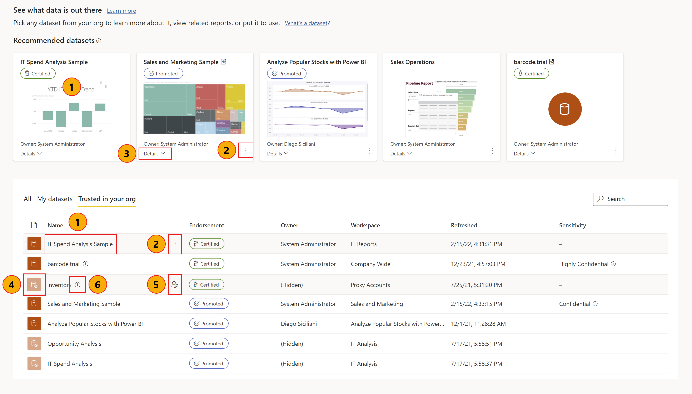
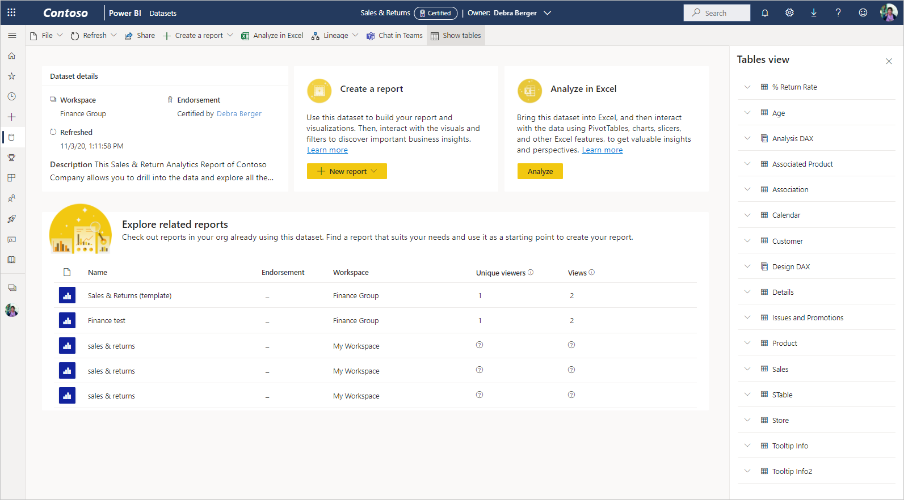

# Datasets discovery using the datasets hub

The datasets hub makes it easy to find, explore, and use the datasets in your organization. It provides information about the datasets as well as entry points for creating reports on top of those datasets or for using those datasets with Analyze in Excel.

The datasets hub can be useful in many scenarios:
* Dataset owners can see dataset usage metrics, refresh status, related reports, and lineage to help monitor and manage their datasets.
* Report creators can use the hub to find suitable datasets to build their reports on and use links to easily create reports based on the dataset, either from scratch or from templates.
* Report consumers can use this page to find reports based on trustworthy datasets.

By making it easy to find quality datasets and their related reports, the datasets hub helps prevent the creation of redundant reports. It also makes it easy to find good reports to use as starting points for creating new reports.

This article explains what you see on the datasets hub and describes how to use it. For dataset owners, it also includes a number of tips about how to [enhance the discoverability and useability of their datasets](#make-your-dataset-discoverable).

**What datasets do I see in the datasets hub?**
* For a dataset to show up in the datasets hub, it must be located in a [new workspace experience](../collaborate-share/service-new-workspaces.md).
* The datasets you can see in the datasets hub are those that you have at least [build permissions](service-datasets-build-permissions.md) for. If [dataset discoverability](../collaborate-share/service-discovery.md) has been enabled for you, you also see datasets that you don't have access to, but they appear grayed out, and you can't create reports from them or see their details. You can request access to them, though. 
* If you're a free user, you only see datasets in your *My workspace*, or datasets that you have [build permissions](service-datasets-build-permissions.md) for and that are located in Premium-capacity workspaces.

## Find the dataset you need

The dataset discovery experience starts on the datasets hub page. To get to the datasets hub page:
* In the Power BI service: Select **Datasets** in the navigation pane.
* In the Power BI app in Teams: Select either the **Datasets** tab or **Datasets** in the navigation pane.

The image below shows the datasets hub in the Power BI service.

The datasets hub presents you with a selection of recommended datasets and a list of all the datasets in the organization that you have permissions to access. If [dataset discoverability](../collaborate-share/service-discovery.md) is enabled for you, you also see datasets you don't have access to.

1. Click to view details page and to explore related reports.
1. Click to view options.
1. Click to view a summary of details.
1. A greyed-out dataset indicates that you don't have permissions to access it (visible only if [dataset discoverability](../collaborate-share/service-discovery.md) is enabled for you).
1. Click to request access.
1. Click to see dataset description.

The sections below describe these sections and the actions you can perform.

### Recommended datasets

Recommended datasets are endorsed datasets (promoted or certified) that are presented to you based on a calculation that takes into account how recently they've been refreshed and how recently you've visited reports and/or dashboards that are related to them.

### Dataset list

The dataset list shows you datasets in the organization that you have at least [build permissions](service-datasets-build-permissions.md) to. If [dataset discoverability](../collaborate-share/service-discovery.md) is enabled for you, you also see datasets you don't have access to. They appear grayed out.

The list has three tabs to filter the list of datasets.
* **All datasets**: Shows all the datasets in your organization that you have permission to find. 
* **Recent**: Shows datasets whose related reports you’ve recently accessed. When you access a report, there may be a delay of several minutes until the related dataset shows up in the Recent column.
* **My datasets**: Shows the datasets you own. 

Use the search box to further filter down the items on the current tab.

The columns of the list are described below. Click on a column header to sort by that column. 
* **Name**: The dataset name. Click the dataset name to explore reports that are built using this dataset.
* **Endorsement**: Endorsement status.
* **Owner**: Dataset owner.
* **Workspace**: The workspace the dataset is located in.
* **Refreshed**: Last refresh time (rounded to hour, day, month, and year. See the dataset info on the dataset detail page for exact time of last refresh).
* **Sensitivity**: Sensitivity, if set. Click on the info icon to view the sensitivity label description.

### Create new reports or pull data into Excel via Analyze in Excel

To create a new report based on dataset, or to pull the data into Excel with [Analyze in Excel](../collaborate-share/service-analyze-in-excel.md), select **More options (...)** either at the bottom right corner of a recommended dataset tile, or on a dataset's line in the list of datasets. Other actions may be appear on the drop-down menu, depending on the permissions you have on the dataset.

When you create a new report based on the dataset, the report edit canvas opens. When you save the new report, it will be saved in the workspace that contains the dataset if you have write permissions on that workspace. If you don't have write permissions on that workspace, or if you are a free user and the dataset resides in a Premium-capacity workspace, the new report will be saved in *My workspace*.

## View dataset details and explore related reports

To see more information about the dataset, to explore related reports, or to create a new report based on the dataset, from scratch or from a template, pick a dataset from the recommended datasets or from the datasets list. A page will open that shows you information about the dataset, lists the reports that are built on top of the dataset, and provides entry points for creating new reports based on the dataset or pulling the data into Excel via [Analyze in Excel](../collaborate-share/service-analyze-in-excel.md).

The page header displays the dataset name, endorsement, if any, and dataset owner. To send an email to the dataset owner or the dataset certifier (if any), click the header and then click the name of the owner.

### Action bar

The Action bar at the top of the page contains a number of actions that you can launch.

|Action  |Description  |
|---------|---------|
|**File**     | Download the .pbix file for this dataset, manage permissions to this dataset, or go to dataset settings.       |
|**Refresh**     | Refresh this dataset.        |
|**Share**     | Share this dataset.        |
|**Create a report**     | Create a report based on this dataset either from scratch or from a template, if one exists.        |
|**Analyze in Excel**     | Launch [Analyze in Excel](../collaborate-share/service-analyze-in-excel.md) using this dataset.        |
|**Lineage**     | Open the [lineage view](../collaborate-share/service-data-lineage.md) of this dataset.        |
|**Chat in Teams**     | Invite people to start [chatting in Teams](../collaborate-share/service-share-report-teams.md). People you invite will receive a Teams chat message from you with a link to this dataset details page. If they have access to the dataset, the link will open this dataset details page in Teams.        |
|**Show tables**     | Open a side panel showing the dataset's tables.        |

### Dataset details

The dataset details section shows the name of the workspace where the dataset is located, the exact time of the last refresh, sensitivity (if set), the dataset description (if any), and certifier name (if certified). You can also open the dataset lineage from here.

### Related reports

The Explore related reports section shows you all the reports that are built on the selected dataset. You can create a copy of a report by selecting the report line in the list and then clicking the Save a copy of this report icon.

The columns in the list of related reports are:
* **Name**: Report name. If the name ends with (template), it means that this report has been specially constructed to be used as a template.
* **Endorsement**: Endorsement status.
* **Workspace**: The name of the workspace where the report is located.

### Create a report built on the dataset

In the Create a report section, click the **Create** button. If there is a report template for the dataset, a drop-down menu will offer two options:
* **From template**: Creates a copy of the template in *My workspace*.
* **From scratch**: Opens the report editing canvas to a new report built on the dataset. When you save your new report, it will be saved in the workspace that contains the dataset if you have write permissions on that workspace. If you don't have write permissions on the workspace, or if you are a free user and the dataset resides in a Premium-capacity workspace, the new report will be saved in *My workspace*.

If there are no report templates, clicking **Create** will open the report editing canvas directly.

>[!NOTE]
> Only one template will be shown in the Create report drop-down, even if more than one report template exists for this dataset. 

### Pull the dataset into Excel via Analyze in Excel

In the Analyze in Excel section, select **Analyze** to pull the dataset into Excel via Analyze in Excel.

## Make your dataset discoverable

There are a number of ways you can enhance the discoverability of your datasets:
* **Endorse your dataset**: You can promote or certify your dataset to make it easier for users to find and to let them know that it is a trustworthy source of data. Endorsed datasets are labeled with badges and are readily identifiable in Power BI. In the datasets hub, only endorsed datasets show up in the recommended datasets section, and the datasets list by default lists endorsed datasets first.

    [Learn how to endorse your datasets](../collaborate-share/service-endorse-content.md).

* **Make your dataset discoverable**: If dataset discoverability is enabled for you, you can mark your dataset as discoverable. When a dataset is marked as discoverable, users who don't have access to it will still be able to find it in the datasets hub.

    [Learn more about dataset discoverability](../collaborate-share/service-discovery.md)

* **Provide a meaningful description of the dataset**: You can help users discover the right dataset for them by providing useful, meaningful descriptions of your datasets. [You provide the description as part of the process of endorsing the dataset](../collaborate-share/service-endorse-content.md#promote-content). 
* **Give your dataset a memorable image**: You can make it easier for users to find and remember your dataset by giving it memorable image. This makes your dataset stand out on the datasets hub page and anywhere else that supports displaying dataset images. To give your dataset an image, open your dataset's settings, and expand the dataset image section.
* **Create a report template built on the dataset**: You can create a report template that users can use to get started building their own reports based on your dataset. This template is simply a regular report that you design keeping in mind that it to be used as a template. When you save it, you must add the suffix "(template)" to the report name, e.g. *Monthly Sales (template)*.

    When a user selects **Create > From template** in the create a report section in the dataset details view of the datasets hub, a copy of the template will be created in the user's *My workspace*, and then opened in the report editing canvas.

    Report templates are also easily identifiable in the list of related reports in the dataset details view of the datasets hub.
  
## Next steps
* [Use datasets across workspaces](service-datasets-across-workspaces.md)
* [Create reports based on datasets from different workspaces](service-datasets-discover-across-workspaces.md)
* [Endorse your dataset](../collaborate-share/service-endorse-content.md)
* Questions? [Try asking the Power BI Community](https://community.powerbi.com/)
