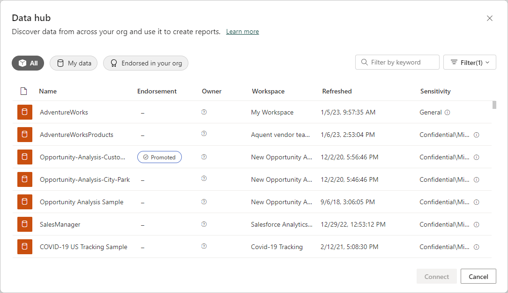

# Find, manage, and connect to datasets

The Dataset hub makes it easy to find and explore the datasets in your organization. It provides information about the datasets as well as entry points for creating reports on top of those datasets or for using those datasets with Analyze in Excel.

The datasets hub can be useful for many purposes:
* Dataset owners can use the information about dataset use, refresh status, related reports, and lineage to help monitor and manage their datasets.  Manage your own datasets. Use “My datasets” tab to see and manage all the datasets you own, and click on a dataset to see its details including usage metrics. View dataset lineage to understand its source and its downstream artifacts
* Report creators can use the hub to find suitable datasets to build their reports on and use links to easily create reports based on the dataset, either from scratch or from templates.
* It makes it easy to find reports that are build on a dataset. This helps prevent the creation of redundant reports. It also makes it easy to find a good report to use as a starting point from creating new reports. 
* Report consumers can use this page to find reports based on trustworthy datasets.

**The datasets you can see via the datasets hub are those that you have [build permissions](connect-data/service-datasets-build-permissions.md) to**.

[Image]

**Recommended datasets**

Recommended datasets are endorsed datasets (promoted or certified) that are presented to you based on a calculation that takes into account how recently they've been refreshed and the number of recent visitors to reports based them.

**Dataset list**

The dataset list shows you all the datasets in the organization that you have at least [build permissions](connect-data/service-datasets-build-permissions.md) to.

The list shows you 
* The database name (if a description exists for the database, a small “i” icon will appear at the end of the name. Mouseover the icon to display the description).
* Endorsement status
* Owner
* The workspace the dataset is located in
* Last refresh time (rounded to hour, day, month, and year. See the dataset info on the detail page for exact time of last refresh).
* Sensitivity, if set. Click on the info icon to view label description.

Click on a column header to sort by that column.

The list has three tabs to filter the items shown.
* **All**: Shows all the datasets in your organization that you have at least [build permissions](connect-data/service-datasets-build-permissions.md) to.
* **Recent**: Shows datasets whose related reports you’ve recently accessed. When you access a report, there may be a delay of several minutes until the dataset it's build on shows up in the Recent column.
* **My datasets**: Shows the datasets you own. 

Use the search box to further filter down the items on the currently viewed tab.

**To create a new report based on the dataset, or to pull the data into Excel with Analzye in Excel, or to view dataset lineage**, select **More options (...)** either at the bottom right corner of a recommendated dataset tile, or on the dataset entry in the list of datasets. Other actions may be appear on the drop-down menu, depending on the permissions you have on the database.

When you create a new report based on the dataset, the report edit canvas opens. When you save the new report, it will be saved in the workspace that contains the dataset if you have write permissions on the workspace the dataset is located in. If you don't have permissions, or if you are a free user and the dataset resides in a Premium capacity, the new report will be saved in "My Workspace".

**To see info about recommended datasets**, click **Details** at the bottom left of a recommended dataset tile.

To see 

The hub page has two sections
####################

Learn how you can create reports in your own workspaces based on datasets in other workspaces. To build a report on top of an existing dataset, you can start from Power BI Desktop or from the Power BI service, in your My Workspace or in a [new workspace experience](../collaborate-share/service-create-the-new-workspaces.md).

- In the Power BI service: **Get data** > **Published datasets**.
- In Power BI Desktop: **Get data** > **Power BI datasets**.

    
   
In both cases, the dataset discovery experience starts in this dialog box, **Select a dataset to create a report**. You see all the datasets you have access to, regardless of where they are:

You notice the first one is labeled **Promoted**. We'll get to that in [Find an endorsed dataset](#find-an-endorsed-dataset), later in this article.

The datasets you see in this list meet at least one of the following conditions:

- The dataset is in one of the new workspace experience workspaces, and you're a member of that workspace. See [Considerations and limitations](service-datasets-across-workspaces.md#considerations-and-limitations).
- You have Build permission for the dataset, which is in a new workspace experience workspace.
- The dataset is in your My Workspace.

> [!NOTE]
> If you're a free user, you only see datasets in your My Workspace, or datasets for which you have Build permission that are in Premium-capacity workspaces.

When you click **Create**, you create a live connection to the dataset, and the report creation experience opens with the full dataset available. You haven't made a copy of the dataset. The dataset still resides in its original location. You can use all tables and measures in the dataset to build your own reports. Row-level security (RLS) restrictions on the dataset are in effect, so you only see data you have permissions to see based on your RLS role.

You can save the report to the current workspace in the Power BI service, or publish the report to a workspace from Power BI Desktop. Power BI automatically creates an entry in the list of datasets if the report is based on a dataset outside of the workspace. The icon for this dataset is different from the icon for datasets in the workspace: 

That way, members of the workspace can tell which reports and dashboards use datasets that are outside the workspace. The entry shows information about the dataset, and a few select actions.

## Find an endorsed dataset

There are two different kinds of endorsed datasets. Dataset owners can *promote* a dataset that they recommend to you. Also, the Power BI admin can designate experts in your organization who can *certify* datasets for everyone to use. Promoted and certified datasets both display *badges* that you see both when looking for a dataset, and in the list of datasets in a workspace. The name of the person who certified a dataset is displayed in a tooltip during the dataset discovery experience; hover over the **Certified** label and you see it.

- In the Power BI service: **Get data** > **Published datasets**.
- In Power BI Desktop: **Get data** > **Power BI datasets**.

    In the **Select a dataset** dialog box, endorsed datasets top the list by default. 

    

## Next steps

- [Use datasets across workspaces](service-datasets-across-workspaces.md)
- Questions? [Try asking the Power BI Community](https://community.powerbi.com/)
