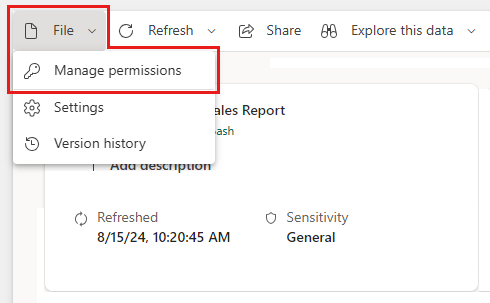
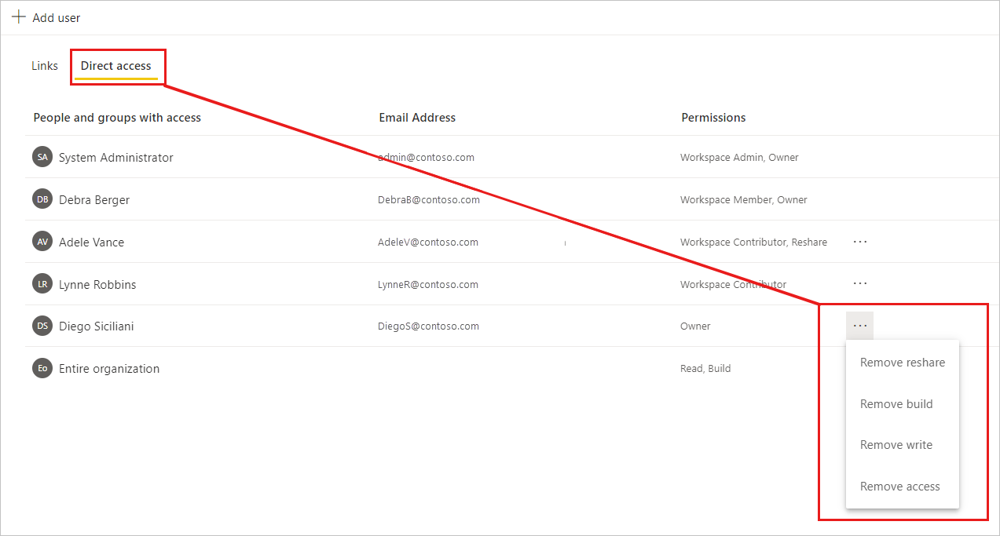
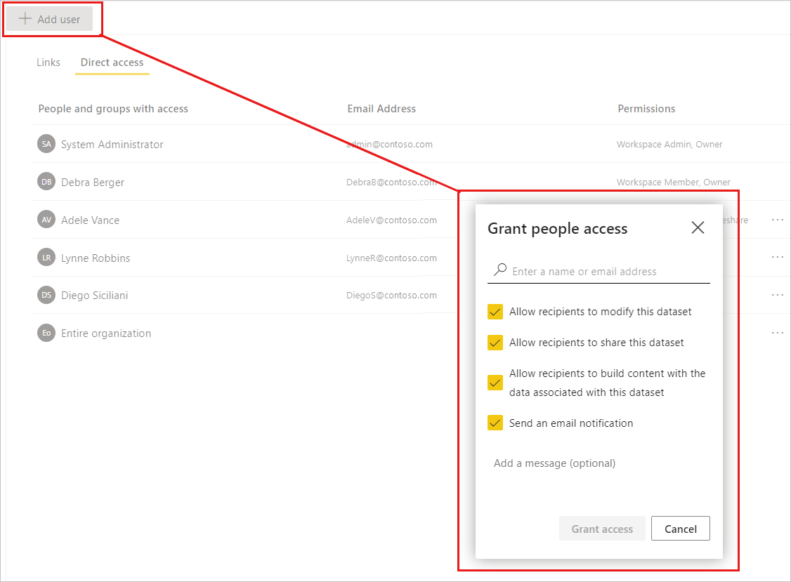

# Manage semantic model access permissions (preview)

The semantic model manage permissions page enables you to monitor and manage access to your semantic model. It has two tabs that help you control access to your semantic model:
* **Direct access**: Enables you to monitor, add, modify, or delete access permissions for specific people or groups (distribution groups or security groups).
* **Shared report links**: Shows you [links that were generated for sharing reports](../collaborate-share/service-share-dashboards.md). Such links sometimes also give access to your semantic model. On this tab you can review them and remove them if necessary.

This document explains how to use the semantic model manage permissions page.

>[!NOTE]
> In order to be able to access a semantic model's manage permissions page, you must have an [admin or member role](../collaborate-share/service-roles-new-workspaces.md) in the workspace where the semantic model is located.

## Open the semantic model manage permissions page

To open the semantic model, manage permissions page:

* From the [OneLake data hub](service-data-hub.md#find-the-data-you-need): Select **Manage permissions** on the **More options (…)** menu.

    

* From the [semantic model details page](service-dataset-details-page.md#supported-actions): Select the **Share** icon on the action bar at the top of the page and choose **Manage permissions**.

    

* From the [Share semantic model dialog](service-datasets-share.md): In the dialog header, select **Manage permissions** on the **More options (…)** menu. The **Managed permissions** side pane opens. In the side pane, choose **Advanced** at the bottom of the pane.

    
 
These actions open the semantic models manage permissions page. The manage permissions page has two tabs to help you manage semantic model access.

## Manage direct access

The direct access tab lists users who have been granted access. For each user, you can see their email address and the permissions they have.

* To modify a user’s permissions, select **More options (…)** and choose one of the available options.

    

* To grant semantic model access to another user, click **+ Add user**. The [Share semantic model dialog](service-datasets-share.md) opens.

    

### Managing permissions granted through an app

Permissions on the semantic model granted through an app are indicated by the word "App" followed by the permissions enclosed in parentheses, as shown in the following image:

You can't modify permissions granted through an app directly from the Direct access tab - you must first remove them from the app configuration. To remove such permissions:

1. [Edit the app](../collaborate-share/service-create-distribute-apps.md#change-your-published-app) and unselect the relevant permissions on the Permissions tab of the app's configuration settings.

1. Republish the app.

1. Go to the Direct access tab of the semantic model's manage semantic model permissions page as described [above](#manage-direct-access). The user has the permissions granted via the app before update, but now they're not tied to the app (note that the parentheses are gone). Now you can remove whatever permissions you desire.

    

## Manage links generated for report sharing

The shared report links tab lists [links that have been created to shared reports](../collaborate-share/service-share-dashboards.md) that are based on your semantic model. Such links may also grant access to the report’s underlying semantic model, and so these links are listed here. You can see what permissions the link carries and who created the link. You can also delete the link from the system if you so desire.

>[!WARNING]
> Deleting a link removes it from the system. Users who use the link to access a report may lose access to that report.

## Related content

* [Semantic model permissions](./service-datasets-permissions.md)
* [Share access to a semantic model](./service-datasets-share.md)
* [Use semantic models across workspaces](./service-datasets-across-workspaces.md)
* [Share a report via link](../collaborate-share/service-share-dashboards.md#share-a-report-via-link)
* Questions? [Try asking the Power BI Community](https://community.powerbi.com/)
