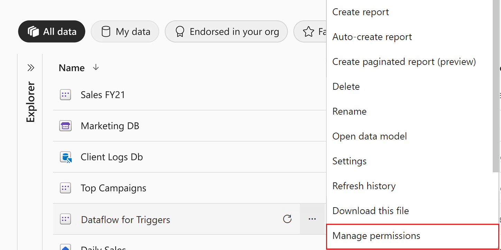

# Manage dataset access permissions (preview)

The dataset manage permissions page enables you monitor and manage access to your dataset. It has two tabs that help you control access to your dataset:
* **Direct access**: Enables you to monitor, add, modify, or delete access permissions for specific people or groups (distribution groups or security groups).
* **Shared report links**: Shows you [links that were generated for sharing reports](../collaborate-share/service-share-dashboards.md). Such links sometimes also give access to your dataset. On this tab you can review them and remove them if necessary.

This document explains how to use the dataset manage permissions page.

>[!NOTE]
> In order to be able to access the manage permissions page for a dataset, you must have at least a [member role](../collaborate-share/service-roles-new-workspaces.md) in the workspace where the dataset is located.

## Open the dataset manage permissions page

To open the dataset manage permissions page:

* From the [datasets hub](service-datasets-hub.md#find-the-dataset-you-need): Click **Manage permissions** on the **More options (…)** menu.

    

* From the [dataset info page](service-datasets-hub.md#view-dataset-details-and-explore-related-reports): Click the **Share** icon on the action bar at the top of the page and choose **Manage permissions**.

    

* From the [Share dataset dialog](service-datasets-share.md): In the dialog header, click **Manage permissions** on the **More options (…)** menu. This opens the **Manage permissions** side pane. In the side pane, choose **Advanced** at the bottom of the pane.

    
 
These actions will open the datasets manage permissions page. The manage permissions page has two tabs to help you manage dataset access.

## Manage direct access

The direct access tab lists users who have been granted access. For each user you can see their email address and the permissions they have.

To modify a user’s permissions, click **More options (…)** and choose one of the available options.
 
Click **+ Add user** to grant dataset access to another user. The [Share dataset dialog](service-datasets-share.md) will open.

## Manage links generated for report sharing

The shared report links tab lists [links that have been created to shared reports](../collaborate-share/service-share-dashboards.md) that are based on your dataset. Such links may also grant access to the report’s underlying dataset, and so they are listed here. You can see what permissions the link carries and who created the link. You can also delete the link from the system if you so desire.

>[!WARNING]
> Deleting a link removes it from the system. Users who use the link to access a report may lose access to that report.

## Next steps

* [Share access to a dataset](service-datasets-share.md)
* [Use datasets across workspaces](service-datasets-across-workspaces.md)
* [Share a report via link](../collaborate-share/service-share-dashboards.md#share-a-report-via-link)
* Questions? [Try asking the Power BI Community](https://community.powerbi.com/)
