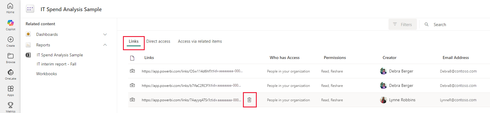

# Dataset permissions

## What are dataset permissions

## How do users acquire dataset permissions?

A  user might acquire dataset permissions in two ways:
* **Implicitly**, via the user's Workspace role
* **Explicitly**, for example, by being granted permissions on the dataset's manage permissions page, or by having a report that uses the dataset shared with them (which might grant them build permission on the dataset).

The table below shows which dataset permissions a user has implicitly based on their workspace role.

|Dataset Permission\Workspace Role  |Admin  |Member  |Contributor  |Viewer |
|-----------------------------------|-------|--------|-------------|-------|
|Read                               |✔️      |✔️       |✔️            |✔️      |
|Build                              |✔️      |✔️       |✔️            |❌      |
|Reshare                            |✔️      |✔️       |❌            |❌      |
|Write                              |✔️      |✔️       |✔️            |❌      |   

|Permission  |Description  |Can be granted explicitly  |
|------------|-------------|---------------------------|
|Read        |Can access reports that read data from the dataset. No enhanced discoverability for report authoring from this dataset. Can't query using XMLA|Yes |
|Build       |Can query using external APIs like XMLA Enhanced discoverability for report authoring from this dataset |Yes        |
|Reshare     |Can assign dataset level permissions (and therefore access) to the dataset |Yes |
|Write       |Can view and modify the dataset metadata |Yes |

The dataset manage permissions page enables you to monitor and manage access to your dataset. It has two tabs that help you control access to your dataset:
* **Direct access**: Enables you to monitor, add, modify, or delete access permissions for specific people or groups (distribution groups or security groups).
* **Shared report links**: Shows you [links that were generated for sharing reports](../collaborate-share/service-share-dashboards.md). Such links sometimes also give access to your dataset. On this tab you can review them and remove them if necessary.

This document explains how to use the dataset manage permissions page.

>[!NOTE]
> In order to be able to access a dataset's manage permissions page, you must have an [admin or member role](../collaborate-share/service-roles-new-workspaces.md) in the workspace where the dataset is located.

## Open the dataset manage permissions page

To open the dataset manage permissions page:

* From the [datasets hub](service-datasets-hub.md#find-the-dataset-you-need): Select **Manage permissions** on the **More options (…)** menu.

    

* From the [dataset info page](service-datasets-hub.md#view-dataset-details-and-explore-related-reports): Select the **Share** icon on the action bar at the top of the page and choose **Manage permissions**.

    

* From the [Share dataset dialog](service-datasets-share.md): In the dialog header, select **Manage permissions** on the **More options (…)** menu. This opens the **Manage permissions** side pane. In the side pane, choose **Advanced** at the bottom of the pane.

    
 
These actions will open the datasets manage permissions page. The manage permissions page has two tabs to help you manage dataset access.

## Manage direct access

The direct access tab lists users who have been granted access. For each user, you can see their email address and the permissions they have.

To modify a user’s permissions, select **More options (…)** and choose one of the available options.
 
Click **+ Add user** to grant dataset access to another user. The [Share dataset dialog](service-datasets-share.md) will open.

## Manage links generated for report sharing

The shared report links tab lists [links that have been created to shared reports](../collaborate-share/service-share-dashboards.md) that are based on your dataset. Such links may also grant access to the report’s underlying dataset, and so they are listed here. You can see what permissions the link carries and who created the link. You can also delete the link from the system if you so desire.

>[!WARNING]
> Deleting a link removes it from the system. Users who use the link to access a report may lose access to that report.

## Next steps

* [Share access to a dataset](service-datasets-share.md)
* [Use datasets across workspaces](service-datasets-across-workspaces.md)
* [Share a report via link](../collaborate-share/service-share-dashboards.md#share-a-report-via-link)
* Questions? [Try asking the Power BI Community](https://community.powerbi.com/)

This article describes Power BI permissions in general, and dataset permissions in the context of the [Power BI REST APIs](/rest/api/power-bi/).

## Power BI permissions

Power BI has two sets of permissions:

* [Workspace permissions](#workspace-permissions)

* [Item permissions](#item-permissions)

### Workspace permissions

Workspace permissions, also known as folder permissions or [roles](../../collaborate-share/service-roles-new-workspaces.md), are the highest level of permissions in Power BI. These permissions override permissions that are given to a specific item in the workspace folder.

The table below lists the four types of folder roles. It shows each role's level, and the code string returned by the Power BI REST APIs. Admin is the highest workspace permission level, and viewer is the lowest. Every permission level includes the capabilities of the permissions below it. You can review the capabilities of each permission in [Workspace roles](../../collaborate-share/service-roles-new-workspaces.md#workspace-roles).

|Folder Role |Level |Derived permissions for datasets created in the workspace |
|------------|------|--------------------------|
|Admin       |4     |`ReadWriteReshareExplore` |
|Member      |3     |`ReadWriteReshareExplore` |
|Contributor |2     |`ReadWriteExplore`        |
|Viewer      |1     |`Read`                    |

>[!NOTE]
>The *write* permission is applied to Power BI datasets created by *admin*, *member* and *contributor* users in a workspace they own. The write permission can be granted or deleted using workspace permissions only. It cannot directly be granted to, or deleted from, a Power BI item.

#### Get and add workspace permissions with APIs

To get and add workspace permissions programmatically, you can use these APIs:

* [Groups - Add Group User](/rest/api/power-bi/groups/add-group-user) - A POST API for adding workspace permissions

* [Groups - Update Group User](/rest/api/power-bi/groups/update-group-user) - A PUT API for changing workspace permissions

*  [Groups - Get Group Users](/rest/api/power-bi/groups/get-group-users) - A GET API for getting workspace permissions

### Item permissions

Power BI items, such as reports, datasets, and dashboards have their own permissions. Item permissions cannot override workspace permissions, and can only be granted by someone who has at least the same permission level.

## Dataset permissions and REST APIs

Dataset permissions are part of the [item permissions](#item-permissions). The table below lists  the Power BI dataset permissions and their representation in the [Power BI REST APIs](/rest/api/power-bi/).

>[!TIP]
>Although the API permissions are identical to the Power BI service permissions, [build](#build-permissions-and-rest-apis) permissions are referred to as *explore* permissions in the APIs.

|Permission             |Read     |Explore  |Reshare  |
|-----------------------|---------|---------|---------|
|Description            |Allows the user to read the content of the dataset|Equivalent to [build permissions](#build-permissions-and-rest-apis) |Allows the user to share the content of the dataset with other users who will get read, reshare, or explore permissions for it |
|**ReadReshareExplore** |✔️       |✔️      |✔️       |
|**ReadReshare**        |✔️       |❌      |✔️       |
|**ReadExplore**        |✔️       |✔️      |❌       |
|**Read**               |✔️       |❌      |❌       |

>[!NOTE]
>To allow a user to perform write operations on a dataset, you need to change the [workspace permissions](#workspace-permissions).

### Build permissions and REST APIs

In the [Power BI REST APIs](/rest/api/power-bi/), the build permission is returned as *explore*. For example, a string with the *read*, *reshare* and *build* permissions, will look like this: `ReadReshareExplore`.

When you give a user the build permission, the user can build new content on your dataset. Examples for such content are reports, dashboards, pinned tiles from Q&A, paginated reports, and Insights Discovery.

Users also need build permissions to work with data outside Power BI:

* To export the underlying data.

* To build new content on the dataset such as with Analyze in Excel.

* To access the data via the XMLA endpoint.

### Row-level security

When you add or change permissions on a dataset that uses row-level security (RLS), any permissions higher than build will enable the user to view all the data in the dataset. Build, and permissions lower than build, will let the dataset user have access only to the data they're allowed to see as configured in your RLS settings.

### Dataset APIs for changing permissions

To add permissions for using datasets, use the POST APIs listed below. Using these APIs, you can add dataset permissions to users that don't have any permissions for the specified dataset, or to users that have a lower permissions level. For example, you can add the *Reshare* permission to a user that has the *Read* permission. However, you cannot remove the *Reshare* permission from a user that has both *Read* and *Reshare* permissions, by attempting to add the *Read* permission.

* [Datasets - Post Dataset User](/rest/api/power-bi/datasets/post-dataset-user)

* [Datasets - Post Dataset User In Group](/rest/api/power-bi/datasets/post-dataset-user-in-group)

### Limitations

These limitations are relevant for the [Datasets - Post Dataset User](/rest/api/power-bi/datasets/post-dataset-user) and [Datasets - Post Dataset User In Group](/rest/api/power-bi/datasets/post-dataset-user-in-group) APIs.

* The API caller must have at least `ReadReshare` permissions on the dataset.

* The API caller cannot grant permissions that are higher than his permissions for the dataset.

* Write permissions cannot be granted.

* These APIs only support datasets that were created in the [new workspace experience](/collaborate-share/service-new-workspaces). Datasets that reside on the classic workspace are not supported.

* These APIs only support users and groups. Service principals are not supported.

* You cannot use these APIs to remove dataset permissions.

## Next steps

>[!div class="nextstepaction"]
>[Power BI REST APIs](/rest/api/power-bi/).

>[!div class="nextstepaction"]
>[Push datasets](/rest/api/power-bi/push-datasets).

