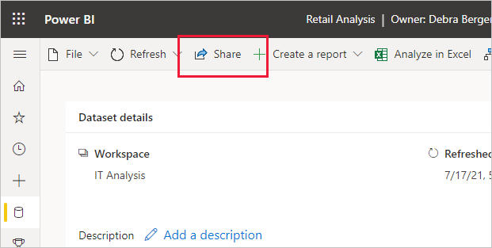
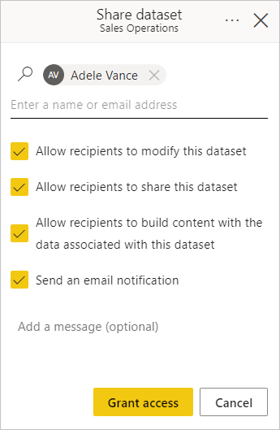

# Share access to a semantic model

To make it possible for other users to take advantage of a semantic model, you can *share* it with them. Sharing a semantic model means granting access to it. This document shows you how to grant access to a semantic model using the **Share semantic model** dialog.

## Share a semantic model

To share a semantic model

1. From either the semantic model's options menu on the [OneLake data hub](/fabric/get-started/onelake-data-hub#open-an-items-options-menu) or from the [data details page](./service-dataset-details-page.md#supported-actions), choose **Share** as follows:

    * **OneLake data hub**: In the data items list, open the [options menu](/fabric/get-started/onelake-data-hub#open-an-items-options-menu) and select **Share**. On a recommended data item tile, choose **Share** on the **More options (…)** menu.

        

    * **Semantic model details page**: Click the **Share** icon on the action bar at the top of the page.

        

1. In the **Share semantic model** dialog that appears, enter the names or email addresses of the specific people or groups (distribution groups or security groups) that you want to grant access to, then choose the types of access you wish to grant. You can optionally choose to send them an email notifying them that they've been granted access.

    

    * **Allow allow recipients to modify this semantic model**: This option allows the recipients to modify the semantic model.
    * **Allow recipients to share this semantic model**: This option allows the recipients to grant access to other users via sharing.
    * **Allow recipients to build content with the data associated with this semantic model**: This option grants the recipients [Build permission](service-datasets-build-permissions.md) on the semantic model, which enables them to build new reports and dashboards based on the data associated it.

        If you clear this checkbox, the user will get **read-only** permission on the semantic model. Read-only permission allows them to explore the semantic model on the [semantic model's info page](service-dataset-details-page.md) but doesn't allow them to build new content based on the semantic model.
    * **Send an email notification**: When this option is selected, an email will be sent to the recipients notifying them that they have been granted access to the semantic model. You can add an optional message to the email message.

1. Click **Grant access**.

> [!NOTE]
> When you press **Grant access**, access is granted automatically. No further approval is required. 

To monitor, change, or remove user access to your semantic model, see [Manage semantic model access permissions](service-datasets-manage-access-permissions.md).

## Related content

* [Semantic model permissions](service-datasets-permissions.md)
* [Manage semantic model access permissions](service-datasets-manage-access-permissions.md)
* [Use semantic models across workspaces](service-datasets-across-workspaces.md)
* [Share a report via link](../collaborate-share/service-share-dashboards.md#share-a-report-via-link)
* Questions? [Try asking the Power BI Community](https://community.powerbi.com/)
