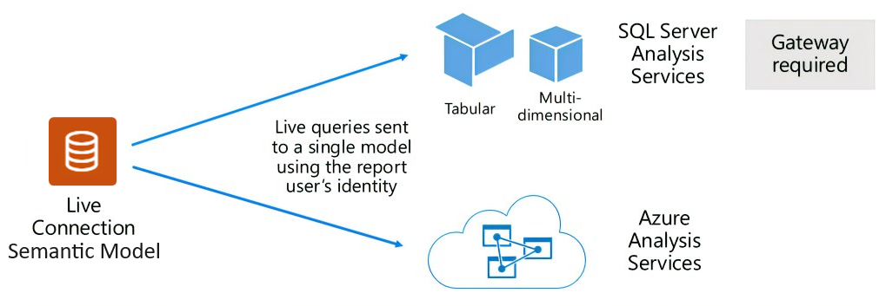

# Semantic models in the Power BI service

This article provides a technical explanation of Power BI semantic models.

## Semantic model types

Power BI semantic models represent a source of data that's ready for reporting and visualization. You can create Power BI semantic models in the following ways:

- Connect to an existing data model that isn't hosted in Power BI.
- Upload a Power BI Desktop file that contains a model.
- Upload an Excel workbook that contains one or more Excel tables and/or a workbook data model, or upload a comma-separated values (CSV) file.
- Use the Power BI service to create a [push semantic model](/rest/api/power-bi).
- Use the Power BI service to create a [streaming or hybrid streaming semantic model](service-real-time-streaming.md).

Except for streaming semantic models, semantic models represent data models, which use the mature modeling technologies of [Analysis Services](/analysis-services/analysis-services-overview).

> [!NOTE]
> Power BI documentation sometimes uses the terms *semantic model* and *model* interchangeably. A *semantic model* in the Power BI service refers to a *model* from a development perspective. In a documentation context, the terms mean much the same thing.

### External-hosted models

There are two types of externally hosted models: SQL Server Analysis Services and [Azure Analysis Services](/azure/analysis-services/analysis-services-overview).

To connect to a SQL Server Analysis Services model, you must install an [on-premises data gateway](service-gateway-onprem.md) either on premises or on a virtual machine-hosted infrastructure-as-a-service (IaaS). Azure Analysis Services doesn't require a gateway.

It often makes sense to connect to Analysis Services when there are existing model investments, which typically form part of an enterprise data warehouse (EDW). Power BI can make a *live connection* to Analysis Services, and enforce data permissions by using the identity of the Power BI report user.

SQL Server Analysis Services supports both multidimensional models, or cubes, and tabular models. As the following image shows, a live connection semantic model passes queries to externally hosted models.

### Power BI Desktop-developed models

You can use Power BI Desktop, a client application for Power BI development, to develop a model. A Power BI Desktop model is effectively an Analysis Services tabular model.

You can develop three different types, or *modes*, of models by using Power BI Desktop: Import, DirectQuery, and Composite. You develop models by importing data from dataflows and then integrating them with external data sources. The mode depends on whether data is imported into the model or whether it remains in the data source. For more information about the modes, see [Semantic model modes in the Power BI service](service-dataset-modes-understand.md).

### Semantic model ownership

When working with semantic models using gateway and cloud connections, your ability to make changes to the semantic model is dependent on ownership of the semantic model. If you're not the owner, a warning is displayed stating that you're viewing the section of the semantic model information in read-only mode because you're not the semantic model owner. To make changes, you must either contact the semantic model owner to request changes, or take over ownership of the semantic model.

### Row-level security

Externally hosted models and Power BI desktop models can enforce row-level security (RLS) to limit the data that certain users can retrieve. For example, users assigned to a **Salespeople** security group might be able to view report data only for the sales regions they're assigned to. RLS roles are *dynamic* or *static*. Dynamic roles filter by the report user, while static roles apply the same filters for all users assigned to the role. For more information, see [Row-level security (RLS) with Power BI](/fabric/security/service-admin-row-level-security).

### Excel workbook models

Creating semantic models based on [Excel workbooks](service-excel-workbook-files.md) or [CSV files](service-comma-separated-value-files.md) automatically creates a model. Imported Excel tables and CSV data create model tables, while Excel workbook data transposes to create a Power BI model. In all cases, file data imports into a model.

## Summary

In summary:

- Power BI semantic models that represent models are either hosted in the Power BI service, or are externally hosted by Analysis Services.
- Semantic models can store imported data, or issue pass-through query requests to underlying data sources, or do both.

## Considerations

The following important facts and considerations apply to Power BI semantic models that represent models:

- SQL Server Analysis Services-hosted models need a gateway to do live connection queries.
- To query Power BI-hosted models that import data, you must fully load them into memory.
- Power BI-hosted models that use Import mode need refresh to keep data current, and must use gateways when source data isn't accessible directly over the internet.
- Power BI-hosted Import models can refresh according to a schedule, or a user can trigger on-demand refresh in the Power BI service.
- Power BI-hosted models that use [DirectQuery](desktop-directquery-about.md) mode require connectivity to the source data. Power BI issues queries to the source data to retrieve current data. This mode must use gateways when source data isn't accessible directly over the internet.
- Models can enforce RLS rules to filter data access to certain users.
- You can use the [semantic models - Take Over In Group API](/rest/api/power-bi/datasets/take-over-in-group) to take over ownership if a semantic model owner leaves the organization.

To successfully deploy and manage Power BI semantic models, you should understand the following factors:

- The model design itself, including its data preparation queries, relationships, and calculations.
- The following configurations that can significantly impact Power BI capacity resources:
  - Where models are hosted
  - The storage mode
  - Any dependencies on gateways
  - The size of imported data
  - Model refresh type and frequency

## Related content

- [Semantic model modes in the Power BI service](service-dataset-modes-understand.md)
- Questions? [Ask the Power BI Community](https://community.powerbi.com)
- Suggestions? [Contribute ideas to improve Power BI](https://ideas.powerbi.com)
