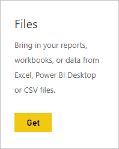
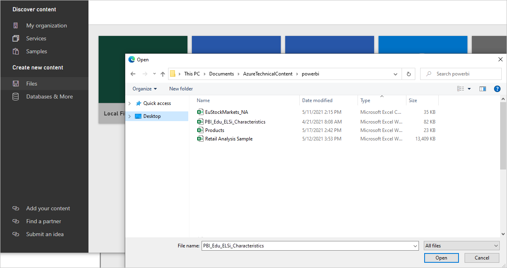
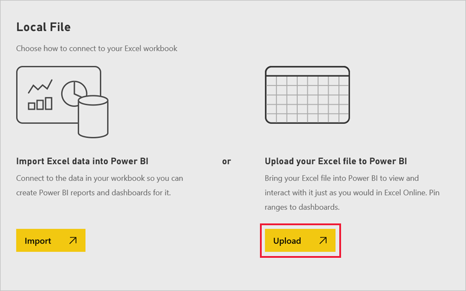
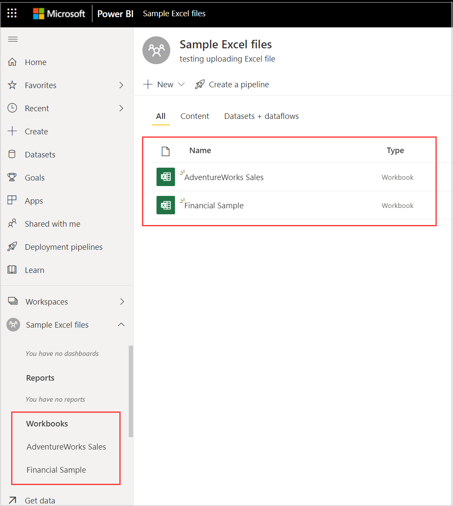

# Get data from Excel workbook files

Microsoft Excel is one of the most widely used business applications around. It’s also one of the most common ways to get your data into Power BI.

## What types of workbooks does Power BI support?
Power BI supports importing or connecting to workbooks created in Excel 2007 and later. Workbooks must be saved as .xlsx or .xlsm file type and be under 1 GB. Some features described in this article are only available in later versions of Excel.

### Workbooks with ranges or tables of data
If your workbook has simple worksheets with ranges of data, to get the most out of your data in Power BI, be sure to format those ranges as tables. This way, when creating reports in Power BI, you’ll see named tables and columns in the Fields pane, making it much easier to visualize your data.

### Workbooks with data models
Workbooks can contain a data model with one or more tables of data loaded into it by using linked tables, Power Query (Get & Transform in Excel 2016), or Power Pivot. Power BI supports all data model properties such as relationships, measures, hierarchies, and KPIs.

> [!NOTE]
> Workbooks with data models cannot be shared across Power BI tenants. For example, a user who logs in to Power BI using a *contoso.com* account cannot share an Excel workbook with a user who logs in using a Power BI login account from *woodgrovebank.com*.
> 
> 

### Workbooks with connections to external data sources
If you use Excel to connect to an external data source, once your workbook is in Power BI, you can create reports and dashboards based on data from that connected data source. You can also setup Scheduled Refresh to automatically connect right to the data source and get updates. You’ll no longer need to refresh manually from the Data ribbon in Excel. Any visualizations in reports and tiles in dashboards based on data from that data source are updated automatically. To learn more, see [Data refresh in Power BI](refresh-data.md).

### Workbooks with Power View sheets, PivotTables and charts
How your PowerView sheets and PivotTables and charts appear, or not appear, in Power BI depends on where your workbook file is saved and how you choose to get it into Power BI. We'll go into this more below.

## Data types
Power BI supports the following data types: Whole Number, Decimal Number, Currency, Date, True/False, Text. Marking data as specific data types in Excel will improve the Power BI experience.

## Prepare your workbook for Power BI
Watch this helpful video to learn more about how to make sure your Excel workbooks are ready for Power BI.

<iframe width="500" height="281" src="https://www.youtube.com/embed/l2wy4XgQIu0" frameborder="0" allowfullscreen></iframe>

## Where your workbook file is saved makes a difference
**Local** - If you save your workbook file to a local drive on your computer or another location in your organization, from Power BI you can load your file into Power BI. Your file will actually remain on your local drive, so the whole file isn’t really imported into Power BI. What really happens is a new dataset is created in Power BI and data and the data model (if any) from the workbook are loaded into the dataset. If your workbook has any Power View sheets, those will appear in your Power BI site under Reports. Excel 2016 also has the **Publish** feature (under the **File** menu). Using **Publish** is effectively the same as using **Get Data > Files > Local File** from Power BI, but is often easier to update your dataset in Power BI if you’re regularly making changes to the workbook.

**OneDrive - Business** – If you have OneDrive for Business and you sign into it with the same account you sign into Power BI with, this is by-far the most effective way to keep your work in Excel and your dataset, reports, and dashboards in Power BI in-sync. Because both Power BI and OneDrive are in the cloud, Power BI *connects* to your workbook file on OneDrive about every hour. If any changes are found, your dataset, reports, and dashboards are automatically updated in Power BI. Just like if you saved your workbook to a local drive, you can also use Publish to update your dataset and reports in Power BI immediately; otherwise Power BI will automatically synchronize, usually within an hour.

**OneDrive - Personal** – If you save your workbook files to your own OneDrive account, you’ll get many of the same benefits as you would with OneDrive for Business. The biggest difference is when you first connect to your file (using Get Data > Files > OneDrive – Personal) you’ll need to sign in to your OneDrive with your Microsoft account, which is usually different from what you use to sign in to Power BI. When signing in with your OneDrive with your Microsoft account, be sure to select the Keep me signed in option. This way, Power BI will be able to connect to your workbook file about every hour and make sure your dataset and reports in Power BI are in-sync.

**SharePoint Team-Sites** – Saving your Power BI Desktop files to SharePoint – Team Sites is much the same as saving to OneDrive for Business. The biggest difference is how you connect to the file from Power BI. You can specify a URL or connect to the root folder.

## One Excel workbook – two ways to use it
If you save your workbook files to **OneDrive**, you'll have a couple of ways you can explore your data in Power BI

### Import Excel data into Power BI
When you choose **Import**, any supported data in tables and/or a data model are imported into a new dataset in Power BI. If you have any Power View sheets, those will be re-created in Power BI as reports.

You can continue editing your workbook. When your changes are saved, they’ll be synchronized with the dataset in Power BI, usually within about an hour. If you need more immediate gratification, you can just click Publish again, and your changes are exported. Any visualizations you have in reports and dashboards will be updated, too, based on the following table.

Refresh triggers:

|Report tiles  |Dashboard tiles  |
|---------|---------|
|Open report (after the cache has expired)     |Open the dashboard (after the cache is refreshed)         |
|Select **Refresh** in the report     |Select **Refresh** in the dashboard         |
|     |Automatically for pinned tiles (when the cache is refreshed) if the dashboard is already open         |

> [!NOTE]
> Pinned *pages* do not have the automatic refresh feature.

Choose this option if you’ve used Get & Transform data or Power Pivot to load data into a data model, or if your workbook has Power View sheets with visualizations you want to see in Power BI.

In Excel 2016, you can also use Publish > Export. It's pretty much the same thing. To learn more, see [Publish to Power BI from Excel 2016](service-publish-from-excel.md).

### Connect, manage and view Excel in Power BI
When you choose **Connect**, your workbook will appear in Power BI just like it would in Excel Online. But, unlike Excel Online, you’ll have some great features to help you pin elements from your worksheets right to your dashboards.

You can’t edit your workbook in Power BI. But if you need to make some changes, you can click Edit, and then choose to edit your workbook in Excel Online or open it in Excel on your computer. Any changes you make are saved to the workbook on OneDrive.

Choose this option if you only have data in worksheets, or you have ranges, PivotTables and charts you want to pin to dashboards.

In Excel 2016, you can also use Publish > Upload. It's pretty much the same thing. To learn more, see [Publish to Power BI from Excel 2016](service-publish-from-excel.md).

## Import or connect to an Excel workbook from Power BI
1. In Power BI, in the nav pane, click **Get Data**.
   
   
2. In Files, click **Get**.
   
   
3. Find your file.
   
   
4. If your workbook file is on OneDrive or SharePoint - Team Sites, choose **Import** or **Connect**.

## Local Excel workbooks
You can also use a local Excel file and upload it into Power BI. Simply select **Local File** from the previous menu, then navigate to where you have your Excel workbooks saved.

Once selected, choose to Upload your file into Power BI.

Once your workbook is uploaded, you get a notification that the workbook is now in your list of workbooks. You can find it in the nav pane in the **Workbooks** section of the workspace, and in the content list for the workspace.

Local Excel workbooks open in Excel Online *within* Power BI. Unlike Excel workbooks stored OneDrive or SharePoint - Team Sites, but you can't edit local Excel files within Power BI.

## Publish from Excel 2016 to your Power BI site
Using the **Publish to Power BI** feature in Excel 2016 is effectively the same as using **Get Data** in Power BI to import or connect to your file. We won't go into the details here, but you can see [Publish to Power BI from Excel 2016](service-publish-from-excel.md) to learn more.

## Troubleshooting
Workbook file too big? Check out [Reduce the size of an Excel workbook to view it in Power BI](reduce-the-size-of-an-excel-workbook.md).

Currently, when you choose Import, Power BI only imports data that is part of a named table or a data model. As a result, if the workbook contains no named tables, Power View sheets, or Excel data models, you might see this error: **"We couldn't find any data in your Excel workbook"**. [This article](service-admin-troubleshoot-excel-workbook-data.md) explains how to fix your workbook and re-import it.

## Next steps
**Explore your data** - Once you get data and reports from your file into Power BI, it's time to explore. Just right-click the new dataset and then click Explore. If you chose to connect to a workbook file on OneDrive in step 4, your workbook will appear in Reports. When you click on it, it will open in Power BI, just as it would if it were in Excel Online.

**Schedule refresh** - If your Excel workbook file connects to external data sources, or you imported from a local drive, you can setup scheduled refresh to make sure your dataset or report is always up-to-date. In most cases, setting up scheduled refresh is quite easy to do, but going into the details is outside the scope of this article. See [Data refresh in Power BI](refresh-data.md) to learn more.

[Publish to Power BI from Excel 2016](service-publish-from-excel.md)

[Data refresh in Power BI](refresh-data.md)
