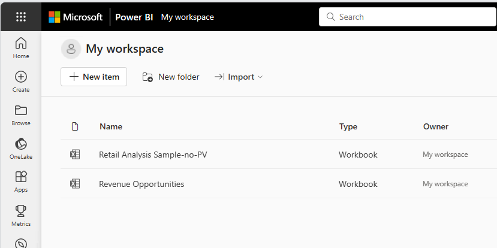

# Get data from Excel workbook files

Microsoft Excel is one of the most widely used business applications and one of the most common data sources for Power BI. This article covers importing Excel data into the Power BI service. To import Excel data using Power BI Desktop, see [Get started with Power BI Desktop](../fundamentals/desktop-getting-started.md#connect-power-bi-to-excel).

## Supported workbooks

Power BI supports importing or connecting to workbooks created in Excel 2007 and later. Some features that this article describes are available only in later versions of Excel. Workbooks must be in the .xlsx or .xlsm file type and be smaller than 1 GB.

> [!IMPORTANT]
> The legacy old import experience for semantic models in Power BI Service is being retired in phases through August 31, 2026.
>
> - After May 31, 2026, creating new semantic models using the old import experience is no longer supported.
> - After July 31, 2026, existing semantic models created using the old import experience will no longer refresh.
> - After August 31, 2026, existing semantic models created using the old import experience will no longer load. Reports that rely on these semantic models will fail to open.
>  
> The following capabilities are deprecated and will no longer be available starting September 29th, 2023:
> - Upload of local workbooks to Power BI workspaces will no longer be allowed.
> - Configuring scheduling of refresh and refresh now for Excel files that don’t already have scheduled refresh configured will no longer be allowed.
>
> The following capabilities are deprecated and will no longer be available starting October 31, 2023:
> - Scheduled refresh and refresh now for existing Excel files that were previously configured for scheduled refresh will no longer be allowed.
> - Local workbooks uploaded to Power BI workspaces will no longer open in Power BI.
>
> After October 31, 2023:
> - You can download existing local workbooks from your Power BI workspace.
> - You can publish your Excel data model as a Power BI semantic model and schedule refresh.
> - You can import Excel workbooks from OneDrive and SharePoint Document libraries to view them in Power BI.
>
> If your organization uses these capabilities, see more details in [Migrating your Excel workbooks](#migrating-your-excel-workbooks).  


### Workbooks with ranges or tables of data

If your workbook contains simple worksheets with ranges of data, be sure to format those ranges as tables to get the most out of your data in Power BI. When you create reports in Power BI, the named tables and columns in the **Tables** pane make it much easier to visualize your data.

### Workbooks with data models

A workbook can contain a data model that has one or more tables of data loaded into it via linked tables, Power Query, **Get & Transform Data** in Excel, or Power Pivot. Power BI supports all data model properties, like relationships, measures, hierarchies, and key performance indicators (KPIs).

> [!NOTE]
> You can't share workbooks that contain data models across Power BI tenants. For example, a user who signs in to Power BI with a `contoso.com` account can't share a workbook containing data models with a user who signs in with a `woodgrovebank.com` account.

### Workbooks with connections to external data sources

If your Excel workbook connects to an external data source, after your workbook is in Power BI, you can create reports and dashboards based on data from that connected source. You can also set up scheduled refresh to automatically connect to the data source and get updates. You no longer need to refresh manually by using **Get Data** in Excel. Visualizations in reports and dashboard tiles that are based on the data source update automatically. For more information, see [Data refresh in Power BI](refresh-data.md).

### Workbooks with PivotTables and charts

Whether and how your PivotTables and charts appear in Power BI depends on where you save your workbook file, and how you choose to get the file into Power BI. The rest of this article explains the options.

## Data types

Assign specific data types to data in Excel to improve your Power BI experience. Power BI supports these data types:

- Whole number
- Decimal number
- Currency
- Date
- True/false
- Text

## Import or upload Excel data

There are two ways to explore Excel data in Power BI: upload and import. When you upload your workbook, it appears in Power BI just like it would in Excel Online. But you also have some great features to help you pin elements from your worksheets to your dashboards. When you import your data, Power BI imports any supported data in tables and any data model into a new Power BI semantic model.

<a name="one-excel-workbook--two-ways-to-use-it"></a>

### Upload to Power BI

You can use the **Upload** button to upload files to the Power BI service. In the workspace where you want to add the file, select **Upload** at the top of the page. In the drop-down list, select:

- **OneDrive** to connect to files that are stored in OneDrive.
- **SharePoint**  to connect to files on any SharePoint site that you have access to.
- **Browse** to upload files from your computer.

:::image type="content" source="media/service-excel-workbook-files/upload.png" alt-text="Screenshot that shows the Upload menu options.":::

If you upload a local file, Power BI adds a copy of the file to the workspace. If you use the **OneDrive for Business** or **SharePoint** options, Power BI creates a connection to the file. As you make changes to the file in SharePoint or OneDrive, Power BI automatically syncs those changes about once an hour.

When you connect to an Excel file by using OneDrive, you can't edit your workbook in Power BI. If you need to make changes, you can select **Edit** and then choose to edit your workbook in Excel Online or open it in Excel on your computer. Changes are saved to the workbook on OneDrive.

You should connect to or upload data if you have only data in worksheets, or if you have ranges, PivotTables, and charts that you want to pin to dashboards.

Local Excel workbooks open in Excel Online within Power BI. Unlike Excel workbooks stored on OneDrive or SharePoint team sites, you can't edit local Excel files within Power BI.

If you use Excel 2016 and later, you can also use **File** > **Publish** > **Upload** from Excel. For more information, see [Publish to Power BI from Microsoft Excel](service-publish-from-excel.md).

After your workbook uploads, it appears in the list of content in the workspace:

  

This upload method is easy to use, and the **OneDrive for Business** and **SharePoint** options use the same file selection interface as many other Microsoft products. Rather than entering a URL to a SharePoint or OneDrive location, you can select one of your sites by using the **Quick access** section or selecting **More places**.

If you don't have a subscription, the **OneDrive for Business** and **SharePoint** options are unavailable, but you can still select **Browse** to get local files from your computer. This image shows the unavailable options, but the **Browse** option is enabled:

:::image type="content" source="media/service-excel-workbook-files/excel-files-new-03.png" alt-text="Screenshot that shows the unavailable options.":::

You can't use **Upload** to get files from personal OneDrive accounts, but you can upload files from your computer.

### Import Excel data into Power BI

To import Excel data into Power BI, in **My workspace**, select **New item** > **Semantic model** > **Excel**, and then find the file.

The **My files** list allows you to add files from your documents folder and other personal sources.

You can use the **Quick access** list on the left side of the window to add files from SharePoint sites and other shared sources.

Select **Browse this device** to add files from the device you're currently using.

When you import Excel data, Power BI imports any supported data in tables and any data model into a new Power BI semantic model.

You should import your data if you used **Get & Transform Data** or **Power Pivot** to load data into a data model.

If you upload from OneDrive for Business, when you save changes, Power BI synchronizes them with the semantic model in Power BI, usually within about an hour. You can also select **Publish** to export your changes immediately. Any visualizations in reports and dashboards also update, based on the following refresh triggers:

|Report tiles  |Dashboard tiles  |
|---------|---------|
|Open the report, after the cache expires.|Open the dashboard, after the cache refreshes.|
|Select **Refresh** in the report.|Select **Refresh** in the dashboard.|
|     |Automatically for pinned tiles when the cache refreshes, if the dashboard is already open.|

> [!NOTE]
> Pinned report pages don't support the automatic refresh feature.

## Where to save your workbook file

Where you save your workbook file makes a difference.

- **Local**. If you save your workbook file to a drive on your computer or another location in your organization, you can load your file into Power BI. Your file actually remains on the source drive. When you import the file, Power BI creates a new semantic model and loads data and any data model from the workbook into the semantic model.

  Local Excel workbooks open in Excel Online within Power BI. Unlike Excel workbooks stored on OneDrive or SharePoint team sites, you can't edit local Excel files within Power BI.

  Excel also has a **Publish** command on the **File** menu. Using this **Publish** command is effectively the same as using **Upload** > **Browse** from Power BI. If you regularly make changes to the workbook, it's often easier to update your semantic model in Power BI.

- **OneDrive**. Signing in to OneDrive with the same account as Power BI is the most effective way to keep your work in Excel in sync with your Power BI semantic model, reports, and dashboards. Both Power BI and OneDrive are in the cloud, and Power BI connects to your workbook file on OneDrive about once an hour. If Power BI finds any changes, it automatically updates your Power BI semantic model, reports, and dashboards.

  As when you have a file saved to a local drive, you can use **Publish** in Excel to update your Power BI semantic model and reports immediately. Otherwise, Power BI automatically synchronizes, usually within an hour.

- **SharePoint team site**. Saving your Power BI Desktop files to a SharePoint team site is almost the same as saving them to OneDrive. The biggest difference is how you connect to the file from Power BI. You can specify a URL or connect to the root folder.

<a name="import-or-connect-to-an-excel-workbook-from-power-bi"></a>

## Publish from Excel to your Power BI site

Using the Excel **Publish to Power BI** feature is effectively the same as using Power BI to import or connect to your file. For more information, see [Publish to Power BI from Microsoft Excel](service-publish-from-excel.md).

> [!NOTE]
> If you upload an Excel workbook that's connected to an on-premises SQL Server Analysis Services (SSAS) cube, you can't refresh the underlying data model in the Power BI service.

## Migrating your Excel workbooks

For local Excel workbooks uploaded to a Power BI workspace, use the **Download Excel file** option to download the workbook. Then save it to OneDrive or a SharePoint Document library (ODSP). You can then import the workbook from ODSP to the workspace again.

  

To refresh data in Excel data models, you'll need to publish the data model as a Power BI semantic model. We recommend using Power BI Desktop to import the model because it upgrades your data model to the latest version. This gives you the best future experience. Use the **Import** from **Power Query, Power Pivot, Power View** option on Power BI Desktop's **File** menu.

To build new workbooks connected to a semantic data model in your Excel workbook, you should first publish the data model as a Power BI semantic model. Then in Excel use the **From Power BI (Microsoft)** option to connect your workbook to the semantic model. This option is available in the **Data ribbon**, under **Get Data** in the **From Power Platform** menu.

For cases where you include a workbook in a Power BI organizational app, remember to republish the app with the new items.

To learn which workbooks can be affected by the deprecation of local workbooks and refresh capabilities, use the **workbooks** Power BI admin REST API. It lists the workbooks in your organization. You must be a Fabric administrator to call this API.

```
GET https://api.powerbi.com/v1.0/myorg/admin/workbooks
```

The API provides a  list of all the Excel workbooks published in your organization. The list is formatted in JSON. 

Below is an example output for the API.

```
[
    {
        "DisplayName": "Workbook without a Data Model",
        "WorkspaceName": "My workspace",
        "HasDataModel": false,
        "HasScheduledRefreshOnDataModel": false,
        "UploadedOn": "2023-07-28T10:54:17.093"
    },
    {
        "DisplayName": "Workbook with Data Model",
        "WorkspaceName": "My workspace",
        "HasDataModel": true,
        "HasScheduledRefreshOnDataModel": true,
        "UploadedBy": "user@contoso.com",
        "UploadedOn": "2022-11-16T09:51:17.497"
    }
]
```
You can check if the Excel workbook is a local workbook by navigating to it in Power BI and seeing if the Download Excel file option is available.

You can use PowerShell to call the API as shown in the example below:

```
Invoke-PowerBIRestMethod -Url "https://api.powerbi.com/v1.0/myorg/admin/workbooks" -Method GET
```

To use PowerShell, first install the required **MicrosoftPowerBIMgmt** module. See [Power BI Cmdlets reference](/powershell/power-bi/overview) for details. You'll need to call **Login-PowerBIServiceAccount** commandlet before calling **Invoke-PowerBIRestMethod**.

## Legacy Excel and CSV import experience retirement

The old Excel and CSV import experience in Power BI service, accessible through the **Create** page, is being retired. This section provides key dates, guidance on identifying affected semantic models, and answers to frequently asked questions.
  

### Key dates

| Date | What happens |
|------|--------------|
| May 31, 2026 | Creation of new semantic models using the old import experience is no longer supported. |
| July 31, 2026 | Existing semantic models created using the old import experience no longer refresh. |
| August 31, 2026 | Existing semantic models created using the old import experience will no longer load. Reports bound to these semantic models will fail to open and display an error. |


After July 31, 2026, reports built on these semantic models display stale data. You need to recreate these reports if the data needs to be refreshable for your report consumers.

### How to identify affected semantic models

Semantic models created by the legacy import experience have the following characteristics:

- Can't be edited in the browser
- Can't be downloaded
- Have no options to schedule a refresh

If your semantic model can be edited in the browser, downloaded, or has a scheduled refresh option, you're already using the current Excel and CSV connectors, and there's no impact on your semantic model and reports.

### Use Power BI REST APIs to identify legacy semantic models

Admins and users can identify semantic models created using the legacy Excel or CSV import experience by querying the Power BI REST APIs for Datasets and inspecting the `ContentProviderType` property in the response.

The following values indicate legacy import pipelines:

| ContentProviderType value | Description |
|---------------------------|-------------|
| Excel | Legacy Excel import experience |
| CSV | Legacy CSV import experience |

Semantic models that return either value were created using deprecated import flows and are impacted by the legacy Excel and CSV retirement.

For more information on using the Power BI REST APIs, see [Power BI REST API reference](/rest/api/power-bi/).

### Frequently asked questions

#### Are Excel and CSV files still supported as data sources?

Yes. Excel and CSV files remain valid data sources for Power BI semantic models and reports. You can use them to create reports in the Power BI service from the **Create** page or in Power BI Desktop. Only the old import experience is being retired.

#### Who is affected by this change?

This change affects users who created reports using the old experience to import an Excel or CSV file from the **Create** page in the service. There's no impact for users who created semantic models in Power BI Desktop.

#### Can I still view and edit my existing reports after July 31, 2026?

Yes. Reports can still be consumed and edited after July 31, 2026, but the data no longer stays in sync with the source Excel or CSV file.

#### What should I do to keep my reports refreshing?

You need to recreate reports that were built using the legacy import experience. Use one of the current methods described in [Import Excel data into Power BI](#import-excel-data-into-power-bi) or create your semantic model in Power BI Desktop.

#### How do I know if my semantic model uses the legacy experience?

If your semantic model can't be edited in the browser, can't be downloaded, and has no scheduled refresh option, it was created using the legacy import experience. Alternatively, use the Power BI REST APIs to check the `ContentProviderType` property as described in [Use Power BI REST APIs to identify legacy semantic models](#use-power-bi-rest-apis-to-identify-legacy-semantic-models).

#### Is there a workaround to keep my existing reports updating?

No. There's no workaround or fix to keep reports created with the legacy experience updating past July 31, 2026. You need to recreate these reports using the current Excel and CSV connectors.

## Troubleshooting and limitations

- If your workbook file is too large, see [Reduce the size of an Excel workbook to view it in Power BI](reduce-the-size-of-an-excel-workbook.md).

- The upload of Excel workbooks to a Power BI workspace isn't supported for sovereign cloud customers.

- You can't use scheduled refresh for Excel workbooks that have connections to on-premises SSAS tabular models through a gateway.

## Related content

- **Explore your data**. After you upload data and reports from your file into Power BI, you can select the new semantic model to explore the data. When you select the workbook, it opens in Power BI the same as if it were in Excel Online.

- **Schedule refresh**. If your Excel workbook connects to external data sources, or if you imported from a local drive, you can set up scheduled refresh to make sure your semantic model or report is always up-to-date. In most cases, setting up scheduled refresh is easy to do. For more information, see [Data refresh in Power BI](refresh-data.md).

- [**Publish to Power BI from Microsoft Excel**](service-publish-from-excel.md).
