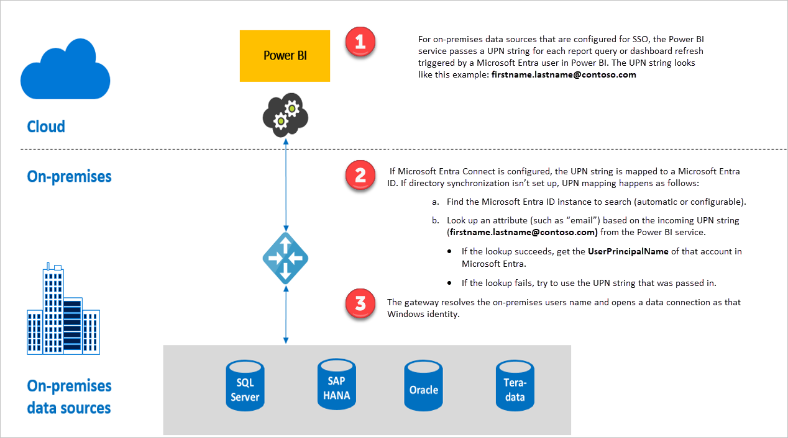

## Query steps when running SSO

A query that runs with SSO consists of three steps, as shown in the following diagram.

Here are additional details about each step:

1. For each query, the Power BI service includes the *user principal name (UPN)*, which is the fully qualified username of the user currently signed in to the Power BI service, when it sends a query request to the configured gateway.

2. The gateway must map the Azure Active Directory UPN to a local Active Directory identity:

   a. If Azure AD DirSync (also known as *Azure AD Connect*) is configured, then the mapping works automatically in the gateway.

   b.  Otherwise, the gateway can look up and map the Azure AD UPN to a local AD user by performing a lookup against the local Active Directory domain.

3. The gateway service process impersonates the mapped local user, opens the connection to the underlying database, and then sends the query. You don't need to install the gateway on the same machine as the database.

## Next steps

Now that you understand the basics of enabling SSO through the gateway, read more detailed information about Kerberos and SAML:

* [Single sign-on (SSO) - Kerberos](service-gateway-sso-kerberos.md)
* [Single sign-on (SSO) - SAML](service-gateway-sso-saml.md
