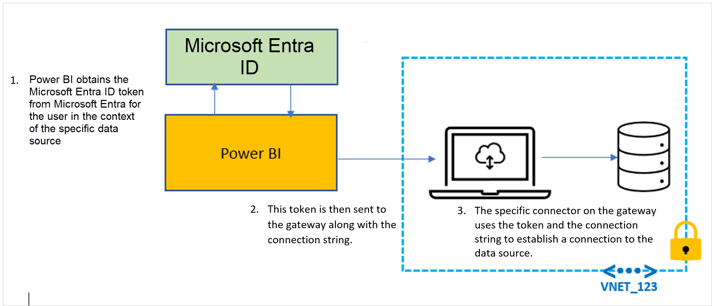

# Microsoft Entra SSO

Microsoft Entra SSO enables single sign-on to the data gateway to access cloud data sources that rely on Microsoft Entra ID based authentication. When you configure Microsoft Entra SSO on the on-premises data gateway for an applicable data source, queries run under the Microsoft Entra identity of the user that interacts with the Power BI report.

While Azure Virtual Networks (VNets) offer network isolation and security for your resources on the Microsoft cloud, you now require a secure way to connect to these data sources. On-premises data gateways help you achieve that. Microsoft Entra SSO as explained previously allows users to see only data that they have access to.

>[!NOTE]
> VNet data gateways, which are available in public preview for Power BI Premium Semantic models, eliminate the need to install an on-premises data gateway for connecting to your VNet data sources. To learn more about VNet gateways and their current limitations, see [What is a virtual network (VNet) data gateway](/data-integration/vnet/overview).

The following data sources aren't supported with Microsoft Entra SSO using an on-premises data gateway behind an Azure VNet:

* Analysis Services
* ADLS Gen1
* ADLS Gen2
* Azure Blobs
* CDPA
* Exchange
* OData
* SharePoint
* SQL Server
* Web
* AzureDevOpsServer
* CDSTOData
* Cognite
* CommonDataService
* Databricks
* EQuIS
* Kusto (when using the newer “DataExplorer” function)
* VSTS
* Workplace Analytics

For more information on SSO, and a list of supported data sources for Microsoft Entra SSO, see [Overview of single sign-on for on-premises data gateways in Power BI](service-gateway-sso-overview.md).

## Query steps when running Microsoft Entra SSO

## Enable Microsoft Entra SSO for Gateway

Since the Microsoft Entra token of the user is passed via the gateway, it's possible for an admin of the gateway computer to obtain access to these tokens. To make sure a user with malicious intent isn't able to intercept these tokens, the following safeguard mechanisms are available:

* A tenant-level setting in the Power BI admin portal allows only Power BI service admins to enable this feature for a tenant. For more information, see [Microsoft Entra single sign-on for gateways](/fabric/admin/service-admin-portal-integration#azure-ad-single-sign-on-sso-for-gateway).
* As a Power BI service admin, you can also control who can install gateways in your tenant. For more information, see [Manage gateway installers](/power-platform/admin/onpremises-data-gateway-management#manage-gateway-installers).

The Microsoft Entra SSO feature is disabled by default for on-premises data gateways. As a Power BI admin, you must enable the **Microsoft Entra Single Sign-On (SSO) for Gateway** tenant setting in the Power BI Admin portal before data sources are enabled for Microsoft Entra SSO on an on-premises data gateway.

:::image type="content" source="media/service-gateway-azure-active-directory-sso/powerbi-admin-portal-azure-ad-sso-for-gateway-setting.png" alt-text="Screenshot of the Microsoft Entra SSO for gateway feature in the Power BI Admin portal.":::

## Related content

* [Overview of single sign-on for on-premises data gateways in Power BI](service-gateway-sso-overview.md)
