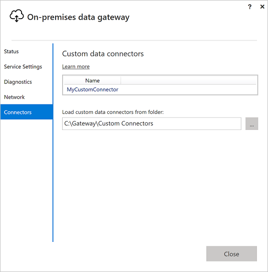
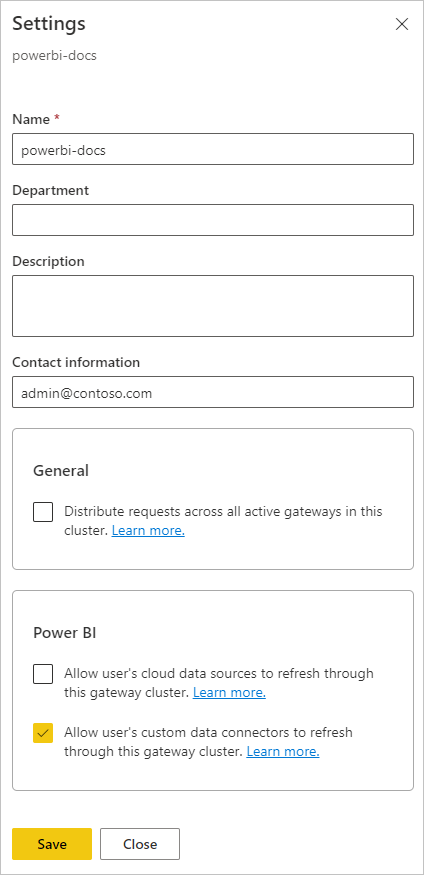
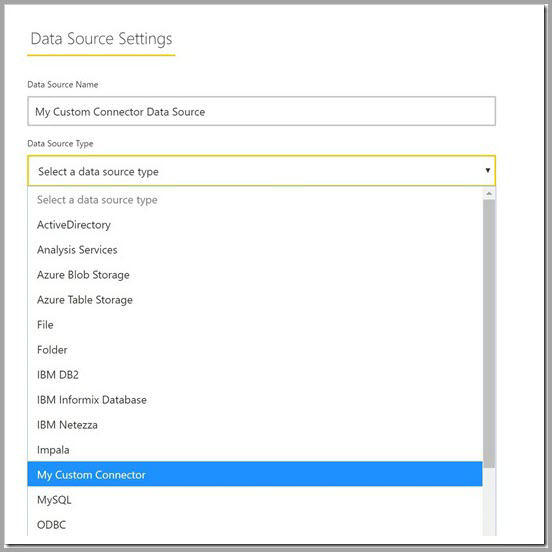

# Use custom data connectors with an on-premises data gateway

[!INCLUDE [gateway-rewrite](../includes/gateway-rewrite.md)]

You use Power BI data connectors to connect to and access data from an application, service, or data source. You can develop custom data connectors and use them in Power BI Desktop.

If you build reports in Power BI Desktop that use custom data connectors, you can use an on-premises data gateway to refresh those reports in the Power BI service.

To learn more about how to develop custom data connectors for Power BI, see the [DataConnectors SDK](https://aka.ms/dataconnectors) in GitHub. This site includes information on how to get started, and samples for Power BI and Power Query.

## Enable and use custom connectors

To enable using custom connectors, select **Connectors** in the on-premises data gateway app. In **Custom data connectors**, under **Load custom data connectors from folder**, browse to and select a folder that the user running the gateway service can access. The default user is *NT SERVICE\PBIEgwService*. The gateway automatically loads the custom connector files in that folder, and they appear in the list of data connectors.

>[!NOTE]
>If you're using an on-premises data gateway (personal mode), you can upload your Power BI report to the Power BI service and use the gateway to refresh it.

For an on-premises data gateway, you need to create a data source for your custom connector. On the gateway settings page in the Power BI service, select the option to enable using custom connectors with this cluster.

When you enable this option, you see your custom connectors as available data source connections that you can add to this gateway cluster. After you create a data source that uses your new custom connector, you can refresh Power BI reports by using the custom connector in the Power BI service.

## Considerations and limitations

- Make sure the folder you create is accessible to the background gateway service. Typically, folders under your users' Windows folders or system folders aren't accessible. The on-premises data gateway app shows a message if the folder isn't accessible. This limitation doesn't apply to the on-premises data gateway (personal mode).

- For custom connectors to work with the on-premises data gateway, they need to implement a TestConnection section in the custom connector code. This section isn't required when you use custom connectors with Power BI Desktop. For this reason, you can have a connector that works with Power BI Desktop, but not with the gateway. For more information on how to implement a TestConnection section, see [TestConnection](/power-query/samples/trippin/9-testconnection/readme).

- If your custom connector is on a network drive, include the fully qualified path in the on-premises data gateway app.

- You can only use one custom connector data source when working in DirectQuery mode. Multiple custom connector data sources don't work with DirectQuery.

## Related content

* [Manage your data source - Analysis Services](service-gateway-enterprise-manage-ssas.md)  
* [Manage your data source - SAP HANA](service-gateway-enterprise-manage-sap.md)  
* [Manage your data source - SQL Server](service-gateway-enterprise-manage-sql.md)  
* [Manage your data source - Oracle](service-gateway-onprem-manage-oracle.md)  
* [Manage your data source - Import/scheduled refresh](service-gateway-enterprise-manage-scheduled-refresh.md)
* [Configure proxy settings for the on-premises data gateway](/data-integration/gateway/service-gateway-proxy)
* [Use Kerberos for single sign-on (SSO) from Power BI to on-premises data sources](service-gateway-sso-kerberos.md)  

More questions? Try asking the [Power BI Community](https://community.powerbi.com/).
