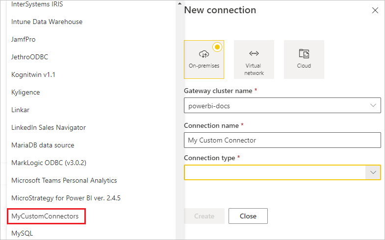

# Use custom data connectors with the on-premises data gateway

[!INCLUDE [gateway-rewrite](../includes/gateway-rewrite.md)]

With data connectors for Power BI, you can connect to and access data from an application, service, or data source. You can develop custom data connectors and use them in Power BI Desktop.

To learn more about how to develop custom data connectors for Power BI, see the [Data connector SDK GitHub page](https://aka.ms/dataconnectors). This site includes information on how to get started and samples for Power BI and Power Query.

When you build reports in Power BI Desktop that use custom data connectors, you can use the on-premises data gateway to refresh those reports from the Power BI service.

## Enable and use this capability

When you install the on-premises data gateway, you see a **Connectors** tab in the on-premises data gateway app. In the **Load custom data connectors from folder** box, select a folder that can be accessed by the user running the gateway service. The default user is *NT SERVICE\PBIEgwService*. The gateway automatically loads the custom connector files located in that folder. They appear in the list of data connectors.

If you're using the on-premises data gateway (personal mode), you can upload your Power BI report to the Power BI service and use the gateway to refresh it.

For the on-premises data gateway, you need to create a data source for your custom connector. On the gateway settings page in the Power BI service, you should see an option when you select the gateway cluster to allow using custom connectors with this cluster. Select that option to enable using custom connectors with this cluster.

When this option is enabled, you see your custom connectors as available data sources that you can create under this gateway cluster. After you create a data source that uses your new custom connector, you can refresh Power BI reports by using that custom connector in the Power BI service.

## Considerations and limitations

* Make sure the folder you create is accessible to the background gateway service. Typically, folders under your user’s Windows folder or system folders won’t be accessible. The on-premises data gateway app shows a message if the folder isn't accessible. This instruction doesn't apply for the on-premises data gateway (personal mode).
* For custom connectors to work with the on-premises data gateway, they need to implement a “TestConnection” section in the custom connector’s code. This section isn't required when you use custom connectors with Power BI Desktop. For this reason, you can have a connector that works with Power BI Desktop, but not with the gateway. For more information on how to implement a TestConnection section, see [this documentation](https://github.com/Microsoft/DataConnectors/blob/master/docs/m-extensions.md#implementing-testconnection-for-gateway-support).
* If your custom connector is on a network drive, include the fully qualified path on the on-premises data gateway app.

## Next steps

* [Manage your data source - Analysis Services](service-gateway-enterprise-manage-ssas.md)  
* [Manage your data source - SAP HANA](service-gateway-enterprise-manage-sap.md)  
* [Manage your data source - SQL Server](service-gateway-enterprise-manage-sql.md)  
* [Manage your data source - Oracle](service-gateway-onprem-manage-oracle.md)  
* [Manage your data source - Import/scheduled refresh](service-gateway-enterprise-manage-scheduled-refresh.md)
* [Configure proxy settings for the on-premises data gateway](/data-integration/gateway/service-gateway-proxy)
* [Use Kerberos for single sign-on (SSO) from Power BI to on-premises data sources](service-gateway-sso-kerberos.md)  

More questions? Try asking the [Power BI Community](https://community.powerbi.com/).
