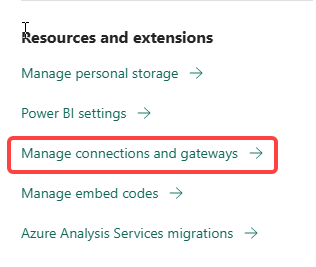
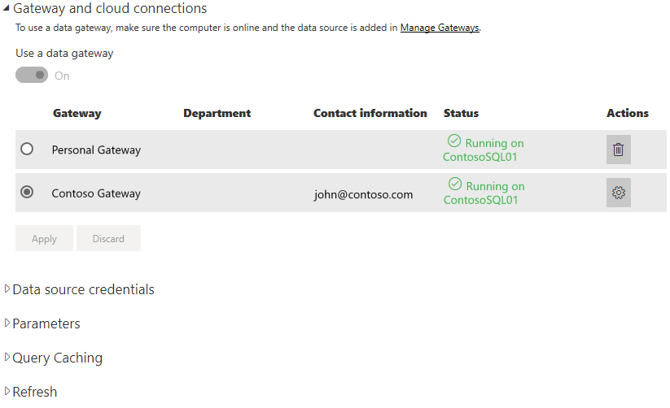

# Add or remove a gateway data source

[!INCLUDE [gateway-rewrite](../includes/gateway-rewrite.md)]

Power BI supports many [on-premises data sources](power-bi-data-sources.md), and each has its own requirements. A gateway can be used for a single data source or multiple data sources. For this example, we show you how to add SQL Server as a data source. The steps are similar for other data sources.

Most data sources management operations can be performed by using APIs as well. For more information, see [REST APIs (Gateways)](/rest/api/power-bi/gateways).

If you don't have a gateway installed yet, see [Install an on-premises data gateway](/data-integration/gateway/service-gateway-install) to get started.

## Add a data source

1. From the page header in the Power BI service, select  **Settings**  > **Manage gateways**.

    

2. Select a gateway and then select **Add data source**. You can select the header text **ADD DATA SOURCE** or hover your cursor next to the gateway entry to reveal the more options menu.

    

3. Assign a name to your data source, then select the **Data Source Type**. In this example, we'll choose SQL Server.

    

4. Enter information about the data source. For SQL Server, provide the **Server** and **Database**.

    

5. Select an **Authentication Method** to use when connecting to the data source. For SQL Server, choose **Windows** or **Basic** (SQL Authentication). Enter the credentials for your data source.

   :::image type="content" source="media/service-gateway-data-sources/basic-auth.png" alt-text="Basic authentication settings.":::

    > [!NOTE]
    > If the selected authentication method is OAuth:
    > - Any query that runs longer than the OAuth token expiration policy may fail.
    > - Cross-tenant AAD accounts are not supported 
    > If the selected authentication method is Windows:
    > - Make sure that account has access on the machine. If not sure, make sure to add NT-AUTHORITY\Authenticated Users (S-1-5-11) to the local machine “Users” group.

6. Under **Advanced settings**, you could configure [Single Sign-On (SSO)](service-gateway-sso-overview.md) for your data source. 

    

    You could either configure **Use SSO via Kerberos for DirectQuery queries**  or **Use SSO via Kerberos for DirectQuery And Import queries** for DirectQuery-based Reports and **Use SSO via Kerberos for DirectQuery And Import queries** for Refresh-based Reports.

    If you use the **Use SSO via Kerberos for DirectQuery queries** and use this data source for a DirectQuery based Report, it will use the credentials of the user that signs in to the Power BI service. For a Refresh-based Report, it will use the credentials that you enter in the **Username** and **Password** fields.

    When you use the **Use SSO via Kerberos for DirectQuery And Import queries**, you don't need to provide any credentials. If this data source is used for DirectQuery based Report, it will use the user that's mapped to the (Azure) Active Directory user that signs in to the Power BI service.  For a Refresh based Report, it will use the dataset owner's security context

    > [!NOTE]
    >SSO for Import Queries is available only for the list of SSO data sources using [Kerberos constrained delegation](service-gateway-sso-kerberos.md).

7. Under **Advanced settings**, optionally configure the [privacy level](https://support.office.com/article/Privacy-levels-Power-Query-CC3EDE4D-359E-4B28-BC72-9BEE7900B540) for your data source (doesn't apply to [DirectQuery](desktop-directquery-about.md)).

    :::image type="content" source="media/service-gateway-data-sources/privacy-level.png" alt-text="Privacy level selections.":::

8. Select **Add**. You see *Connection Successful* if the process succeeds.

    

You can now use this data source to include data from SQL Server in your Power BI dashboards and reports.

## Remove a data source

You can remove a data source if you no longer use it. Removing a data source breaks any dashboards and reports that rely on that data source.

To remove a data source, go to the data source and then select **Remove** from the more options menu. The more options menu appears when you hover your cursor next to the data source name.

## Use the data source for scheduled refresh or DirectQuery

After you create the data source, it's available to use with either DirectQuery connections or through scheduled refresh. You can learn more about setting up scheduled refresh in [Configure scheduled refresh](refresh-scheduled-refresh.md).

> [!NOTE]
>Server and database names must match between Power BI Desktop and the data source added to the on-premises data gateway.

The link between your dataset and the data source in the gateway is based on your server name and database name. These names must match. For example, if you supply an IP address for the server name, in Power BI Desktop, you must use the IP address for the data source in the gateway configuration. If you use *SERVER\INSTANCE* in Power BI Desktop, you must use the same in the data source configured for the gateway.

If you're listed in the **Users** tab of the data source configured in the gateway, and the server and database name match, you see the gateway as an option to use with scheduled refresh.

> [!WARNING]
> If your dataset contains multiple data sources, each data source must be added in the gateway. If one or more data sources aren't added to the gateway, you won't see the gateway as available for scheduled refresh.

### Limitations

OAuth is a supported authentication scheme only for custom connectors with the on-premises data gateway.

## Manage users

After you add a data source to a gateway, you give users and email-enabled security groups access to the specific data source (not the entire gateway). The access list for the data source controls only who is allowed to publish reports that include data from the data source. Report owners can create dashboards and apps, and then share those items with other users.

You can also give users and security groups administrative access to the gateway.

> [!NOTE]
> Users with access to the data source can associate datasets to the data source, and connect, based on the security options (either the stored credentials or Single Sign-On) selected while creating a data source.

### Add users to a data source

1. From the page header in the Power BI service, select  **Settings**  > **Manage gateways**.

2. Select the data source where you want to add users.

3. Select **Users**, and enter the users and mail-enabled security groups from your organization who will access the selected data source. Select **Add**, and the added member's name is added to the list of people who can publish reports that use this data source.

    

Remember that you need to add users to each data source that you want to grant access to. Each data source has a separate list of users. Add users to each data source separately.

### Remove users from a data source

On the **Users** tab for the data source, you can remove users and security groups that use this data source.

## Store encrypted credentials in the cloud

When you add a data source to the gateway, you must provide credentials for that data source. All queries to the data source will run by using these credentials. The credentials are encrypted securely. They use symmetric encryption so that they can't be decrypted in the cloud before they're stored in the cloud. The credentials are sent to the machine that runs the gateway, on-premises, where they're decrypted when the data sources are accessed.

## List of available data source types

For information about which data sources the on-premises data gateway supports, see [Power BI data sources](power-bi-data-sources.md).

## Next steps

* [Manage your data source - Analysis Services](service-gateway-enterprise-manage-ssas.md)
* [Manage your data source - SAP HANA](service-gateway-enterprise-manage-sap.md)
* [Manage your data source - SQL Server](service-gateway-enterprise-manage-sql.md)
* [Manage your data source - Oracle](service-gateway-onprem-manage-oracle.md)
* [Manage your data source - Import/scheduled refresh](service-gateway-enterprise-manage-scheduled-refresh.md)
* [Guidance for deploying a data gateway](service-gateway-deployment-guidance.md)

More questions? Try the [Power BI Community](https://community.powerbi.com/).
