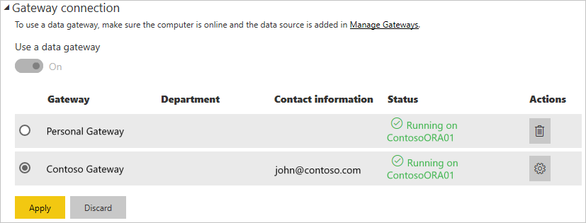

# Manage your data source - import and scheduled refresh

[!INCLUDE [gateway-rewrite](../includes/gateway-rewrite.md)]

After you [install the on-premises data gateway](/data-integration/gateway/service-gateway-install), you need to [add data sources](service-gateway-data-sources.md#add-a-data-source) that can be used with the gateway. This article looks at how to work with gateways and data sources that are used for scheduled refresh as opposed to DirectQuery or live connections.

## Add a data source

Select a data source type. All of the data source types listed can be used for scheduled refresh with the on-premises data gateway. Analysis Services, SQL Server, and SAP HANA can be used for scheduled refresh, DirectQuery, or live connections. For more information about how to add a data source, see [Add a data source](service-gateway-data-sources.md#add-a-data-source).

:::image type="content" source="media/service-gateway-enterprise-manage-scheduled-refresh/add-data-source-sql.png" alt-text="Screenshot of adding SQL data source to the gateway." :::

Then fill in the information for the data source, which includes the source information and credentials that are used to access the data source.

> [!NOTE]
> All queries to the data source run by using these credentials. To learn more about how credentials are stored, see [Store encrypted credentials in the cloud](service-gateway-data-sources.md#store-encrypted-credentials-in-the-cloud).

:::image type="content" source="media/service-gateway-enterprise-manage-scheduled-refresh/authentication-sql.png" alt-text="Screenshot of credentials for SQL data source." :::

For a list of data source types that can be used with scheduled refresh, see [List of available data source types](service-gateway-data-sources.md#list-of-available-data-source-types).

After you fill in everything, select **Create**. If the action succeeds, you see *Created New data source.* You can now use this data source for scheduled refresh with your on-premises data.

:::image type="content" source="media/service-gateway-enterprise-manage-scheduled-refresh/successful-sql.png" alt-text=" Screenshot of successful creation for SQL data source." :::

### Advanced settings

Optionally, you can configure the privacy level for your data source. This setting controls how data can be combined. It's only used for scheduled refresh. To learn more about privacy levels for your data source, see [Privacy levels (Power Query)](https://support.office.com/article/Privacy-levels-Power-Query-CC3EDE4D-359E-4B28-BC72-9BEE7900B540).

:::image type="content" source="media/service-gateway-enterprise-manage-scheduled-refresh/privacy-level-sql.png" alt-text="Screenshot of privacy level setting for SQL data source." :::

## Use the data source for scheduled refresh

After you create the data source, it's available to use with either DirectQuery connections or through scheduled refresh.

> [!NOTE]
> The server and database names must match between Power BI Desktop and the data source within the on-premises data gateway.

The link between your dataset and the data source within the gateway is based on your server name and database name. These names must match. For example, if you supply an IP address for the server name within Power BI Desktop, you must use the IP address for the data source within the gateway configuration. If you use *SERVER\INSTANCE* in Power BI Desktop, you also must use it within the data source configured for the gateway.

If you're listed in the **Users** tab of the data source configured within the gateway and the server name and database name match, you see the gateway as an option to use with scheduled refresh.

> [!IMPORTANT]
> Upon republish, the data set owner must associate the dataset to a gateway and corresponding data source again. The previous association is not maintained after republishing.

> [!WARNING]
> If your dataset contains multiple data sources, each data source must be added within the gateway. If one or more data sources aren't added to the gateway, you don't see the gateway as available for scheduled refresh.

## Related content

* [Troubleshooting the on-premises data gateway](/data-integration/gateway/service-gateway-tshoot)
* [Troubleshoot gateways - Power BI](service-gateway-onprem-tshoot.md)

More questions? Try the [Power BI Community](https://community.powerbi.com/).
