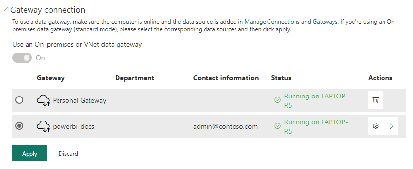

# Manage a SQL Server data source

[!INCLUDE [gateway-rewrite](../includes/gateway-rewrite.md)]

After you [install an on-premises data gateway](/data-integration/gateway/service-gateway-install), you can add data sources to use with the gateway. This article describes how to add a SQL Server data source to an on-premises data gateway to use for scheduled refresh or DirectQuery.

## Add a data source

Follow these instructions to add a SQL Server data source to your on-premises data gateway.

> [!NOTE]
> When you use DirectQuery, the gateway supports only **SQL Server 2012 SP1** and later.

1. On the **New connection** screen, select **On-premises**. Enter the **Gateway cluster name** and new **Connection name**, and under **Connection type**, select **SQL Server**.

   :::image type="content" source="media/service-gateway-enterprise-manage-sql/add-data-source-sql.png" alt-text=" Screenshot of selecting the SQL Server data source." :::

1. Fill in the **Server** and **Database** information for the data source. 

1. Under **Authentication Method**, choose either **Windows** or **Basic**. Choose **Basic** if you plan to use SQL authentication instead of Windows authentication. Then enter the credentials to use for this data source.

   
   :::image type="content" source="media/service-gateway-enterprise-manage-sql/authentification-sql.png" alt-text=" Screenshot of filling in the data source settings." :::

   All queries to the data source run using these credentials unless you configure and enable Kerberos single sign-on (SSO) for the data source. With SSO, datasets use the current Power BI user's SSO credentials to execute the queries.

   For more information about storing and using credentials, see:
   - [Store encrypted credentials in the cloud](service-gateway-data-sources.md#store-encrypted-credentials-in-the-cloud)
   - [Use Kerberos for single sign-on (SSO) from Power BI to on-premises data sources](service-gateway-sso-kerberos.md).

1. Configure the **Privacy level** for your data source. This setting controls how data can be combined for scheduled refresh only. The privacy level setting doesn't apply to DirectQuery. To learn more about privacy levels for your data source, see [Privacy levels (Power Query)](https://support.office.com/article/Privacy-levels-Power-Query-CC3EDE4D-359E-4B28-BC72-9BEE7900B540).

1. Select **Create**.

   :::image type="content" source="media/service-gateway-enterprise-manage-sql/privacy-level-sql.png" alt-text=" Screenshot of the Privacy level setting for SQL data source." :::

You see a success message if the creation succeeds. You can now use this data source for scheduled refresh or DirectQuery against an on-premises SQL Server.

:::image type="content" source="media/service-gateway-enterprise-manage-sql/succesful-data-source-sql.png" alt-text=" Screenshot of successful creation of SQL data source." :::

For more information about how to add a data source, see [Add a data source](service-gateway-data-sources.md#add-a-data-source).

## Use the data source

After you create the data source, it's available to use with either DirectQuery connections or through scheduled refresh.

### Server and database names must match

The link between your dataset and the data source in the gateway is based on your server name and database name. These names must match exactly.

For example, if you supply an IP address for the server name in Power BI Desktop, you must use the IP address for the data source in the gateway configuration. If you use *SERVER\INSTANCE* in Power BI Desktop, you must use *SERVER\INSTANCE* in the data source you configure for the gateway. This requirement holds for both DirectQuery and scheduled refresh.

### Use the data source with DirectQuery connections

Make sure that the server and database names match between Power BI Desktop and the configured data source for the gateway. Also, to be able to publish DirectQuery datasets, your users must appear under **Users** in the data source list.

You select the DirectQuery connection method in Power BI Desktop when you first connect to data. For more information about how to use DirectQuery, see [Use DirectQuery in Power BI Desktop](desktop-use-directquery.md).

After you publish reports, either from Power BI Desktop or by getting data in Power BI service, your SQL Server on-premises data connection should work. It might take several minutes after you create the data source in the gateway to be able to use the connection.

### Use the data source with scheduled refresh

If you're listed in the **Users** column of the data source configured within the gateway, and the server name and database name match, you see the gateway as an option to use with scheduled refresh.

## Related content

- [Connect to on-premises data in SQL Server](service-gateway-sql-tutorial.md)
- [Troubleshoot the on-premises data gateway](/data-integration/gateway/service-gateway-tshoot)
- [Troubleshoot gateways - Power BI](service-gateway-onprem-tshoot.md)
- [Use Kerberos for single sign-on (SSO) from Power BI to on-premises data sources](service-gateway-sso-kerberos.md)

More questions? Try asking the [Power BI Community](https://community.powerbi.com/).
